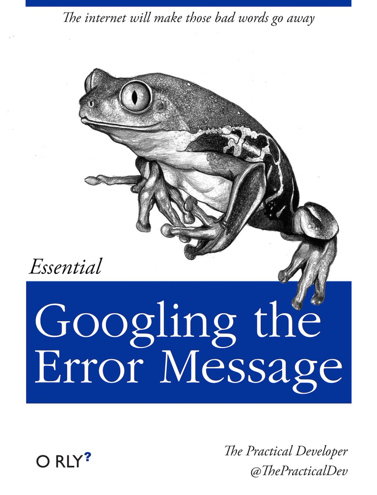

# Introduction {#intro}

::: { .alert .alert-info}
Hi there! this is where the material for the first lecture will appear.
To sign up, check out the [welcome page](https://jmbuhr.de/dataintro/index.html)
:::

> ... in which we get started with R and RStudio,
  learn about literate programming and build our first
  plot by discovering a Grammar of Graphics.

::: {.video-container}
<iframe class="video" src="https://www.youtube.com/embed/r0bWxrzu4tg" allowfullscreen></iframe>
:::

## What You will Learn

- as scientists, we answer questions
  by generating data and analyzing this data
- is my hypothesis correct? is there and effect?
- could this just be a fluke?
- then show our results in an engaging
  and correct way e.g. with plots and statistics

- why a new recording?

## Execute R Code

- console
- script
- a script is like a recipe, keeping it is more important than keeping e.g.
  the plots that come out of it!

## Get to know RStudio

- projects
- panes / layout
- important settings:
  - never restore .Rdata at startup
- theme (more via packages,
  which we will talk about later today)

## Expressions: Tell R to do things

- e.g. math
- vectors e.g. numbers from:to
- no scalars (individual values), those are just vectors of length 1
- mathematical opterations are "vectorized"
- comments

## Variables: Boxes for things

- naming things for reuse
- mutable / changeable
- order of execution matters!
- conventions and allowed names


## Atomic datatypes

- numbers
- whole numbers
- (complex numbers)
- text
- yes / no
- special: NULL, NA (NA is contagious!)

## Functions: Calculate, run and automate things

- e.g. math: `sin`
- In R, everything that exists is an object, everything that does something is a function.
- show help!
- other functions:
  - `c`
  - `as.numberic` / `as.<...>`
  - `max`, `min`, `mean`, `range`
  - `seq`
- create our own functions
  - syntax
  - e.g. add

## Packages: Sharing functions

- installing and loading packages
- finding source code and documentation
  - click on the icons in the script!
  - search the internet for e.g.:
    r package <package name> github
  - tip: when searching for r help,
    use it's full name `rstats`
 
## Literate Programming with Rmarkdown: Code is communication

<aside>
<a href="https://rmarkdown.rstudio.com/index.html">
{width=200}
</a>
</aside>

- open a new Rmarkdown document
- explain structure
- knit
- show output formats
  - html_document
  - pdf_document
  - docx_document
- note about links to resources in the script
- show visual editor
- move over to dataintro project


### The Tidyverse

<aside>
<a href="https://tidyverse.org/">
{width=200}
</a>
</aside>

## Our First Dataset: The Palmer Penguins


```{r}
library(palmerpenguins)

```


```{r}
penguins
```


### Dataframes: R's powerfull tables

- penguins
- a list of columns, where columns are vectors
- `str` function

## The Grammar of Graphics: Translate data into visualizations

<aside>
<a href="https://ggplot2.tidyverse.org/">
{width=200}
</a>
</aside>

```{r}
library(tidyverse)
library(palmerpenguins)

penguins %>%
  ggplot(aes(flipper_length_mm, bill_length_mm,
             color = species,
             shape = sex)) +
  geom_point(size = 2.5) +
  geom_smooth(aes(group = species), method = "lm", se = FALSE,
              show.legend = FALSE) +
  labs(x = "Flipper length [mm]",
       y = "Bill length [mm]",
       title = "Penguins!",
       subtitle = "The 3 penguin species can be differentiated by their flipper- and bill-lengths.",
       caption = "Datasource:\nHorst AM, Hill AP, Gorman KB (2020). palmerpenguins:\nPalmer Archipelago (Antarctica) penguin data.\nR package version 0.1.0. https://allisonhorst.github.io/palmerpenguins/",
       color = "Species",
       shape = "Sex") +
  theme_minimal() +
  scale_color_brewer(type = "qual") +
  theme(plot.caption = element_text(hjust = 0))
```


- a grammar means:
  - we can build complex visualizations
    with basic building blocks
    that fit together acording to
    some rules (the grammar)
- just like lego
- learn the building blocks and
  not a different function for
  all the different types of plots
  (e.g. barplot, scatterplot, lineplot,
  piechart)
- build up the plot from the ground up

- data
- aesthetic mapping
- geom(s)
- (stat(s))
- coordinate system
- guides
- scales
- theme

```{r}
theme_set(theme_minimal())


my_plot <- ggplot(penguins, aes(x = flipper_length_mm, y = bill_length_mm,
                     shape = sex, color = species)) +
  geom_point() +
  scale_color_manual(values = c("red", "blue", "orange")) +
  labs(title = "Penguins") +
  theme(plot.title = element_text(colour = "purple"))

my_plot 
```


```{r, eval=FALSE}
ggsave("my_plot.png", my_plot)
```

- saving plots
- get rid of the `NA` -> next week

## The Community: There to catch You.

{width=50%}

{width=50%}

## Bonus: Get more RStudio themes

- and talk about where packages come from
- <https://github.com/gadenbuie/rsthemes>

## Exercises

- how to hand in!

### Put your flippers in the air!

In a fresh Rmarkdown document (without the example template content),
load the tidyverse and the palmerpenguins packages.


## Learn more:

Check out the dedicated [Resources](Resources) page.
