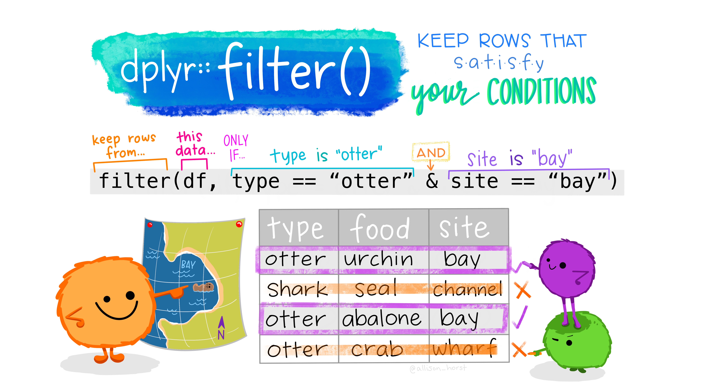

# Data Wrangling

> ... in which we explore the typical data analysis workflow with the tidyverse, wrangle different kinds of data and learn about factors.

:::{.video-container}
<iframe class="video" src="https://www.youtube.com/embed/oCYn2pHfizg" allowfullscreen></iframe>
:::

-   talk about how to say things in your head
-   loading packages first

- Ctrl+Alt+I

```{r, include=FALSE}
knitr::opts_chunk$set(echo = TRUE, warning = FALSE, message = FALSE)
```


```{r loading-packages}
library(tidyverse)
```

## A Data Analysis Workflow


## Reading Data with `readr`

<aside>

<a href="https://readr.tidyverse.org/">  </a>

</aside>

-   download data for today
-   show folder structure
-   showing raw data
-   download.file (make sure data folder exists)


-   show tab / ctrl+space autocompletion
-   read gapminder data (csv)
-   read csv also works with url
    -   but you probably also want a local copy
    -   write_csv and friends
-   `View` and ctrl+click

```{r, eval=FALSE}
read_csv("data/02/gapminder.csv")
```

```{r, eval=FALSE}
download.file("https://raw.githubusercontent.com/jmbuhr/dataintro/main/data/02/gapminder.csv", "example-download.csv")
```

```{r, eval=FALSE}
our_data <- read_csv("https://raw.githubusercontent.com/jmbuhr/dataintro/main/data/02/gapminder.csv")

write_csv(our_data, "our-data.csv")
```


## A Project-based Workflow

-   why we do the project based workflow
-   getwd

```{r}
getwd()
```

```{r}
# read_csv("/home/jannik/Documents/projects/teaching/dataintro/data/02/gapminder.csv")
read_csv("./data/02/gapminder.csv")
```

-   why not to use setwd

```{r}
# setwd()
```


-   what are file-paths
    -   absolute
    -   relative
-   The gapminder dataset [@bryanGapminderDataGapminder2017] is an excerpt from the [gapminder project](https://www.gapminder.org/) and contains the life expectancy at birth for 142 countries at 5 year intervals between 1952 and 2007. It also contains the population and the Gross Domestic Product (GDP) per Inhabitant. We will built a visualization later on.

```{r}
gapminder <- read_csv("data/02/gapminder.csv")
gapminder
```

```{r, eval=FALSE}
View(gapminder)
gapminder
```

```{r}
# read.csv()
```


### Common Hurdles when Importing Data

-   csv vs csv2 

```{r}
read_csv2("data/02/gapminder_csv2.csv")
```


-   read_lines of
    -   `_tsv`, `obscure_file`
-   `read_delim`
-   `_messier`


```{r}
read_lines("data/02/gapminder_tsv.txt", n_max = 3)
```

```{r}
# read_tsv()
```


```{r}
read_delim("data/02/obscure_file.tsv", "~")
```


```{r}
read_lines("data/02/gapminder_messier.csv", n_max = 5)
```

```{r}
read_csv("data/02/gapminder_messier.csv", skip = 2)
```

-   what is parsing?
-   how about excel files?
    -   note on `::` and `library`


```{r}
readxl::read_xlsx("data/02/gapminder.xlsx")
```

## Wrangling Data with `dplyr`

<aside>

<a href="https://dplyr.tidyverse.org/">  </a>

</aside>


### select

```{r}
select(gapminder, country, year, gdpPercap)
```

-   `…`
-   column names, `:` , `where` `starts_with`, see `select_helpers`, `c(…)`

```{r}
select(gapminder, year:pop)
```


```{r}
select(gapminder, starts_with("co"))
```


```{r}
select(gapminder, where(is.numeric))
```


```{r}
select(gapminder, where(is.character))
```

### filter



-   conditions e.g. year, country

```{r}
filter(gapminder, year > 2000, country == "New Zealand")
```


```{r}
filter(gapminder, year > 2000, str_to_lower(country) == "new zealand")
```


```{r}
filter(gapminder, country == "New Zealand" | country == "Afghanistan")
```

```{r}
filter(gapminder, country %in% c("New Zealand", "Afghanistan"))
```


### mutate

-   calculate gdp
-   note on assignment

```{r}
mutate(gapminder, gdp = pop * gdpPercap)
```


```{r}
gapminder
```

```{r}
gapminder <- mutate(gapminder, gdp = pop * gdpPercap)
gapminder
```


### Interlude: Begind the magic, handling data with base-R

-   what even are dataframes / tibbles?
-   `tibble`
-   get elements of a vector
-   get elements of a tibble
-   get elements of a list

```{r}
test_tibble <- tibble(
  x = 1:5,
  y = x ^ 2,
  z = c("hello", "world", "test", "four", "five")
)
test_tibble
```


```{r}
test_tibble[c(1, 3)]
```

```{r}
test_tibble[c("x", "z")]
```

```{r}
test_tibble[1, c(1, 2)]
```

```{r}
test_tibble$x
```

```{r}
test_tibble[[1]]
```

```{r}
pull(test_tibble, x)
```

```{r}
x <- 1:10
x[1] <- 42
x
```

### The pipe `%>%`

-   performing more than one step
-   compare to ggplot +
-   all basic tidyverse functions take data as their first argument
-   reading code in your head
-   note on `|>`


```{r}
subset_gapminder <- select(gapminder, country, year, pop)
filtered_gapminder <- filter(subset_gapminder, year > 200)
final_gapminder <- mutate(filtered_gapminder, pop_thousands = pop / 1000)
final_gapminder
```

Ctrl+Shift+M

```{r}
final_gapminder <- gapminder %>% 
  select(country, year, pop) %>% 
  filter(year > 2000) %>% 
  mutate(pop_thousands = pop / 1000)

final_gapminder
```

### arrange

-   ascending and `desc`

```{r}
gapminder %>% 
  arrange(year)
```

```{r}
gapminder %>% 
  arrange(desc(year))
```


### summarise

```{r}
gapminder %>% 
  summarise(
    max_year = min(year),
    pop = max(pop),
    mean_life_expectancy = mean(lifeExp)
  )
```

### group_by

```{r}
gapminder %>% 
  group_by(year) %>% 
  summarise(
    mean(lifeExp)
  )
```

```{r}
gapminder %>% 
  group_by(year, continent) %>% 
  summarise(
    mean(lifeExp)
  ) %>%
  ungroup()
```
```{r}
gapminder %>% 
  group_by(year) %>%
  mutate(pop = pop / sum(pop))
```


### others:

-   `rename`
-   `n()`
-   `count`

```{r}
gapminder %>% 
  rename(population = pop)
```

```{r}
gapminder %>% 
  group_by(year) %>% 
  mutate(n = n())
```

```{r}
gapminder %>% 
  count(year, country) %>% 
  count(n)
```

## Visualization and our first encounter with `factor`s

<aside>

<a href="https://forcats.tidyverse.org/">  </a>

</aside>

-   life expectancy over time
-   controlling the order of things
-   `fct_`
-   `fct_relevel`

-   add color to our plot
-   `head`
-   named vectors!
-   `pull` and `$`

```{r}
gapminder %>% 
  ggplot(aes(year, lifeExp, group = country)) +
  geom_line() +
  facet_wrap(~continent)
```

```{r}
gapminder %>% 
  ggplot(aes(year, lifeExp, color = country)) +
  geom_line() +
  facet_wrap(~continent) +
  guides(color = "none")
```


```{r}
gapminder %>% 
  mutate(continent = fct_relevel(continent, c("Oceania"))) %>% 
  ggplot(aes(year, lifeExp, color = country)) +
  geom_line() +
  facet_wrap(~continent) +
  guides(color = "none")
```

```{r}
animals <- c("cat", "dog", "bear")
animals <- factor(animals, levels = c("cat", "dog"), ordered = TRUE)
```

```{r}
country_colors <- read_csv("data/02/country_colors.csv")
country_colors
```
```{r}
x <- c(first = 1, second = 3, hello = 5)
x["first"]
```

```{r}
color <- country_colors$color
names(color) <- country_colors$country
head(color)
```


```{r}
gapminder %>% 
  mutate(continent = fct_relevel(continent, c("Oceania"))) %>% 
  ggplot(aes(year, lifeExp, color = country)) +
  geom_line() +
  facet_wrap(~continent) +
  guides(color = "none") +
  scale_color_manual(values = color)
```


## Exercises

## Resources

## Package Documentation

-   [The tidyverse website](https://www.tidyverse.org/)
-   [The readr package website with cheatsheet](https://readr.tidyverse.org/)
-   [The dplyr package website with cheatsheet](https://dplyr.tidyverse.org/)

## Getting Help

-   [How to find help](https://www.tidyverse.org/help/#reprex)
-   [R4DS online learning community](https://www.rfordatasci.com/)
