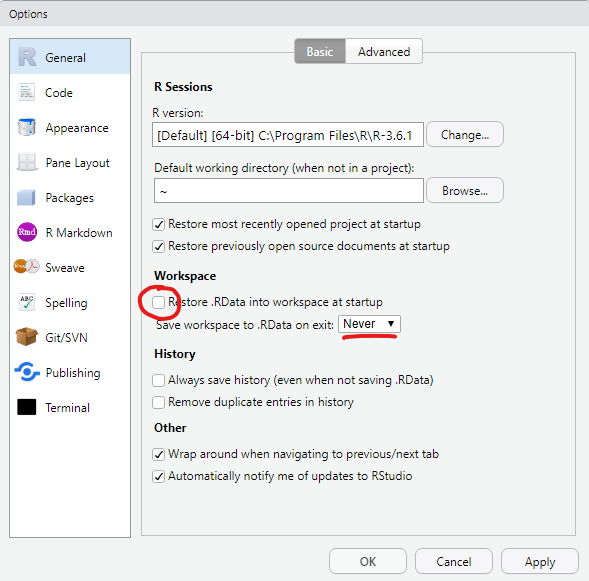

# Data Wrangling

> ... in which we explore the typical
  data analysis workflow
  with the tidyverse,
  wrangle different kinds of data and
  learn about factors.

<!--

::: {.video-container}
<iframe class="video" src="https://www.youtube.com/embed/yo6uQYr8U48" allowfullscreen></iframe>
:::


> **Note**:\
> I try to be vocal about what the code does in plain English while I type it and learning the "translations" of symbols and keywords can help you, too. After a while, programming can feel a lot more like having a conversation with your digital assistant or a helpful friend. The boundary between human languages and computer languages is more blurry than you might think.

Before we get deeper into R,
let's talk a little bit about our Home when working with R:
RStudio.

## Making Ourselves at Home in RStudio

### Important Settings

I highlighted 3 settings that I consider important to change from their default values. The first two might seem odd at first glance.

```{r rsettings1, echo=FALSE, fig.show='hold', out.width="50%"}

include_graphics("images/RS_settings2.png")
```

The workspace that RStudio would save as `.RData` contains all objects created in a session, which is, what we can see in the **Environment** pane (by default in the top right panel, bottom right in my setup). Why would we not want to load the objects we created in the last session into our current session automatically? The reason is reproducibility. We want to make sure that everything our analysis needs is in the script. It creates our variables and plots from the raw data and should be the sole source of truth. Given the raw data and the script, everyone should be able to reproduce our results. The third setting (text encoding) is also concerned with collaboration. It makes sure that our text files and special characters in them (like German umlauts) look the same on different operating systems like Windows, iOS and Linux.

### A Project-based Workflow

Last week we simply went ahead and created a script file and an Rmarkdown file in some folder on our computer. But how does R known, where the script is? How does it know, where to look, when we tell it to read in a file or save a plot? The main folder where R starts is called the **working directory**. To find out, what our current working directory is, we execute the function `getwd()` for get working directory:

```{r}
getwd()
```

This will look slightly different depending on you operating system. The next function I want you to know, but **never use**:

```{r, eval=FALSE}
setwd("some/file/path")
```

"Why should I not use it?", you might ask. Let's assume I use the function to set the working directory as seen above:

```{r, eval=FALSE}
setwd("/home/jannik/Documents/projects/teaching/dataIntro20/_lectures/lecture2")
```

Now, when I give the file to you to test my analysis, chances are very low that it would work. Because you are likely not called Jannik and even more likely don't have the same folder structure that I had.

So what we want instead of these *absolute file paths*, is a **relative file paths** that start in the folder that our scripts are in. This is what **RStudio Projects** are for. It is basically just a folder with a special file that ends in `.Rproj`, but as soon as R finds this file in the folder, the working directory will automatically be this folder. So when you share this folder, it will still just work.

Go ahead and use the blue R button in the top right corner to create a **New Project**. I recommend you do this either as one project for the whole course or with one project per week. Projects are also convenient because they save what files you had open and so forth.

There is one thing I didn't tell you about Rmarkdown documents, yet. Their working directory is always the folder they are in, even if they are in some subdirectory of a project. In a way this also means that you don't necessarily need a project to work with Rmarkdown, but having one anyway makes it easier to keep track of your files and have a consistent structure.

### Working in Style

Now that we have a cosy project for today, let's also make sure we are working in style and are feeling right at home in RStudio. [This blogpost](https://www.pipinghotdata.com/posts/2020-09-07-introducing-the-rstudio-ide-and-r-markdown/) provides excellent gifs for the different settings in RStudio and even for Rmarkdown troubleshooting. I am also fond of the [rsthemes package](https://github.com/gadenbuie/rsthemes) for additional appearances.

## A Data Analysis Workflow

We are getting close to importing our very first dataset from a file into R. Generally, this is the first thing that needs to happen with any data analysis and we will cover it today. The data I provided is already pretty tidy so we will start with that and build some visualizations. The communicate-part is also covered, because we are working in Rmarkdown after all, which is designed to communicate our findings. Later, we will also have a look at some less tidy data, but not before having defined what "tidy data" is.

(ref:workflow) Figure from @wickhamDataScienceImport2017.

```{r workflow, echo=FALSE, fig.cap="(ref:workflow)", out.width="100%", out.extra="class=external"}
include_graphics("images/workflow-wickham.png")
```

## Reading Data with `readr`

<aside>
<a href="https://readr.tidyverse.org/">

</a>
</aside>

The package responsible for loading data in the tidyverse is called `readr`, so we start by loading the whole tidyverse.

Note, that in general, we could also load just the `readr` package with `library(readr)`, but we need the rest of the tidyverse later on anyways. There is also the option to not load a package at all but rather only use one function from a package by prefixing the function with the package name and two colons (`::`) Like so: `readr::read_csv("...")`.

```{r, message=FALSE, warning=FALSE}
library(tidyverse)
```

Without further ado, let's download the data for today. In fact, there are multiple ways to go about this. We could download the whole course folder from GitHub by following the link in the top right corner of this website and then using the download button:

```{r github, echo=FALSE}
include_graphics("images/download_repo.png")
```

You will then find the data in the folder `./_lectures/lecture2/data/`.

Or we can navigate to the file on GitHub. Follow this link: [files](https://github.com/jmbuhr/dataIntro20/tree/master/_lectures/lecture2/data), click on one of the files and then click on **raw**:

```{r github2, echo=FALSE}
include_graphics("images/github-raw.png")
```

From there you can copy the link displayed in your browser address field and download the file straight from R:

```{r download-gapminder, eval=FALSE}
download.file("https://raw.githubusercontent.com/jmbuhr/dataIntro20/master/_lectures/lecture2/data/gapminder.csv",
              "data/gapminder.csv")
```

The folder to download your data to (`./data`) must be created in advance. This is an example for a relative path (an absolute path would start with `/` or a drive letter like `C:`).

Now we can finally load in the data and store it in a variable. When working with file paths, RStudio's autocompletion is especially helpful. We can trigger it with **Tab** or **Ctrl+Space**.

```{r}
gapminder <- read_csv("data/02/gapminder.csv")
```

`readr` will also tell you the datatypes it guessed for the columns. Let's inspect our dataset:

```{r}
gapminder
```

The gapminder dataset [@bryanGapminderDataGapminder2017] is an excerpt from the [gapminder project](https://www.gapminder.org/) and contains the life expectancy at birth for 142 countries at 5 year intervals between 1952 and 2007. It also contains the population and the Gross Domestic Product (GDP) per Inhabitant. We will built a visualization later on.

`read_csv` can even read data from a url straight away, without the need for us to download the file ourselves, but we usually want a copy of the data locally. For the curious run this:

```{r eval=FALSE}
read_csv("https://raw.githubusercontent.com/jmbuhr/dataIntro20/master/_lectures/lecture2/data/gapminder.csv")
```

So, this all went smoothly. But this will not always be the case. We will now look at common hurdles when importing data

### Common Hurdles when Importing Data

The function we just used was called `read_csv`, because it reads a file format that consists of **comma separated values**. Look at the raw file in a text editor (not word) like notepad or RStudio to see why. But the file extension `.csv` can sometimes be lying...

Because in German, the comma is used to separate decimal numbers (vs. the dot in English), a lot of Software will output a different type of csv-file when configured in German. It will still call it csv, but actually it is separated by semicolons! We have a special function for this:

```{r csv2, eval=FALSE}
read_csv2("data/gapminder_csv2.csv")
```

When looking through the autocompletion options that pop up when you are typing the function name, you might have noticed a similar function `read.csv` and `read.csv2`. These are the functions that come with R, without any packages like the tidyverse. You can of course use those as well, but the tidyverse functions provide a more consistent experience and have less surprising quirks. I am teaching the tidyverse first, because it allows you to do more while having to learn less edge cases.

If we look at yet another file `data/gapminder_tsv.txt`, we notice that the file extension doesn't tell us much about the format, only that it is text (as opposed to a binary format only computers can read). If we look into the file:

```{r}
read_lines("data/02/gapminder_tsv.txt", n_max = 3)
```

We notice that the values are separated by "\t", a special sequence that stands for the tab character. The `read_tsv` function will do the job.

If the separator (also called delimiter) is even more obscure, we can use the general function `read_delim`. Say a co-worker misunderstood us and thought tsv stands for "Tilde separated values", we can still read his file.

```{r}
read_lines("data/02/obscure_file.tsv", n_max = 3)
```

```{r read-tilde-sv, eval=FALSE}
read_delim("data/02/obscure_file.tsv", delim = "~")
```

There are more ways in which raw data can be messy or hard to read depending on the machine but I can't show all of them. One common thing you will encounter though is measurement machines writing some additional information in the first couple of lines before the actual data (like the time of the measurement). In this example:

```{r}
read_lines("data/02/gapminder_messier.csv", n_max = 4)
```

The first 2 lines are not part of the data. Reading the file normally as a csv would produce something weird: Because the first line does not contain any commata, it will assume that the file contains only one column and also report a bunch of **parsing failures**. Parsing is the act of turning data represented as raw text into a useful format, like a table of numbers.

```{r}
read_csv("data/02/gapminder_messier.csv", n_max = 3)
```

We can fix this by telling R to skip the first 2 lines entirely:

```{r}
read_csv("data/02/gapminder_messier.csv", skip = 2, n_max = 3)
```

I was using the `n_max` argument of the functions above to save space in this lecture script.

In the video I forgot to mention that I also included an excel file to practice. We can read it using a function from the `readxl` package. This package is automatically installed with the tidyverse, but it is not loaded along with the other packages via `library(tidyverse)`. We can either load it with `library(readxl)` or refer to a single function from the package without loading the whole thing using double colons (`::`):

```{r, eval=FALSE}
readxl::read_xlsx("data/02/gapminder.xlsx")
```

Now, that we learned about some of the ways in which raw data can be structured, let us go back to the original data that we read in and saved in the variable `gapminder`.

```{r gapminder-table, echo=FALSE}
gapminder %>% 
  head() %>% 
  kable()
```

## Wrangling Data with `dplyr`

<aside>
<a href="https://dplyr.tidyverse.org/">

</a>
</aside>

There a are a number of ways in which we can manipulate data. Of course I mean manipulate in it's original sense, not the malicious one. This is sometimes referred to as **data wrangling** and within the tidyverse, this is a job for the `dplyr` package (short for data plyer, the tool you see in the logo).

dplyr provides functions for various operations on our data. Theses functions are sometimes also called **dplyr verbs**. All of them take a `tibble` or `data.frame` as input (plus additional parameters) and always return a `tibble`.

```{r dplyr-cute, fig.cap="[@ArtworkAllisonHorst]", echo=FALSE, out.extra='class=external'}
include_graphics("images/dplyr_wrangling.png")
```

### select

The first verb we introduce is used to select columns. And hence, it is called `select`. The first argument is always the data, followed by an arbitrary number of column names. We can recognize functions the take an arbitrary number of additional arguments by the `...` in the autocompletion and help page.

```{r}
select(gapminder, country, year, pop)
```

It might be confusing why we don't need quotation marks around the column names like we do when we select and element from a vector by name as in:

```{r}
c(first = 1, second = 2)["first"]
```

This concept is known as quasiquotation or data masking. It is quite unique to R, but it allows functions to known about the content of the data that is passed to them and use this as the environment in which they do their computations and search for variable names. So while the variable `country` doesn't exist in the global environment, it does exist as a column of the gapminder tibble. `dplyr` functions always look in the data first when they search for names.

The help page for `select` tells us more about the different ways in which we can select columns. Here are a couple of examples without the output, rum them in your R session to confirm that they do what you think they do. (but do have a look at the help pages yourselves, they are quite well written).

```{r select-examples, eval=FALSE}
select(gapminder, where(is.numeric))
select(gapminder, country:lifeExp)
select(gapminder, starts_with("c"))
select(gapminder, c(1, 3, 4))
```

### filter

```{r dplyr-filter, fig.cap="[@ArtworkAllisonHorst]", echo=FALSE, out.extra='class=external'}
include_graphics("images/dplyr_filter.jpg")
```

After selecting columns it is only natural to ask how to select rows. This is achieved with the function `filter`. For example, we can **filter for** all years smaller than 2000:

```{r}
filter(gapminder, year < 2000)
```

Or all the rows where the country is "New Zealand":

```{r}
filter(gapminder, country == "New Zealand")
```

### mutate

We are back at manipulating columns, this time by creating new ones or changing old ones. The `dplyr` verb that does that is called `muate`. For example, we might want to calculate the total GDP from the GDP per Capita and the population:

```{r}
mutate(gapminder, gdp = pop * gdpPercap)
```

Notice, that none of the functions changed the original variable `gapminder`. They only take an input and return and output, which makes it easier to reason about our code and later chain pieces of code together. How do you change it then? Use the Force! ... ahem, I mean, the assignment operator (`<-`).

```{r}
gapminder <- mutate(gapminder, gdp = pop * gdpPercap)
```

Here, the power of dplyr shines. It knows that `pop` and `gdpPercap` are columns of the tibble and that `gdp` refers to the new name of the freshly created column.

### Interlude: Begind the magic, handling data with base-R

This section is meant to show you what happens behind the scenes. It is not strictly necessary to understand all the details of it in order to work effectively with the tidyverse, but it helps especially when things don't go as planned.

So let's look into handling data with base-R. Last week we briefly covered subsetting of vectors by their indices, their names, or a logical vector:

```{r}
x <- c(42, 1, 13, 29)
names(x) <- c("first", "second", "third", "fourth")
x
```

```{r}
x[c(1,3)]
```

```{r}
x[c("first", "second")]
```

```{r}
x[c(TRUE, FALSE, FALSE, TRUE)]
```

This subsetting with a logical vector can be used to filter the vector:

```{r}
select_this <- x < 20
select_this
```

```{r}
x[select_this]
```

With data in 2 dimensions, rows and columns, subsetting works similarly. Let's use the function `tibble` to create a tibble from vectors:

```{r}
my_data <- tibble(
  x = c(42, 1, 13, 29),
  y = c(1, 2, 3, 4),
  z = c("z1", "z2", "z3", "z4")
)
my_data
```

> Note:\
> R is not whitespace sensitive (like python). That means indentation doesn't change the meaning of the code. We can use this to format our code to look pretty, which is why I started a new line after the opening bracket of `tibble(`.

Subsetting a tibble like a vector selects columns:

```{r}
my_data[c(1, 3)]
```

But if you pass two arguments to the square brackets, separated by commata, we can filter rows and select columns Here, we get the first row in the second and third columns:

```{r}
my_data[1, c(2, 3)]
```

If we follow the logic above, we can also filter the data. The comma without any argument afterwards selects all columns.

```{r}
my_data[my_data$x < 20, ]
```

At first glance, the tidyverse way of doing the same is only a little bit shorter. But apart from the fact that we don't have to repeat the name of the data object `my_data` (because `filter` knows where to look for `x`, whereas `[]` doesn't), there is another advantage.

```{r}
filter(my_data, x < 20)
``` 

### The pipe `%>%`

The tidyverse functions are easier to compose (i.e. chain together). To facilitate this, we introduce another operator, a bit like `+` for numbers or the `+` to add ggplot components, but specially for functions. The pipe, which you can either type or insert in RStudio with **Ctrl+Shift+M**, takes it's left side and passes it as the first argument to the function on the right side:

```{r}
my_data %>% select(x, z)
```

And because all main `tidyverse` functions take data as their first argument, we can chain them together fluently. Additionally, it enables autocompletion of column names inside of the function that gets the data. So back to the gapminder example:

```{r}
gapminder %>% 
  filter(year > 2000) %>% 
  mutate(gdp = pop * gdpPercap) %>% 
  select(country, year, gdp)
```

It also reads much nicer in your head, which makes reasoning about the code easier. Without telling you what the above code did, you can understand it, because it reads like English. You can often pronounce the pipe as "and then" in your head, or out-loud, I'm not judging.

> Note:\
> The base-R and the tidyverse way are not mutually exclusive. Sometimes you can mix and match.

### arrange

A simple thing you might want from a table is to sort it based on some column. This is what `arrange` does:

```{r}
gapminder %>% 
  arrange(year)
```

The helper function `desc` marks a column to be arranged in descending order. We can arrange by multiple columns, where the first will be most important.

```{r}
gapminder %>% 
  arrange(desc(year), pop) %>% 
  select(country, year, pop) %>% 
  rename(population = pop)
```

I also introduced the `rename` verb without warning. It does what it says it does, only the order of the names might be confusing. The new name comes first (like when you are creating a new column with `mutate`). You can also rename within `select`:

```{r}
gapminder %>% select(country, year, population = pop)
```

### summarise

To condense one or multiple columns into summary values, we use `summarise`: Like with mutate, we can calculate multiple things in one step.

```{r}
gapminder %>% 
  summarise(
    last_year = max(year),
    average_pop = mean(pop),
    minimal_gdp = min(gdp)
  )
```

But condensing whole columns into one value, flattening the tibble in the style of Super Mario jumping on mushrooms, is often not what we need. We would rather know the summaries within certain groups. For example the maximal gdp **per country**. This is what `group_by` is for.

### group_by

`group_by` is considered an adverb, because it doesn't change the data itself but it changes how subsequent functions handle the data. For example, if a tibble has groups, all summaries are calculated within these groups:

```{r}
gapminder %>% 
  group_by(country)
```

For example, let's look at the range of the life expectancy for each country:

```{r}
gapminder %>% 
  group_by(country) %>% 
  summarise(lower_life_exp = min(lifeExp),
            upper_life_exp = max(lifeExp))
```

`summarize` removes one level of grouping. If the data was grouped by multiple features, this means that some groups remain. We can make sure that the data is no longer grouped with `ungroup`.

```{r}
gapminder %>% 
  group_by(continent, year) %>% 
  summarise(mean_gdpPercap = mean(gdpPercap)) %>% 
  ungroup()
```

Groups also work within `mutate` and `filter`. For example, we can get all rows where the gdp per Person was highest per country:

```{r}
gapminder %>%
  group_by(country) %>% 
  filter(gdpPercap == max(gdpPercap))
```

Or we can use groups in `mutate` to find out, what percentage of it's continent a country's population makes up per year:

```{r}
gapminder %>% 
  group_by(continent, year) %>% 
  mutate(pctPop = pop / sum(pop) * 100)
```

Sometimes you want to refer to the size of the current group inside of `mutate` or `summarise`. The function to to just that is called `n()`. For example, I wonder how many rows of data we have per year.

```{r}
gapminder %>% 
  group_by(year) %>% 
  summarise(n = n())
```

A shortcut for `group_by` and `summarise` with `n()` is the `count` function:

```{r}
gapminder %>% 
  count(year)
```

In general, you might find after solving a particular problem in a couple of steps that there is a more elegant solution. Do not be discouraged by that! It simply means that there is always more to learn, but the tools you already know by now will get you a very long way and set you on the right track.

I think we learned enough dplyr verbs for now. We can treat ourselves to a little ggplot visualization.

## Visualization and our First Encounter with `factor`s

```{r}
gapminder %>% 
  ggplot(aes(year, lifeExp, group = country)) +
  geom_line(alpha = 0.3) +
  facet_wrap(~ continent)
```

The `facet_wrap` function slices our plot into theses subplots, a style of plot sometimes referred to as *small multiples*. At this point you might wonder: "How do I control the order of these facets?" The answer is: With a `factor`! Any time we have a vector that can be thought of as representing discrete categories (ordered or unordered), we can express this by turning the vector into a factor with the `factor` function. This enables R's functions to handle them appropriately. Let's create a little example. We start out with a character vector.

```{r}
animals <- c("cat", "dog", "parrot", "whale shark", "bear")
animals
```

```{r}
animals <- factor(animals)
animals
```

Note the new information R gives us, the **Levels**, which is all possible values we can put into the factor. They are automatically ordered alphabetically on creation. We can also pass a vector of levels on creation.

```{r}
animals <- c("cat", "dog", "parrot", "whale shark", "bear")
factor(animals, levels = c("parrot", "cat", "dog", "bear"))
```

A factor can only contain elements that are in the levels, so because I omitted the whale shark, it will be turned into `NA`. The tidyverse contains the `forcats` package to help with factors. Most functions from this package start with `fct_`.

<aside>
<a href="https://forcats.tidyverse.org/">

</a>
</aside>

For example, the `fct_relevel` function, which keeps all levels but let's us change the order:

```{r}
animals <- factor(animals)
fct_relevel(animals, c("parrot", "dog"))
```

Using this in action, we get:

```{r}
plt <- gapminder %>% 
  mutate(continent = fct_relevel(continent, "Europe", "Oceania")) %>% 
  ggplot(aes(year, lifeExp, group = country)) +
  geom_line(alpha = 0.3) +
  facet_wrap(~ continent)

plt
```

I saved the plot to a variable called `plt` because we need it later. Let's make this plot a bit prettier by adding color! The `gapminder` package that provided this dataset also included a nice color palette. I included it as a `.csv` file in the `data/` folder so that we can practice importing data once more. But you could also take the shortcut of getting it straight from the package (`gapminder::country_colors`). Here, we are using the `head` function to look at the first couple of rows of the tibble and to look at the first couple of elements of the named vector from the package.

```{r}
country_colors <- read_csv("data/02/country_colors.csv")
head(country_colors)
```

```{r}
head(gapminder::country_colors)
```

Notice, that the csv that we read in translates to a tibble with two columns, namely `country` and `color`. But what we need for ggplot to assign colors to the countries is what the gapminder package provides: a names vector. The names are the countries and the values so called hexadecimal (short Hex) color codes (<https://www.w3schools.com/colors/colors_hexadecimal.asp>). So what we want to do is translate the tibble into a named vector:

```{r}
country_colors <- country_colors %>% 
  mutate(color = set_names(color, country)) %>% 
  pull(color)

head(country_colors)
```

Two things happened here that are sort of new. `set_names` is a handy way to take a vector and return a vector with names. It fits better into the tidyverse syntax than the "old" way of assigning to `names(x) <- c("new", "names", "vector")`. And secondly `pull` can be though of as a *pipeable dollar*. It pulls out the column of a tibble or the element of a named list.

```{r}
gapminder$year %>% head()
gapminder %>% pull(year) %>% head()
```

Now, with our color vector ready to go, we can make the plot pretty. Remember the variable we saved our plot to? We can add more ggplot functions to it just like to a regular ggplot. A `guide` is the generalization of a legend, so we are setting it to *none* because adding a legend for 142 different colors (/countries) would fill the whole plot.

```{r prev-plt, preview=TRUE}
plt +
  aes(color = country) +
  scale_color_manual(values = country_colors, guide = guide_none()) +
  theme_minimal() + 
  labs(x = "",
       y = "Life Expectancy at Birth",
       title = "Life Expectancy over Time")
```

We also added a theme and modified the axis titles. You might have already notice a number of very pronounced dips in some of the lines. We will investigate this rather bleak reality when we talk about modeling and iteration next week.

## Exercises

- Drink a cup of coffee or tea, relax, because you
  just worked through quite a long video.
- Familiarize yourself with the folders on your computer.
  Make sure you understand, where your directories and files live.
- From RStudio, create a new RStudio project for this course.
  - Inside the project folder, create a folder
    for the data.
  - Create a new Rmarkdown document at the top level of
    your project folder for today's exercises, again including
    questions that came up during the course.
  - Download the data for today in one of the ways taught.
    You can refer to the script anytime.
  - Make sure you have all the important settings set
    and are feeling right at home in RStudio.
- The file `./data/exercise1.txt` is in an unfamiliar format.
  - Find out how it is structured and read it as a tibble.
  - Create a scatterplot of the x and y column with ggplot2.
  - Look at the help page for `geom_point`.
    What is the difference between `geom_point(aes(color = <something>))` and `geom_point(color = <something>)`?
    A relevant hint is in the section about the `...`-argument.
  - Make the plot pretty by coloring the points,
    keeping in mind the above distinction.
- Read in the `gapminder` dataset with `readr`
  - Using a combination of `dplyr` verbs and / or
    visualizations with `ggplot2`,
    answer the following questions:
  - Which continent had the highest life expectancy on average
    in the most current year? There are two options here.
    First, calculate a simple mean for the countries
    in each continent. Then, remember that the countries
    have different population sizes, so we really need
    a _weighted mean_ using R's function `weighted.mean()`.
  - Is there a relationship between the GDP per capita and
    the life expectancy? A visualization might be helpful.
  - How did the population of the countries change over time?
    Make the plot more informative by adding color,
    facets and labels (with `geom_text`). Can you find out,
    how to add the country name label only to the last year?
    Hint: Have a look at the `data` argument that all `geom_`-functions
    have.

## Resources

## Package Documentation

- [The tidyverse website](https://www.tidyverse.org/)
- [The readr package website with cheatsheet](https://readr.tidyverse.org/)
- [The dplyr package website with cheatsheet](https://dplyr.tidyverse.org/)

## Getting Help

- [How to find help](https://www.tidyverse.org/help/#reprex)
- [R4DS online learning community](https://www.rfordatasci.com/)

-->
