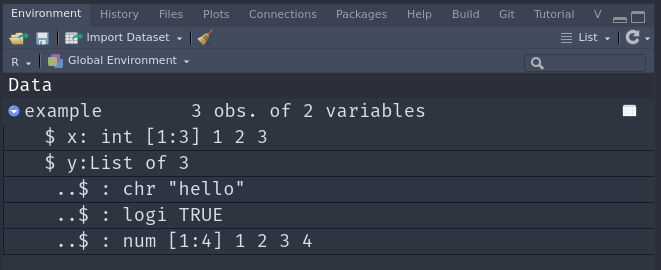

# Tidy data

>   ... in which we explore the concept of Tidy Data and learn more
  advanced data wrangling techniques 

:::{.video-container}
<iframe class="video" src="https://www.youtube.com/embed/4BuFhsZp-4w" allowfullscreen></iframe>
:::

Once again, we start by loading the tidyverse.
In the lecture video you can also see a recap, a speed run of sorts,
of lectures 1 and 2.

```{r}
library(tidyverse)
```

## Tidy data

Let's get started with this pivotal topic.

### What and why is tidy data?

There is one concept which also lends it's name to
the tidyverse that I want to talk about.
**Tidy Data** is a way of turning your datasets into a uniform shape.
This makes it easier to develop and work with tools because we get a consistent interface.
Once you know how to turn any dataset into a tidy dataset,
you are on home turf and can express your ideas more fluently in code.
Getting there can sometimes be tricky,
but I will give you the most important tools.

In tidy data, each variable (feature) forms it's own column.
Each observation forms a row.
And each cell is a single value (measurement).
Furthermore, information about the same things belongs in one table.


### Make data tidy

<aside>
<a href="https://tidyr.tidyverse.org/">

</a>
</aside>

with the `tidyr` package.

> "Happy families are all alike; every unhappy family is unhappy in its own way"\
> --- Leo Tolstoy (<https://tidyr.tidyverse.org/articles/tidy-data.html>)

And this quote holds true for messy datasets as well.
The `tidyr` package contained in the tidyverse provides small example datasets to
demonstrate what this means in practice.
Hadley Wickham and Garrett Grolemund use these in their book as well (<https://r4ds.had.co.nz/tidy-data.html>)[@wickhamDataScienceImport2017].

Let's make some data tidy!

`table1`, `table2`, `table3`, `table4a`, `table4b`,
and `table5` all display the number of TB cases documented by
the World Health Organization in Afghanistan, Brazil,
and China between 1999 and 2000.
The first of these is in the tidy format, the others are not:

```{r}
table1
```

This nicely qualifies as tidy data.
Every row is uniquely identified by the country and year,
and all other columns are properties of the specific country
in this specific year.

### `pivot_wider`

Now it gets interesting.
`table2` still looks organized, but it is not tidy (by our definition).
Note, this doesn't say the format is useless --- it has it's places ---
but it will not fit in as snugly with our tools. 
The column `type` is not a feature of the `country`,
rather the actual features are hidden in that column with
their values in the `count` column.

```{r}
table2
```

In order to make it tidy, this dataset would needs become wider.

```{r}
table2 %>% 
  pivot_wider(names_from = type, values_from = count)
```

### `separate`

In `table3`, two features are jammed into one column.
This is annoying, because we can't easily calculate
with the values; they are stored as text and
separated by a slash like `cases/population`.

```{r}
table3
```

Ideally, we would want to separate this column into two:

```{r}
table3 %>% 
  separate(col = rate, into = c("cases", "population"), sep = "/")
```

### `pivot_longer`

`table4a` and `table4b` split the data into two different tables,
which again makes it harder to calculate with.
This data is so closely related, we would want it in one table.
And another principle of tidy data is violated.
Notice the column names?
`1999` is not a feature that Afghanistan can have.
Rather, it is the value for a feature (namely the `year`),
while the values in the `1999` column are in fact 
values for the feature `population` (in `table4a`)
and `cases` (in `table4b`).

```{r}
table4a
```

```{r}
table4b
```

```{r}
table4a %>% 
  pivot_longer(-country, names_to = "year", values_to = "cases")
```

```{r}
table4b %>% 
  pivot_longer(-country, names_to = "year", values_to = "population")
```

We have another case where we are doing a very similar
thing twice.
There is a general rule of thumb that says:

> "If you copy and paste the same code 3 times,
  you should probably write a function."

This no only has the advantage of reducing code duplication
and enabling us to potentially reuse our code
later in another project, it also aids readability
because we are forced to give this stop a name.

```{r}
clean_wide_data <- function(data, values_column) {
  data %>% 
    pivot_longer(-country, names_to = "year", values_to = values_column)
}
```

We can then use this function for both tables.

```{r}
clean4a <- table4a %>% 
  clean_wide_data("cases")
```

```{r}
clean4b <- table4b %>% 
  clean_wide_data("population")
```

### `left_join`

Now is the time to join `clean4a` and `clean4b` together.
For this, we need an operation known from databases
as a `join`.
In fact, this whole concept of 
tidy data is closely related to databases and
something called Codd`s normal forms [@coddRelationalModelDatabase1990; @wickhamTidyData2014]
so I am throwing these references in here just in case you are interested in
the theoretical foundations.
But without further ado:

```{r}
left_join(clean4a, clean4b, by = c("country", "year"))
```

### `unite`

In `table5`, we have the same problem as in `table3` and 
additionally the opposite problem!
This time, feature that should be one column (namely `year`)
is spread across two columns (`century` and `year`).

```{r}
table5
```

What we want to do is unite those into one,
and also deal with the other problem.
However, we when do this we find out the our newly
created `year`, `cases` and `population` columns
are actually stored as text, not numbers!
So in the next step, we convert those into numbers
with the `parse_number` function.

```{r}
table5 %>% 
  unite("year", century, year, sep = "") %>% 
  separate(rate, c("cases", "population")) %>% 
  mutate(
    year = parse_number(year),
    cases = parse_number(cases),
    population = parse_number(population)
  )
```

`parse_number` is a bit like a less strict version of `as.numeric`.
While `as.numeric` can only deal with text that contains only a number
and nothing else, `parse_number` can help us by extracting numbers
even if there is some non-number text around them:

```{r}
as.numeric("we have 42 sheep")
```

`parse_number` handles this, no questions asked:

```{r}
parse_number("we have 42 sheep")
```

Notice, how we applied the same function `parse_number` to
multiple columns of our data?
If we notice such a pattern, where there is lot's of code repetition,
chances are that there is a more elegant solution.
You don't have to find that elegant solution at first try,
but keeping an open mind will improve your code in the long run.
In this case, let me tell you about the `across` function.
We can use it inside of dplyr verbs such as `mutate` and `summarise`
to apply a function to multiple columns:

```{r}
table5 %>% 
  unite("year", century, year, sep = "") %>% 
  separate(rate, c("cases", "population")) %>% 
  mutate(
    across(c(year, cases, population), parse_number)
  )
```

As it's first argument it takes a vector of column names
(the `c(...)` bit) or a `tidy-select` specification (see `?dplyr_tidy_select`)
and as it's second argument either one function or even a list of functions (with names).

Another way of specifying what columns to use here
would be to say "every column **but** the `country`"
with `-country`.

```{r}
table5 %>% 
  unite("year", century, year, sep = "") %>% 
  separate(rate, c("cases", "population")) %>% 
  mutate(
    across(-country, parse_number)
  )
```

### Another example

Let us look at one last example of data that needs tidying,
which is also provided by the `tidyr` package as an example:

```{r}
head(billboard)
```

This is a lot of columns!
For 76 weeks after a song entered the top 100 (I assume in the USA)
its position is recorded.
It might be in this format because it made data entry easier,
or the previous person wanted to make plots in excel,
where this wide format is used to denote multiple traces.
In any event, for our style of visualizations with the grammar of
graphics, we want a column to represent a feature,
so this data needs to get longer:

```{r}
billboard %>% 
  pivot_longer(starts_with("wk"), names_to = "week", values_to = "placement") %>% 
  mutate(week = parse_number(week)) %>% 
  head()
```

Let's save this to a variable.
And while we are at it, we can save the extra `mutate`-step
by performing the transformation from text to numbers
right inside of the `pivot_longer` function.

```{r}
tidy_bilboard <- billboard %>% 
  pivot_longer(starts_with("wk"),
    names_to = "week",
    values_to = "placement",
    names_prefix = "wk",
    names_transform = list(week = as.integer)
  )

tidy_bilboard %>% head(10)
```

Yes, those `pivot` functions are really powerful!

A notable difference that often happens between long-
and wide-format data is the way missing data is handled.

Because every row needs to have the same number of columns,
and in the wide format every column is a week,
there are bound to be a lot of `NA` values wherever
a song was simply no longer in the top 100 at the
specified week.
Those missing values are then very **explicit**.

In the long format we have the option to make the missing values
**implicit** by simply omitting the row where
there is no meaningful information.
With the function `na.omitt` for example, we can remove
all rows that have `NA` somewhere:

```{r}
tidy_bilboard %>%
  head(10) %>% 
  na.omit()
```

Let's reward ourselves with a little visualization.
Here, I am also introducing the `plotly` package,
which has the handy function `ggplotly` to turn a
regular ggplot into an interactive plot.
Plotly also has its own way of building plots,
which you might want to check out for advanced interactive
or 3-dimensional plots: <https://plotly.com/r/>,
but for the most part we don't need to worry about it due to the amazingly
simple `ggplotly` translation function.

```{r}
plt <- tidy_bilboard %>% 
  ggplot(aes(week, placement)) +
  geom_point(aes(label = paste(artist, track))) +
  geom_line(aes(group = paste(artist, track)))

plotly::ggplotly(plt)
```

This whole tidy data idea might seem like just another
way of moving numbers around.
But once you build the mental model for it,
it will truly transform the way you are able to think about data.
Both for data wrangling with dplyr, as shown last week,
and also for data visualization with ggplot,
a journey we began in the first week and that is
still well underway.

## More shapes for data

Data comes in many shapes and R has more than just 
vectors and dataframes / tibbles.
I this course we are omitting `matrices`,
which store data of the same type in 2 dimensions,
and it's multi-dimensional equivalent `arrays`.

What we are not omitting, and in fact have already teased
but never properly defined is `list`s.

### Lists

On first glance, lists are very similar to atomic vectors,
as they are both one dimensional data structures and both
of them can have names.

```{r}
c(first = 1, second = 2)
```

```{r}
list(first = 1, second = 2)
```

What sets them apart is that while atomic vectors can only
contain data of the same type (like only numbers or only text),
a list can contain anything, even other lists!

```{r}
x <- list(first = 1, second = 2, "some text", list(1, 2), 1:5)
x
```

As it turns out, dataframes internally are also lists,
namely a list of columns.
They just have some more properties
(which R calls attributes) that tell R to display it
in the familiar rectangular shape.

```{r}
palmerpenguins::penguins %>% head()
```


### Nested data

The `tidyr` package provides more tools for dealing
with data in various shapes.
We just discovered the first set of operations called _pivots_
and _joins_ to get a feel for tidy data and to obtain it from various formats.
But data is not always rectangular like we can show it in a spreadsheet.
Sometimes data already comes in a nested
form, sometimes we create nested data because it serves
our purpose.
So, what do I mean by nested?

Remember that `lists` can contain elements of any type, even other lists.
If we have a list that contains more lists, we call it nested e.g.

```{r, eval=FALSE}
list(
  c(1, 2),
  list(
    42, list("hi", TRUE)
  )
)
```

But nested list are not always fun to work with,
and when there is a straightforward way to represent
the same data in a rectangular, flat format,
we most likely want to do that.
We will deal with data rectangling today was well.
But first, there is another implication
of nested lists:

Because dataframes (and tibbles) are built on top
of lists, we can nest them to!
This can sometimes come in really handy.
We a dataframe contains a column that is not
an atomic vector but a list (so it is a list in a list),
we call it a list column:

```{r}
example <- tibble(
  x = 1:3,
  y = list(
    "hello",
    TRUE,
    1:4
  )
)

example
# View(example)
```

Use the `View` function, or the click in the environment panel to inspect
the nested data with a better overview.



Of course we are unlikely to build these nested tibbles by hand
with the tibble function.
Instead, our data usually comes from some dataset we are working with.
Let's take the familiar penguins dataset and _nest_ it.

```{r}
nested <- palmerpenguins::penguins %>% 
  nest(data = -island)

nested
```

`nest` has a syntax similar to `mutate`, where we first specify the name
of the column to create (we call it `data` here),
followed by a specification of the columns to nest into that list column.

Our `data` column is now a list of tibbles and each individual tibble in the
list contains the data for the species of that row.
Looking into the data column's first element, we can see that it is indeed
a regular tibble and didn't take it personal to get stuffed into
a list column.

```{r}
nested$data[[1]]
```

To unnest the column again we use the function `unnest`.
Sometimes we need to be specific and use `unnest_wider`
or `unnest_longer`, but here the automatic `unnest` makes
the right choices already.

```{r}
nested %>% 
  unnest(data)
```

## Exercises

### Tidy data

For the first set of exercises I am cheating a little
and take those from the (absolutely brilliant) book
R for Data Science [@wickhamDataScienceImport2017] by
the original creator of much of the tidyverse.
So, for the first part, solve / answer the 4 questions
found here: <https://r4ds.had.co.nz/tidy-data.html#exercises-24>

I do have to give another hint, because I haven't mentioned
it so far: When I introduced variables I told you that
those can only contain letters, underscores and numbers
and are not allowed to start with a number.
However, we can use "illegal" names for variables and
columns if the surround them with backticks, e.g.:

```{r}
`illegal variable` <- 42
`illegal variable`
```

This is how Hadley can refer to the columns named after years
in `pivot_longer` in exercise 1.

### A new dataset: airlines

<!-- TODO: reword these or change, the _standardize_ -->
<!-- part is misleading with some airlines having 0 accidents! -->

- Imagine for a second this whole pandemic thing is not
  going on and we are planning a vacation.
  Of course, we want to choose the safest airline possible.
  So we download data about incident reports.
  You can find it in the `./data/03/` folder.
- Instead of the `type_of_event` and `n_events` columns
  we would like to have one column per type of event,
  where the values are the count for this event.
- Which airlines had the least fatal accidents?
  What happens if we standardized these numbers
  to the distance theses airlines covered in the two time ranges?
- Which airlines have the best record when it comes
  to fatalities per fatal accident?
- Create informative visualizations and / or tables
  to communicate your discoveries.
  It might be beneficial to only plot e.g. the highest or lowest scoring Airlines.
  One of the `slice_` functions will help you there.
  And to make your plot more organized, you might want to
  have a look into `fct_reorder`.

## Resources

- [tidyr documentation](https://tidyr.tidyverse.org/)
- [purrr documentation](https://purrr.tidyverse.org/)
- [stringr documentation](https://stringr.tidyverse.org/)
  for working with text and a helpful cheatsheet for
  the **regular expressions** mentioned in the video

