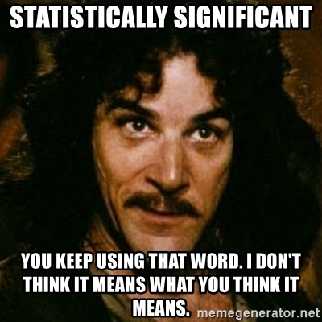

# Probability and Hypothesis Testing

> ... in which we reason about the nature of randomness and
  discover various statistical tests.

:::{.video-container}
<iframe class="video" src="https://www.youtube.com/embed/LBU22HxJm6I?vq=hd1080" allowfullscreen></iframe>
:::

## Motivation

```{r}
library(tidyverse)
```

In the first four lectures we covered the fundamentals of handling data with R.
Now, we will shift our focus away from the **how** and towards the **why** of
data analysis. We will talk about different statistical tests, common mistakes,
how to avoid them and how to spot them in other research. But of course, we will
do so using R. So you will still learn one or the other useful function or
technique along the way. In most instances it should be clear when I use R
solely to demonstrate an idea from statistics and the code is just included for
the curious, or whether the code is something you will likely also use for your
own analysis. I am open for questions if things are unclear in any of the two
cases. For purely aesthetic code I might also speed up the typing in the edit.

For the longer text parts it might be helpful to look at the script while watching the video or pause frequently to take your own notes (Rmarkdown is great for your lecture notes as well!).


## Statistically Significant...

> ...you keep using that word. I don't think it means what you think it means.



You will hear the phrases "statistically significant", "significant" or even
"very significant" thrown around quite a bit in academic literature . And while
they are often used carelessly, they have a clearly defined meaning. A meaning
we will uncover today. This meaning is related to the concept of so called
p-values, which have an equally bad reputation for frequently being misused. The
p in p-value stands for **probability**, so in order to understand p-values, we
need to understand probability and learn how to deal with randomness, chance, or
luck if you will. So...

## Getting our Hands dirty with Probability

> To understand statistics means understanding the nature of randomness first.

```{r chess-board, fig.cap="A ggplot chessboard", echo=FALSE, fig.asp=1, fig.width=3}
n = 8
crossing(x = 1:n,
         y = 1:n) %>%
  mutate(f = xor((x %% 2 == 0), (y %% 2 == 0))) %>% 
  ggplot(aes(x, y, fill = f)) +
  geom_tile() +
  coord_equal() +
  scale_fill_manual(values = c("#388e00", "#122a00")) +
  theme_void() +
  guides(fill = "none")
```

Say you and you friend are playing a game of chess, when your friend proudly
proclaims:\
"I am definitely the better player!".\
"Proof it!", you reply.\
"That's easy", she says: "I won 7 out of the 8 rounds we played to today."\
"Pah! That's just luck." is your less witty and slightly stubborn response.

As expected, we shall be using R to resolve this vital conflict.


### Definitions: Hypothesis

Both of you involuntarily uttered an hypothesis, a testable assumption. And we
want to test these hypothesis using statistics. The first hypothesis ("I am the
better player.") is what we call the **alternative hypothesis** ($H_1$). The
name can be a bit confusing, because most often, this is your actual scientific
hypothesis, the thing you are interested in. So, alternative to what? It is
alternative to the so called **null hypothesis** ($H_0$), which is the second
statement ("This is just luck"). The null hypothesis provides a sort of baseline
for all our findings. It usually goes along the lines of "What if our
observations are just based on chance alone?", where "chance" can be any source
of random variation in our system.

The tricky part is that there is no way to directly test the alternative
Hypothesis, all we can test is the null hypothesis. Because for any null
hypothesis we discard, there are always multiple alternative hypothesis that
could explain our data. In our example, even if we end up discarding the idea of
our friend's chess success being only down to luck, this does not prove the
alternative hypothesis that she is the better player (she could still be
cheating for example). Do keep this in mind when we transfer this to a more
scientific setting. Just because we show that something is unlikely to have
arisen by chance does not mean that your favorite alternative hypothesis is
automatically true.

So, after these words of warning, let's test some null hypothesis!

### Testing the Null Hypothesis with a Simulation

We will start off by building a little simulation. Before testing any
hypothesis, it is important to have defined $H_0$ and $H_1$ properly, which we did in
the previous section. But we need to be a little more specific. Winning by
chance would entail a completely random process, which we can model with a coin
flip. R has the lovely function `sample` to take any number of things from a
vector, with or without replacement after taking each thing:

```{r}
coin <- c("heads", "tails")
sample(coin)
```

Not giving it a number of things to draw just shuffles the vector, which is
fairly boring in the case of just two tings. We can't sample 10 things from a
vector of only two elements

```{r, error=TRUE}
sample(coin, size = 10)
```

But we can, if we put the thing back every time:

```{r}
sample(coin, 10, replace = TRUE)
```

So, let's make this a little more specific to our question:

```{r}
winner <- c("you", "friend")
random_winners <- sample(winner, size = 8, replace = TRUE)
random_winners
random_winners == "friend"
1 + TRUE
```

```{r}
1 + FALSE
```


```{r}
sum(random_winners == "friend")
```

```{r}
mean(random_winners == "friend")
```

If we were to run this script a million times, the resulting proportion
of random wins for both of you would be very, very close to 50-50 because we
used a fair coin. However, we don't have the time to play this much Chess and we
sure don't have the money to run a million replicates for each experiment in the
lab. But here, in our little simulated world, we have near infinite
resources (our simulation is not to computationally costly).

> One trick used above: When we calculate e.g. a sum or mean,
  R automatically converts TRUE to 1 and FALSE to 0.
  
Let's create a function that returns a random number of wins your friend would have
gotten by pure chance for a number of rounds `N`.

```{r}
get_n_win <- function(N) {
  winner <- c("you", "friend")
  random_winners <- sample(winner, size = N, replace = TRUE)
  sum(random_winners == "friend")
}

get_n_win(8)
```

This number is different every time, so how does it change?

```{r}
result <- map_dbl(rep(8, 1000), get_n_win)
head(result)
```

A histogram is a type of plot that shows how often each value occurs in a
vector. Usually, the values are put into bins first, grouping close values
together for continuous values, but in this case it makes sense to just have one
value per bin because we are dealing with discrete values (e.g. no half-wins).
Histograms can either display the raw counts or the frequency e.g. as a
percentage. In ggplot, we use `geom_bar` when we don't need any binning, just
counting occurrences, and `geom_histogram` when we need to bin continuous
values.

```{r}
tibble(result) %>% 
  ggplot(aes(x = result)) +
  geom_bar() +
  labs(x = "N wins for friend",
       title = "Throwing a coin 8 times") +
  scale_x_continuous(breaks = 0:8)
```

As expected, the most common number of wins out of 8 is 4 (unless I got really
unlucky when compiling this script). Let us see, how this **distribution**
changes for different values of `N`. First, we set up a grid of numbers (all
possible combinations) so that we can run a bunch of simulations:

```{r}
simulation <- crossing(
   N = 1:15,
   rep = 1:1000
) %>% 
  mutate(
    wins = map_dbl(N, get_n_win)
  )
```

And then we use our trusty ggplot to visualize all the distributions.

```{r}
simulation %>% 
  ggplot(aes(wins)) +
  geom_bar() +
  facet_wrap(~N, labeller = label_both) +
  labs(title = "Flipping a coin N times")
```

With a fair coin, the most common number of wins should be half of the number of
coin flips. Note, how it is still possible to flip a coin 15 times and and not
win a single time. It is just very unlikely and the bars are so small that we
can't see them.

Let us go back to the original debate. The first statement: "I am better." is
something that can never be definitively proven. Because there is always the
possibility, no matter how small, that the same result could have arisen by pure
chance alone. Even if she wins 100 times and we don't take a single game from
her, this sort of outcome is still not *impossible* to appear just by flipping a
coin. But what we can do, is calculate, how likely a certain event is under the
assumption of the null hypothesis (only chance). And we can also decide on some
threshold $\alpha$ at which we reject the null hypothesis. This is called the
**significance threshold**. When we make an observation and then calculate that
the probability for an observation like this or more extreme is smaller than the
threshold, we deem the result **statistically significant**. And the probability
thus created is called the **p-value**.

From our simulation, we find the that probability to win 7 out of 8 rounds under
the null hypothesis is:

```{r}
simulation %>% 
  filter(N == 8) %>% 
  summarise(
    mean(wins >= 7)
  )
```
Which is smaller than the commonly used significance threshold of $\alpha=0.05$
(i.e. $5\%$). So with 7 out of 8 wins, we would **reject the null hypothesis**.
Do note that this threshold, no matter how commonly and thoughtlessly it is used
throughout academic research, is completely arbitrary.

### Getting precise with the Binomial Distribution

Now, this was just from a simulation with 1000 trials, so the number can't be
arbitrarily precise, but there is a mathematical formula for this probability.
What we created by counting the number of successes in a series of yes-no-trials
is a **binomial distribution**. For the most common distributions, R provides a
set of functions. the functions starting with `d` give us the probability
density function. In the case of discrete values like counting wins, this is
equivalent to the actual probability, but for continuous values we obtain the
probability by taking the integral. We get these integrals with the
corresponding functions starting with `p` (for probability).

```{r}
dbinom(x = 7, size = 8, prob = 0.5) 
```

This is the probability to win **exactly 7 out of 8** games. But what we wanted
was the probability for **7 or more out of 8**! So we move to the integral. This
part can get a bit confusing, because the default for `pbinom` is
`lower.tail = TRUE`, which according to the help page means that probabilities
it returns $P[X \le x]$.

```{r}
pbinom(q = 7, size = 8, prob = 0.5)
```

If we set `lower.tail` to `FALSE` , we get $P[X > x]$, so the probability for a
random variable X being bigger than a number x. So to get the probability that
we are interested in, we need to replace the 7 with a 6 as well:

```{r}
pbinom(q = 6, size = 8, prob = 0.5, lower.tail = FALSE)
```

Our simulation was pretty close! So the exact values agrees and we reject the
null hypothesis of both opponents being equally good.
Here is the full graph for the probability density function of the binomial
distribution.

```{r}
ggplot() +
  stat_function(fun = function(x) dbinom(x = x, size = 8, prob = 0.5),
                geom = "step",
                n = 9) +
  scale_x_continuous(n.breaks = 9, limits = c(0, 8))
```

And the integral, the probability $P[X \le x]$.

```{r}
ggplot() +
  stat_function(fun = function(q) pbinom(q = q, size = 8, prob = 0.5),
                geom = "step",
                n = 9) +
  scale_x_continuous(n.breaks = 9, limits = c(0, 8))
```

There is two more functions I want to showcase from this family. The third is the
so called **quantile function**. Quantiles divide a probability distribution
into pieces of equal probability. One example for a quantile is the 50th
percentile, also known as the median, which divides the values such that half of
the values are above and half are below. And we can keep dividing the two halves
as well, so that we end up with more quantiles. Eventually, we arrive at the
quantile function. It is the inverse of the probability function, so you obtain
it by swapping the axis.

```{r}
ggplot() +
  stat_function(fun = function(p) qbinom(p = p, size = 8, prob = 0.5),
                geom = "step",
                n = 9) +
  scale_x_continuous(n.breaks = 10, limits = c(0, 1))
```

Quantiles will also be useful for
deciding if a random sample follows a certain distribution
with quantile-quantile plots.

Lastly, there is always also an `r` variant of the function, which gives us any
number of random numbers from the distribution.

```{r}
rbinom(10, 8, 0.5)
```


### But how much better? Understanding Effect Size and Power, False Positives and False Negatives

We decided to abandon the null hypothesis that both players are equally good,
which equates to a 50% win-chance for each player. But we have not determined
**how much better** she is. And how much better does she need to be for us to
reliably discard the null hypothesis after just 8 games? The generalization of
the **how much better** part, the **true difference**, is called the **effect
size**.

Our ability to decide that something is statistically significant when there is
in fact a true difference is called the statistical **power**. It depends on the
effect size, our significance threshold $\alpha$ and the sample size $n$ (the
number of games). We can explore the concept with another simulation.

```{r}
reps <- 10000
simulation <- crossing(
  N = c(8, 100, 1000, 10000),
  true_prob = c(0.5, 0.8, 0.9)
) %>% 
  rowwise() %>% 
  mutate(
    wins = list(rbinom(n = reps, size = N,  prob = true_prob)),
  ) %>% 
  unnest(wins) %>% 
  mutate(
    p = pbinom(q = wins - 1, size = N, prob = 0.5, lower.tail = FALSE)
  )

head(simulation)
```

I also introduced a new piece of advanced dplyr syntax. `rowwise` is similar to
`group_by` and essentially puts each row into its own group. This can be useful
when working with list columns or running a function with varying arguments and
allows us to treat the inside of `mutate` a bit like as if we where using one of
the `map` functions. For more information, see [the documentation
article](https://dplyr.tidyverse.org/articles/rowwise.html).

It leaves us with `r format(reps)` simulated numbers of wins at N games for different
true probabilities of her winning (i.e. how much better our friend is). We then
calculate the probability to have this or a greater number of wins under the
null hypothesis (equal probability for win and loss), in other words: the
p-value.

```{r}
simulation %>%
  ggplot(aes(p)) +
  geom_histogram() +
  facet_wrap(~ true_prob + N,
             labeller = label_both,
             scales = "free_y",
             ncol = 4) +
  geom_vline(xintercept = 0.05, color = "red") +
  labs(x = "p-value",
       y = "frequency") +
  scale_y_continuous(breaks = NULL)
```

We notice a couple of things in this plot. As the number of games
played approaches very high numbers, the p-values for the
case where the null hypothesis is in fact true (both players have
the same chance of winning), start following a uniform distribution,
meaning for a true null hypothesis, all p-values are equally likely.
This seems counterintuitive at first, but is a direct consequence
of the definition of the p-value.
The consequence of this is, that if we apply our regular significance
threshold of 5%, by definition we will say that there is a true
difference, even though there is none (i.e. the null hypothesis is true
but we falsely reject it and favor of our alternative hypothesis).
This is called a **false positive**. By definition, we will get at
least $\alpha$ false positives in all of our experiments.
Later, we will learn, why the real number of false positives is
even higher.
Another name for false positives is **Type I errors**.

On the other side of the coin, there are also cases
where there is a true difference (we used winning probabilities
of 0.8 and 0.9), but we don't reject the null hypothesis because
we get a p-values larger than $alpha$.
These are all **false negatives** and their rate is sometimes
referred to as $\beta$.
Another name for false negatives is **Type II errors**.
People don't particularly like talking about negative things like errors,
so instead you will often see the inverse of $\beta$, the
**Statistical Power** $1-\beta$.
The proportion of correctly identified positives out of
the actual positives is also shown on the plot below.
For example, say her true win probability is 90%
and we play 8 games. If this experiment runs in an infinite
number of parallel universes, we will conclude that she is
better than chance in 80% of those.
We could set our significance threshold higher to detect
more of the true positives, but this would
also increase our false positives.

```{r}
simulation %>%
  group_by(true_prob, N) %>%
  summarise(signif = mean(p <= 0.05)) %>% 
  ggplot(aes(true_prob, signif, fill = true_prob == 0.5)) +
  geom_col(color = "black") +
  geom_text(aes(label = signif), vjust = -0.2) +
  facet_wrap(~N,
             labeller = label_both) +
  scale_y_continuous(expand = expansion(c(0, 0.1))) +
  scale_fill_viridis_d() +
  labs(y = "Proportion of significant results")
```

There are also packages out there, which have a function
to compute the power for the binomial test, but I think
the simulation was way more approachable.
The cool thing about simulations is also, that they work
even when there is no analytical solution, so you
can use them to play around when planning an experiment.

## P-Value Pitfalls

Let us look into some of the pitfalls of p-values.
Remember from the definition of p-values, that we will get
a significant result even if there is no true difference in
5% of cases (assuming we use this as our alpha)?
Well, what if we test a bunch of things?
This is called **Multiple Testing** and there is a problem
associated with it:

If you test 20 different things, and your statistical
test will produce a significant result by chance alone
in 5% of cases, the expected number of significant results is 1.
So we are not very surprised.
Speaking of surprised: In his book, available for free online,
["Statistics done wrong"](https://www.statisticsdonewrong.com/), Alex Reinhart
describes p-values as a "measure of surprise":

> »A p value is not a measure of how right you are,
  or how significant the difference is;
  it’s a measure of how surprised you should be if there is no actual difference
  between the groups, but you got data suggesting there is.
  A bigger difference, or one backed up by more data,
  suggests more surprise and a smaller p value.«
> --- Alex Reinhart [@reinhartStatisticsDoneWrong2015]

So, we are not very surprised, but if you focus to hard on
the one significant result, trouble ensues.
In a "publish or perish" mentality, this can easily happen,
and negative findings are not published nearly enough,
so most published findings are likely exaggerated.
John Bohannon showcased this beautifully by
running a study on chocolate consumption and
getting it published:
[I Fooled Millions Into Thinking Chocolate Helps Weight Loss. Here's How.](https://io9.gizmodo.com/i-fooled-millions-into-thinking-chocolate-helps-weight-1707251800)

What can we do about this?

### Multiple Testing Correction

The simplest approach is to take all p-values calculate
when running a large number of comparisons and
dividing them by the number of tests performed.
This is called the **Bonferroni correction**

```{r}
p_values <- c(0.5, 0.05, 0.3, 0.0001, 0.003)
p.adjust(p_values, method = "bonferroni")
```

Of course, this looses some statistical power
(remember, no free lunch).
A slightly more sophisticated approach to
controlling the false discovery rate (FDR)
is the Benjamini-Hochberg procedure. It retains
a bit more power. Here is what happens:

- Sort all p-values in ascending order.
- Choose a FDR $q$ you are willing to accept
  and call the number of tests done $m$.
- Find the largest p-value with:
  $p \leq iq/m$ with its index $i$.
- This is your new threshold for significance
- Scale the p-values accordingly

And this is how you do it in R:

```{r}
p.adjust(p_values, method = "fdr")
```

### Other forms of p-hacking

This sort of multiple testing is fairly obvious.
You will notice it, when you end up with a large
number of p-values, for example when doing a genetic
screening and testing thousands of genes.
Other related problems are harder to spot.
For a single research question there are often different
statistical tests that you could run, but trying
them all out and then choosing the one that best
agrees with your hypothesis is not an option!
Likewise, simply looking at your data is a form of
comparison if it influences your choice of statistical test.
Ideally, you first run some exploratory experiments
that are not meant to test your hypothesis, then
decide on the tests you need, the sample size you
want for a particular power and then run the actual
experiments designed to test your hypothesis.

At this point, here is another shout-out to
Alex Reinharts book [@reinhartStatisticsDoneWrong2015].
It is a very pleasant read
and also shines more light on some of the other
forms of **p-hacking**.

## Bayesian Statistics and the Base Rate Fallacy

There is another more subtle problem called the
base rate fallacy. As an example, we assume
a medical test, testing for a certain condition.
In medical testing, different words are used
for the same concepts we defined above^[This is a slightly annoying trend
in statistics; as it enters different fields, people come
up with new names for old things
(perhaps the most notorious field for this is
machine learning).].

Here, we have:

- Sensitivity = Power = true positive rate = $1-\beta$
- Specificity = true negative rate = $1-\alpha$

Let us assume a test with a
sensitivity of 90% and a specificity
of 92%. When we visit the doctor to
get a test, and get a positive result,
what is the probability, that we are in
fact positive (i.e. a true positive)?
Well, the test has a specificity of 92%,
so if we where negative, it would have detected
that in 92% of cases, does this mean, that we can
be 92% certain, that we are actually positive?

Well, **no**. What we are ignoring here
is **base rate**, which for diseases is called
the **prevalence**. It is the proportion at
which a disease exists in the general population.

So, let us say, we are picking 1000 people
at random from the population and testing
them. We are dealing with a hypothetical
condition that affects 1% of people,
so we assume 10 people in our sample to be positive.
Of those 10 people, 9 will be tested positive
(due to our sensitivity),
those will be our true positives.
The remaining 1 will be a false negative.
However, we are of course also testing
the negatives (if we knew ahead of time
there would be no point in testing) and of
those due to our specificity, 8% will also be
tested positive, which is 0.08 * 990, so
we get 79 false positives.
Because there are so many negatives in our
sample, even a relatively high specificity
will produce a lot of false positives.
So that actual probability of being
positive with a positive test result is

$$\frac{true~positives}{true~positives + false~positives}=10\%$$

```{r, echo = FALSE}
total <- 1000
positives <- 10
negatives <- total - positives
sensitivity <- 0.9
specificity <- 1 - 0.08
true_positives  <- sensitivity * positives
false_positives <- (1 - specificity) * negatives
p_positive <- true_positives / (true_positives + false_positives)

colors = c("detected positives" = "darkred",
           "not detected positives (false negatives)" = "red",
           "false positives" = "palevioletred1",
           "true negatives" = "white")


tibble(
  parts = c("detected positives",
            "not detected positives (false negatives)",
            "false positives",
            "true negatives"),
  vals = c(true_positives,
           positives - true_positives,
           round(false_positives),
           negatives)
) %>% 
  ggplot(aes(values = vals, fill = parts)) +
    waffle::geom_waffle(color = "black", n_rows = 10) +
    theme_void() +
    scale_fill_manual(values = colors) +
    theme(legend.position = "bottom") +
    guides(fill = guide_legend(title = "")) +
  coord_equal()
```

Formally, this is described by Bayes's Formula

$$P(A|B)=\frac{P(B|A)*P(A)}{P(B)}$$

Read: The probability of A given B is the probability
of B given A times the probability of A divided by
the probability of B.

In bayesian statistics, the prevalences are known
as **priors**.

## Concepts discussed today

After today you should be familiar with the following concepts:

- Null and alternative hypothesis
- P-values and statistical significance
- Binomial distribution
- Probability density, probability and quantile functions
- Effect size and statistical power
- False positives, false negatives
- Multiple testing and p-hacking
- Bayes's Theorem

## Exercises

## An Fair Coin

We have a regular old coin and flip it 100 times.
Given a significance threshold $\alpha$ of 0.05,
with what probability do we (mistakenly) reject the null hypothesis i.e.
conclude that the coin is not fair even though it is?
Can you show this with a simulation?
As a tip I can tell you that due to the vectorized nature
of the functions involved you won't need a `map` or loop.
The shortest version I could think of uses only 3 functions.

## An Unfair Game

We are playing a game where you have to roll the most sixes in order to win.
Someone is trying to fool us and is using a loaded die.
The die is manipulated such that the chance of rolling
a six is 35% instead of the usual 1/6.
At the same significance threshold as above, what is the
chance of us rejecting the null hypothesis (= a fair die)
and thus concluding correctly that we are being tricked
after rolling the die 20 times?
You will have to run a simulation here again.

## Discovering a new Distribution

The binomial distribution was concerned with sampling
with replacement (you can get head or tails any number
of times without using up the coin). In this exercise
you will explore sampling **without** replacement.
The common model for this is an urn with two
different colored balls in it.
The resulting distribution is called the
**hypergeometric distribution** and the
corresponding R functions are `<r/d/p/q>hyper`

- Imagine you are a zoo manager.
  - We got a gift from another zoo! It consists
    of 8 red pandas and 2 giant pandas.
    What is the probability that they end up
    properly separated, if we randomly take 8 animals,
    put them in one enclosure and put the rest in another?
  - Our penguin colony hatched eggs and we have
    a bunch of newcomers. We have have 15 males and
    10 females. If we look at a random subset of
    12 penguins, what does the distribution of the
    number of males look like? Which number is most
    likely? How likely is it, to get at least
    9 males in the sample?

## Resources

- <https://www.tandfonline.com/doi/full/10.1080/00031305.2016.1154108>
- <https://jimgruman.netlify.app/post/education-r/>
- [P-Value histograms blogpost by David Robinson](http://varianceexplained.org/statistics/interpreting-pvalue-histogram/)
- ["Statistics done wrong"](https://www.statisticsdonewrong.com/)

