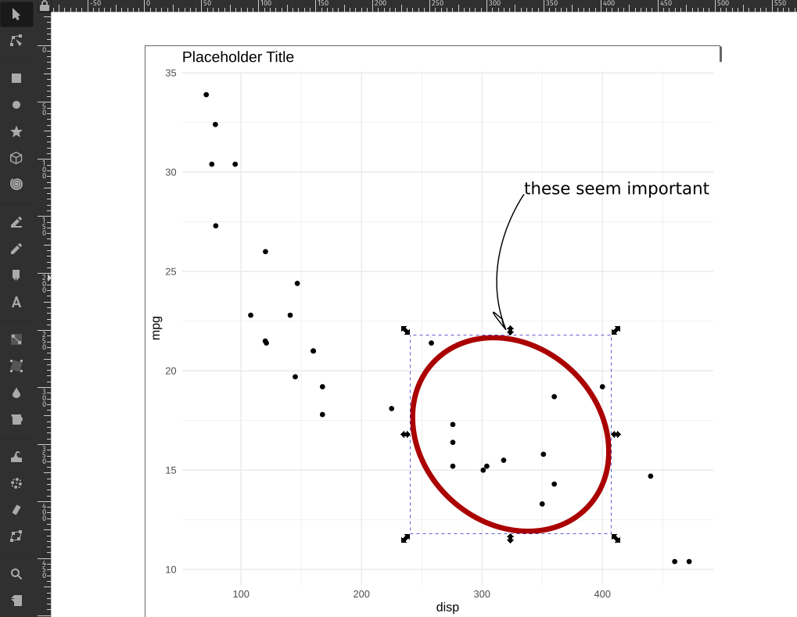

# Fallacies

> ... in which we hear Stories of Warplanes,
  Correlation and Regression and explore the Datasaurus Dozen.

::: {.video-container}
<iframe class="video" src="https://www.youtube.com/embed/VYLAxbt9Izk" allowfullscreen></iframe>
:::


```{r}
library(tidyverse)
```

## Data Considerations

### 1943

1943\. The second World War is well underway, ravaging large parts of Europe.
Military aircraft that had first entered the stage in World War I are now
reaching their peak importance as they rain fire from the skies. But the Allied
forces are facing a problem. As warplanes get better, so do anti-aircraft
systems. In an effort to improve the survival of their fleet, the US military
starts examining the planes returning from skirmishes with the opposing forces.
They characterize the pattern of bullet holes in the metal hull, meticulously
noting down each hit that the plane sustained. The resulting picture is better
summarized in the modern, redrawn version in figure \@ref(fig:surv). We will
look at it in just a second, but before we do, let me preface this one by
stressing the reach of what we will find.

The effect in question has an invisible hand in the laboratory results you
create, in the advice people give and is the reason why you don't get rich after
reading books by people telling you how to get rich. It is the pervasive
mechanism that powerful people often don't want to admit exists.

(ref:surv) Figure from Wikipedia [@SurvivorshipBias2020].

```{r surv, fig.cap="(ref:surv)", echo=FALSE}
include_graphics("images/survivorship-bias.png")
```

After taking a look at the data they gathered, the military is ready to rush
into action. To improve the endurance of their aircraft, the plan is to
reinforce the parts of the plane that were most often hit by bullets. With
stronger wings and a sturdier body of the plane, they think, surely more pilots
will come back from their missions safely. They were wrong.

### The Story of Abraham Wald

But the pilots where in luck. The military also consulted with the Statistics
Research Group at Columbia University. A man named Abraham Wald worked there. In
his now unclassified report "A method of estimating plane vulnerability based on
damage of survivors", he argued against the generals
[@waldReprintMethodEstimating1980]. Instead of the most-hit parts of the planes,
the least-hit parts are to be reinforced.

![Cover of "A method of estimating plane vulnerability based on damage of
survivors" [@waldReprintMethodEstimating1980]](images/paste-57122EF0.png)

> Instead of the most-hit parts, the least-hit parts are to be reinforced.

The reason for this seemingly counterintuitive result is what is now known as
*survivorship bias*. The data that was collected contained only survivors, those
planes that sustained damage not severe enough to hinder them from coming back
after their mission. The aircraft that where hit in other places simply didn't
make it back. Consequently, Wald advised to reinforce the engines and the fuel
tanks.

### Thinking further

This is but one of a multitude of biases, specifically a selection bias, that
will influence the quality of the inferences you can draw from available data.
Keep in mind, data is not objective and never exists in a vacuum. There is
always context to consider. The way the data was collected is just one of them.
A lot of these ideas seem obvious in hindsight, which incidentally is another
bias that social psychologists call *hindsight bias*, but they can sometimes be
hard to spot.

A common saying is that music was better back in the days, or that all the old
music still holds up while the new stuff on the radio just sounds the same.
Well, not quite. This is also survivorship bias at work. All the bad and
forgettable songs from the past just faded into oblivion, never to be mentioned
again, while the songs people generally agreed to be good survived the ravages
of time unscathed. A similar happens with success in general, not just songs. If
you ask any CEO high up the corporate ladder, a millionaire or the author of a
book that reads "How to get rich", they are sure to have a witty anecdote about
how their persistence or their brilliance or charisma got them to where they are
now. What we are not seeing is all the people just as witty, just as charismatic
or even just as persistent that where simply not as lucky. Very few people will
tell you this. Because it takes a whole lot of courage to admit that ones
success is based on luck and privilege.

And to take it back to the scientific context: When you are planning an
experiment for the lab, always ask whether your data collection process can in
some way be biased towards what you are trying to show.

I leave you with this:

```{r, echo=FALSE}
tweetrmd::include_tweet("https://twitter.com/jakevdp/status/1336343740235935744")
```

And from this cautionary tale we jump straight back into RStudio.

## Miscelaneous

To ease back into R programming, let's look at some small but helpful things
that might otherwise be missed on the sidelines.

### Glue

First up is the `glue` package. Using `paste` to create a text in which the
values of variables are inserted can be painful. The `glue` package makes it a
breeze. Everything inside of curly braces in the text inside of the `glue`
function will be evaluated as regular R code, enabling us to write text quite
naturally:

```{r}
library(glue)
glue("1 + 1 is {1 + 1}")
```

I hope you are not too confused by the package and it's main function having the
same name.

```{r}
value <- 0.04
glue("With a p-value of {value}!")
```

Another thing I want to briefly mention was already hinted at, when I talked
about graphics devices.

### SVGs

Generally, there are those devices that produce pixel graphics where the
information is stored as color values of the pixels.
These are called raster devices. `ragg`, which I showed you
last week, provides some of them. When you zoom into raster images,
you can see the texts and shapes getting pixely or blurry. Another way to store
information about graphs is to write a mathematical description of the lines and
other shapes in the plot, which will then be interpreted by the program with
which you open the vector graphic. Let me show you the most popular one called
**Scalable Vector Graphics** (svg).

```{r}
example <- ggplot(mtcars, aes(disp, mpg)) +
  geom_point() +
  labs(title = "Placeholder Title")

ggsave("results/plots/example.svg", example)
```

If you get `Error in loadNamespace(name) : there is no package called ‘svglite’`
you will have to install the mentioned package first.

You can now open the svg file with e.g. your browser to preview it. Some image
display software will also preview it. Notice, how you can zoom in without
loosing clarity. However, the more points and shapes your plot has, the more you
computer will have to work to preview it and the file gets bigger than a
comparable pixel graphics like png.

I am showing you svgs specifically, because it takes time to master all the
intricacies of ggplot, for example to create annotation. And I don't want to
leave the impression that everything **has** to be done with pure R. Sure, from
a reproducibility standpoint, being able to replicate all your plots and even
the complete research report via Rmarkdown at the press of a button is great and
should be the ultimate goal. But no one ever started out as an expert. And
connecting with tools you already know is an important step.

So, for example, we could open up the svg file with the vector editor
**inkscape**, which is also open source software, to add a different title and
annotate some points.



But a word of **Warning**: When you do this, there is nothing from preventing
you to also modify, move or scale the actual datapoints and other important
parts that are vital to convey the correct information. So be extra careful when
you do this.

### Best Practices

Speaking of being careful. There is one rule I can give you
to make your data analysis more secure:

> **Your raw data is sacred!** Do not ever modify it or
  save over it.

This is even more important when,
for example, using excel to preview a csv file.
Under no circumstances should you hit the save button
in excel when you are looking at the raw data.
With approximately one-fifth of genomic research papers containing
errors in the gene lists, because excel converted genes
such as _SEPT2_ (Septin 2) into dates, you can see why [@ziemannGeneNameErrors2016].
Biologists have since given up and renamed the genes that
where commonly converted into dates... but the point still stands.
This caution is of course also necessary when analyzing data
with R, not just excel. When we read in the raw data and
save a processed version, we create a new file, or even
better, a new folder for it. A good convention for example
would be do divide your data into a `raw` and `derived` folder.

## Covariance, Correlation and Regression


Last week, we talked about a measure of the spread of a
random variable called the **variance**.

$$var(X) = \frac{\sum_{i=0}^{n}{(x_i-\bar x)^2}}{(n-1)}$$

Today, we are extending this idea to 2 random variables.
Because the normal distribution is so common, we are using
two normally distributed variables.
For the fun of it, they will have different means and
standard deviations (remember: SD is the square-root of the variance).

```{r}
N <- 50
df <- tibble(
  x = rnorm(N, 1, 0.8),
  y = rnorm(N, 3, 1.2)
)

m_x <- mean(df$x)
m_y <- mean(df$y)

ggplot(df, aes(x, y)) +
  geom_vline(xintercept = m_x, alpha = 0.8, color = "darkviolet") +
  geom_hline(yintercept = m_y, alpha = 0.8, color = "darkviolet") +
  geom_point() 
```

We also added lines for the
means of the two random
variables. Maybe I should have mentioned
this more clearly earlier on,
but the general convention in statistics is that random variables
are uppercase and concrete values from the distribution have the
same letter but lowercase.

We now get the **covariance** of X and Y as:

$$cov(X,Y)=\text{E}\left[(X-\text{E}\left[X\right])(Y-\text{E}\left[Y\right])\right]$$

The expected value $E[X]$ is just a fancy way of saying
the mean of X.
If we asses the contribution of individual points towards the
covariance, we can understand it quite intuitively.
A point that has a higher x than the mean of X and a higher
y than the mean of Y (top right quadrant) will push the covariance towards
positive values. Likewise, a point in the bottom left quadrant
will have negative differences with the X and Y mean, which cancel
each other out to result in a positive covariance.
The bottom right and top left quadrants push towards a negative
covariance. A mix of positive and negative contributions will
result in a covariance with a small absolute value.

The covariance has one problem: It will have weird units
(X times Y) and the scale is different depending on the random
variables.
So what we do is standardize it by dividing by both standard
deviations and get the **correlation coefficient**:

$$corr(X,Y)=\frac{cov(X,Y)}{\sigma_{X}\sigma_{Y}}$$

It can assume values between -1 and 1. It's full name is
_Pearson product-moment correlation coefficient_, or
_pearsons R_. We can square it to get $R^2$ (obviously),
which indicates the strength of the correlation with
values between 0 and 1 independent of the direction.
We will meet it again later.

Let us apply our knowledge to a new dataset.

### Introducing the Dataset

The `dplyr` package includes and example dataset of Star Wars
characters. Unfortunately, it was created a while ago,
so the is no baby yoda, but 87 other characters are present.


```{r, eval=FALSE}
starwars
```

```{r, echo=FALSE}
starwars %>% paged_table()
```

Let's look at some correlations:

### Pearson vs. Spearman (not a Boxing Match)

To compute pearsons correlation, we use the `cor` function in R.
Instead of filtering out `NA` values beforehand,
which would result in a correlation of `NA`, we can use
`use = "complete.obs"` to ignore the `NA` is in the computation.

```{r}
pearson <- cor(starwars$mass, starwars$height, use = "complete.obs")
pearson
```

There is another way we can specify which features to correlate.
`corr` also takes a matrix or data frame as it's x argument instead
of x and y:

```{r}
corr_matrix <- cor(starwars[c("mass", "height")], use = "complete.obs")
corr_matrix
```

This is known as a correlation matrix, and we can create it for
more than two features, as long as all features are numeric
(after all, what is the correlation between 1,4 and "cat" "dog"?).
If you need this for your analysis, it will be handy to know
how to convert this  matrix to a tibble:

```{r}
as_tibble(corr_matrix)
```

Looses the information about the rownames, because tibbles
have no rownames. However, we can tell `as_tibble` to create
a new column out of what previously where rownames.

```{r}
as_tibble(corr_matrix, rownames = "feature1")
```

Now we could even turn it into a tidy format to make a heatmap:

```{r}
as_tibble(corr_matrix, rownames = "feature1") %>% 
  pivot_longer(-feature1, names_to = "feature2", values_to = "corr") %>% 
  ggplot(aes(feature1, feature2, fill = corr, label = corr)) +
  geom_raster() +
  geom_text(color = "white")
```

If you are working a log with correlations, it is certainly
worth checking out the `corrr` package from the tidymodels framework:
<https://corrr.tidymodels.org/>

Apart from `cor`, there is also `cor.test`, which gives more information. 

```{r}
cor_test <- cor.test(starwars$mass, starwars$height, use = "complete.obs")
cor_test
```

If we so fancy, we can use `broom` to turn the test output into
a tidy format as well:

```{r, eval=FALSE}
broom::tidy(cor_test)
```

```{r, echo=FALSE}
broom::tidy(cor_test) %>% paged_table()
```

When I first did this I was surprised that the correlation was so
low. We are after all talking about height and mass, which
I assumed to be highly correlated.
Let us look at the data to see what is going on.

```{r}
label_text <- glue("Pearson correlation: {round(pearson, 2)}")

jabba <- filter(starwars, str_detect(name, "Jabba"))
jabba_text <- list(x = 1100, y = 120)

starwars %>% 
  ggplot(aes(mass, height)) +
  geom_point() +
  annotate(geom = "text", x = 500, y = 75, label = label_text,
           hjust = 0) +
  annotate(geom = "curve",
           x = jabba_text$x, y = jabba_text$y,
           xend = jabba$mass, yend = jabba$height,
           curvature = .3,
           arrow = arrow(length = unit(2, "mm"))) +
  annotate(geom = "text",
           x = jabba_text$x,
           y = jabba_text$y, label = "Jabba the Hutt",
           hjust = 1.1) +
  xlim(0, 1500) +
  labs(x = "mass [kg]",
       y = "height [cm]")
```

This is the culprit! We have a massive outlier,
in all senses of the word "massive". At this point
it is fair to say, Jabba the Hutt could use some workout
to loose weight.
Luckily, there is another method to asses correlation.
Spearman's method is more resistant to outliers,
because the data is transformed into ranks first,
which negates the massive effect of outliers.
Visually, this is what the points look like
after rank transformation:

```{r}
spearman <- cor(starwars$mass, starwars$height,
                method = "spearman",
                use = "complete.obs")

label_text <- glue("Spearman rank correlation: {round(spearman, 2)}")

starwars %>% 
  mutate(mass = rank(mass),
         height = rank(height)) %>% 
  ggplot(aes(mass, height)) +
  geom_point() +
  annotate(geom = "text", x = 0, y = 75, label = label_text,
           hjust = 0) +
  labs(x = "rank(mass)",
       y = "rank(height)")
```

### Linear Regression

Finally, linear regression is
a related concept, because both correlation and
linear regression quantify the strength of a linear
relationship. However, there are key differences.
When we fit a linear model like `y ~ a + b * x`,
there is no error in x. We assume x is something that
is fixed, like the temperature we set for an experiment
or the dosage we used. Y on the other hand is a random
variable. In `cov(X,Y)` and `cor(X,Y)`, X and Y are both random variables,
usually things we observed, not set ourselves.

While the correlation coefficient is symmetrical and translation-scale-invariant,
meaning $corr(X,Y)=corr(Y,X)$ and $corr(X,Y)=corr(X * a +b,Y * c + d)$,
linear models are not!

In the `data` folder we find the IMDB ratings for 10
Star Wars movies (plus more features). 

```{r}
starwars_movies <- read_rds("data/07/starwars_movies.rds")
starwars_movies
```

We can fit a linear model to see if the production year
has an effect on the rating.

```{r}
model <- lm(imdbRating ~ year, data = starwars_movies)

broom::augment(model) %>%
  ggplot(aes(year, imdbRating)) +
  geom_smooth(method = "lm", alpha = 0.3, color = "darkviolet") +
  geom_point() +
  geom_segment(aes(x = year, y = .fitted,
                   xend = year, yend = imdbRating),
               alpha = 0.4)
```

What I added here as gray segments are the so called **residuals**.
They are what makes linear regression work.
It's full name is **Ordinary Least Squares** and the squares in
question are the squares of these residuals, the word _least_
indicates that these squares are minimized in order to find the
best fit line.

> I am yet to encounter _Extraordinary_ Least Squares
  but I am sure someone in machine learning will soon
  need more words to fuel the hype and it will become a thing.

```{r}
broom::tidy(model)
```

Looks like every year decreases the estimated rating by 0.03.

One thing however is the same between correlation and
linear regression, and that is the $R^2$ value we get
from both calculations:

```{r}
summary(model)
```

We can interpret $R^2$ as the fraction of the variance of
the response variable y that can be explained by the
predictor x.

## Non-linear Least Squares

So far, we only properly dealt with linear relationships
and now it is time to get non-linear.
We will be creating a mechanistically driven
predictive model, so we have a formula of which
we want to adjust the parameters so that it fits our data.

Let's take classical Michaelis-Menten-Kinetics
There is a dataset for enzyme reaction rates included in R.
But we convert it from a 
dataframe to a tibble so that it prints
nicer:

```{r}
as_tibble(Puromycin)
```

The initial rate $v_0$ of the an
enzymatic reaction was measured
for a control and a sample treated
with puromycin at different substrate
concentrations.
For every concentration we
have two replicates except for
one missing replicate.
We can make this explicit so
that we can keep track of the replicates:

```{r}
puro <- as_tibble(Puromycin) %>% 
  group_by(conc, state) %>% 
  mutate(rep = 1:n()) %>% 
  ungroup()
```

Now we can plot the individual curves.

```{r}
puro %>% 
  ggplot(aes(conc, rate,
             group = paste(rep, state),
             color = state)) +
  geom_line() +
  geom_point()
```

From our Biochemistry studies, we know
that we can express the rate depending
on the concentration with the following
formula:

$$rate=\frac{(Vm * conc)}{(K + conc)}$$

To make it easier to work with, let's
turn it into a function:

```{r}
rate <- function(conc, Vm, K) {
  (Vm * conc) / (K + conc)
}
```

Let's pick some arbitrary starting values.
For example, we see that the maximal velocity
could be around 200.
We also know that K is the concentration at which the half-maximal
velocity is reached.

```{r}
puro %>% 
  ggplot(aes(conc, rate,
             color = state)) +
  geom_line(aes(group = paste(rep, state))) +
  geom_point() +
  geom_function(fun = ~ rate(conc = .x, Vm = 200, K = 0.2),
                color = "black")
```

`geom_function` expects a function of x or an anonymous function
where the first argument is the values on the x-axis,
so this is what we did.
Well, I bet we can do better than guessing the function!
What R can do for us is the same it did for linear least squares
and that is minimizing the distance of our curve to the
datapoints.
This is the job of the `nls` function, which stands for
**Nonlinear Least Squares**.

```{r}
model <- nls(rate ~ rate(conc, Vm, K),
    data = puro,
    subset = state == "treated",
    start = list(K = 0.1, Vm = 200))

model
```

NlS needs starting values, so we use any guess that isn't too far off.
If it is completely wrong, the model doesn't know in which direction it
should move the parameters to improve the fit and we get an error like this:
`Error in nls(rate ~ rate(conc, Vm, K), data = puro, subset = state ==  : singular gradient`

> For this special case, R also has a self-starting model. I won't go
  into it because it is not as useful as the general concept of fitting
  arbitry functions, but you can check out `SSmicmen` for a model that
  estimes the starting values automatically.

Additionally, `nls` takes an argument `subset`, which works
just like the `dplyr` verb `filter` so that we can fit
the model on a subset of the data without having to create it beforehand.

There are now multiple ways of displaying our model.
With `broom::augments` we can add the predictions to
the original data (which is just the treated state):

```{r}
broom::augment(model) %>% 
  ggplot(aes(conc, rate)) +
  geom_point() + 
  geom_line(aes(y = .fitted))
```

But this has the obvious disadvantage of only adding
a point (or a nick in the line) where we previously
had datapoints. We have the parameters and the complete
function, so we can calculate an arbitrary amount of values
in between to make a smooth function.

```{r}
broom::tidy(model)
```

So  we could pull the estimates of K and Vm out with broom and
then use them in our function.
Or, we make use of the `predict` function.
It takes a model and some new data and generates the predicions.
If we don't give it new data, we just get predictions for the 
data that we used to fit the model.

```{r}
predict(model)
```

```{r}
predictions <- tibble(
  conc = seq(0, 1, by = 0.01),
  rate = predict(model, newdata = list(conc =  conc))
)

puro %>% 
  filter(state == "treated") %>% 
  ggplot(aes(conc, rate)) +
  geom_point() +
  geom_line(data = predictions, color = "darkviolet")
```

We can also use a combination of this and `geom_function`,
which I think feel pretty natural once you are comfortable
with writing functions on the fly.

```{r}
puro %>% 
  filter(state == "treated") %>% 
  ggplot(aes(conc, rate)) +
  geom_point() +
  geom_function(fun = ~ predict(model,
                                newdata = list(conc = .x)),
                color = "darkviolet")
```

Now, what if we want to fit the model for both states?
We can resort back to our trusty `purrr` package like
we did in an earlier lecture.

```{r}
puro_models <- puro %>% 
  nest(data = c(-state)) %>% # updated to reflect new `nest` syntax
  mutate(
    model = map(data, ~ nls(rate ~ rate(conc, Vm, K), data = .x,
                            start = list(Vm = 200, K = 0.1))),
    tidy = map(model, broom::tidy),
    glance = map(model, broom::glance)
  )

puro_models
```

Now we can inspect the estimated parameters with ease:

```{r}
puro_models %>% 
  unnest(tidy)
```

And check how the models performed. Unfortunately, I can't
get into these performance metrics because time is short.

```{r}
puro_models %>% 
  unnest(glance)
```

Now, we could use the estimated parameters to or the
models with `predict` to plot all (well, both) model
fit lines over the original data, but there is an easier way.
`geom_smooth` can take "nls" as a method as well, we
just need to make sure to pass the correct arguments.
And it can be confusing, because when we are specifying
the formula in `geom_smooth`, it always needs to be 
a formula of `y ~ x`, whereas in the normal `nls` we did
earlier, we specified the variables in terms of their
actual names (`rate` and `conc`).

```{r}
puro %>% 
  ggplot(aes(conc, rate, color = state)) +
  geom_point() +
  geom_smooth(
    method       = "nls",
    formula      = y ~ rate(conc = x, Vm = Vm, K = K),
    method.args  = list(start = list(Vm = 200, K = 0.1)),
    se           = FALSE
  )
```

We also need `se = FALSE`, because by default R would
try to plot a confidence interval around the fit-line
like it did for the linear model, but `nls` doesn't return one,
so we would get an error.

The unfortunate thing about this method is that we end up
fitting the model twice, once to get the estimated parameters
and the likes for ourselves and a second time in ggplot
to display the fitted lines. But in most cases this is not
a problem, because the model is not very computationally expensive.

## Exercises

## The Datasaurus Dozen

The Datasaurus Dozen [@matejka2017] is a dataset
crafted to illustrate certain concepts.
It can be accessed from R via the `datasauRus` package.

```{r, eval=FALSE}
datasauRus::datasaurus_dozen
```

- Explore the dataset before looking at the publication
  above (it contains spoilers...):
  - It actually contains 13 different datasets,
    denoted by the column `dataset`, in one tibble.
    What are the means for x and y for the different datasets?
    What are the standard deviations for x and y for the different datasets?
    What are the correlations coefficients for the different datasets?
    I bet you notice a pattern by now.
  - Now create one (or multiple) scatterplots of the data.
    What do you notice? what conclusions do you draw from this observation?
    
There is another dataset in the package to illustrate a different
point:

```{r, eval=FALSE}
datasauRus::box_plots
```

- First, turn it into a tidy format, much like the `datasaurus_dozen`
  tibble.
- Now, visualize the distributions of the values for the
  5 different groups. Try out different versions of your plot
  until you are satisfied, but be sure to also include a boxplot
  and compare it to your approaches.

## Preparing for the Christmas Special

- What datasets would you find interesting? Maybe you
  already have some data you collected or maybe just an
  idea (in the second case I might also do an episode
  on getting data from the internet via webscarping),
  or maybe there is a dataset in the tidytuesday repository
  that speaks to you: <https://github.com/rfordatascience/tidytuesday>


