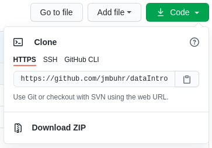
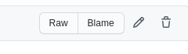

--- 
title: "Introduction to Data Analysis with R"
author: "Jannik Buhr"
date: "`r Sys.Date()`"
site: bookdown::bookdown_site
documentclass: book
bibliography: [book.bib, packages.bib]
csl: chicago-fullnote-bibliography.csl
url: "https://jmbuhr.de/dataintro/"
favicon: "favicon.png"
link-citations: false
description: "This is where you will find all the resources for the course Introduction to Data Analysis with R"
---

```{r setup, include=FALSE}
options(tidyverse.quiet = TRUE)
library(knitr)
library(rmarkdown)

knitr::opts_chunk$set(
  # cache = TRUE,
  out.width = "100%",
  echo = TRUE,
  message = FALSE,
  warning = FALSE,
  comment = "",
  paged.print = TRUE
)
```

# Hello and welcome! {- #welcome}

... to the latest iteration of my introductory R course, where we will learn to analyse data in style.

::: { .alert .alert-info}
**Current course dates**\
WS21/22\
21.10.21 – 09.12.21\
Lecture online in your own time\
Seminar weekly on Fridays at 9:15 – 10:45\
Sign-up (Heidelberg University): see [discord](#discord)\
Language: Lectures are in English but the seminar can be in German if you choose so
(and in any case you can always ask questions in German as well).
:::

::: {.video-container}
<iframe class="video" src="https://www.youtube.com/embed/GguzPRquTLI" allowfullscreen></iframe>
:::

::: { .alert .alert-dark}
**Warning**: This site is still under development, as I am restructuring some of the lectures to further improve the learning experience.

If you are curious ahead of time about my style of teaching and the topics covered, check out the website for the previous year here: <https://jmbuhr.de/dataIntro20/>
:::

In this course, we will handle different kinds of data, create pretty and insightful visualizations, compute different statistics on our data and also explore what these statistical concepts mean.
From penguins to p-values, I got you covered.

```{r cover-plot, echo=FALSE, fig.cap="One of the plots we will be creating in the first lecture."}
library(tidyverse)
library(palmerpenguins)

penguins %>%
  filter(complete.cases(.)) %>% 
  ggplot(aes(flipper_length_mm, bill_length_mm,
                     color = species,
                     shape = sex)) +
  geom_point(size = 2.5) +
  geom_smooth(aes(group = species), method = "lm", se = FALSE,
              show.legend = FALSE) +
  labs(x = "Flipper length [mm]",
       y = "Bill length [mm]",
       title = "Penguins!",
       subtitle = "The 3 penguin species can be differentiated by their flipper- and bill-lengths.",
       caption = "Datasource:\nHorst AM, Hill AP, Gorman KB (2020). palmerpenguins:\nPalmer Archipelago (Antarctica) penguin data.\nR package version 0.1.0. https://allisonhorst.github.io/palmerpenguins/",
       color = "Species",
       shape = "Sex") +
  theme_minimal() +
  scale_color_brewer(type = "qual") +
  theme(plot.caption = element_text(hjust = 0))
```

## Prerequisits

No prior knowledge necessary.

Software to install:

- [R](https://cloud.r-project.org/)
- [Rstudio](https://www.rstudio.com/products/rstudio/download/#download)

## Structure of the course

The current course is for the WS21/22 at Heidelberg University.
Most participants will be biochemistry bachelor (and master) students,
but the material is open to anyone!

- There are 8 lectures in total, each accompanied by:
  - A video of the lecture at the top of each page
  - The lecture script, which consists of the code written during the lecture
    (plus some more code to generate illustrative graphics) and explanations
  - [Exercises](#exe) to complete and send in
  - A [seminar] to discuss the exercises
  - A [discord](#discord) server to ask questions and share solutions

I do recommend to watch the lecture in your own time, and then use the lecture script afterwards to look up concepts and code you want to revisit.
Code chunks also have a copy-button, which is helpful for quickly playing around with it, but make sure you actually walk through the lecture and do the typing first,
because muscle memory will server you well in the future.

### Exercises {#exe}

To complete the course, hand in at least 5 out of 8 exercises.
The important part here is not that each exercise is a perfect solution,
but if you encounter questions and struggles during your attempt of the exercise, make sure to include those pain points as well so that we can cover those in the [Seminar].
Please hand in your solutions **before** the seminar via a direct message on [discord](#discord).
The earlier in the week you submit your solutions,
the more time I have to prepare answers for the seminar.

### Seminar

Each week, we will meet to discuss the exercises and answer any questions that might have have popped up.
Currently it looks like it will be possible to do so in person, in which case we will meet here: 

> Mathematikon (INF 205), IWR CIP-Pool 3. OG

Even though these are technically computer rooms, it would be great if you could bring your own laptop so that you can code along and known that you will be able to apply what you learned after the course as well.
Also, we might not be able to install the necessary software in the computer room.

### Discord and signup {#discord}

If you are a biochemistry student at Heidelberg University,
click on this link: <https://discord.gg/jVZcNPCrp7> to join our discord server and sign up for the course.
If the link doesn't work, please send me a message via my [contact form](https://jmbuhr.de/contact)

Once you are there be sure to drop me a message with your name name matriculation number so that we can put the course onto your official transcript of records.
On the server, you will be able to ask questions that can be answered by me and your fellow learners, hand in the exercises and receive feedback.

Discord is a good choice for this, because messages there support code formatting and we can easily open up a voice call should a question get more complicated.


<!--chapter:end:index.Rmd-->

# Introduction {#intro}

::: { .alert .alert-info}
Hi there! this is where the material for the first lecture will appear.
To sign up, check out the [welcome page](https://jmbuhr.de/dataintro/index.html)
:::

> ... in which we get started with R and RStudio,
  learn about literate programming and build our first
  plot by discovering a Grammar of Graphics.

::: {.video-container}
<iframe class="video" src="https://www.youtube.com/embed/r0bWxrzu4tg" allowfullscreen></iframe>
:::

## What You will Learn

Throughout your scientific career --- and potentially outside of it --- you will encounter various forms of data. Maybe you do an experiment and measured the fluorescence of a molecular probe, or you simply count the penguins at your local zoo. Everything is data in some form or another. But raw numbers without context are meaningless and tables of numbers are not only boring to look at, but often hide the actual structure in the data.

In this course you will learn to handle different kinds of data. You will learn to create pretty and insightful visualizations, compute different statistics on your data and also what these statistical concepts mean. From penguins to p-values, I got you covered.

The course will be held in English, as the concepts covered will directly transfer to the research you do, where the working language is English. That being said, feel free to ask questions in any language that I understand, so German is also fine. My Latin is a little rusty, thought.

In this course, we will be using the programming language R. R is a language particularly well suited for data analysis, because it was initially designed by statisticians and because of the interactive nature of the language, which makes it easier to get started. So don't fret if this is your first encounter with programming, we will take one step at a time.

The datasets chosen to illustrate the various concepts and tools are not particularly centered around Biology. Rather, I chose general datasets that require less introduction and enable us to focus on learning R and statistics. This is why we will be talking about penguins, racing games or life expectancy instead of intricate molecular measurements.

## Execute R Code

- console
- script
- a script is like a recipe, keeping it is more important than keeping e.g.
  the plots that come out of it!

You can now execute commands in the R console in the bottom left. For example we can calculate a mathematical expression:

```{r}
1 + 1
```

Or generate the numbers from one to 10:

```{r}
1:10
```

But I rarely type directly into the console. Because we want our results to be reproducible, we write our code in a **script** first, so that the next person [^1] can see what we did and replicate our analysis. You will see that reproducibility is quite near and dear to me, so it will pop up once or twice. And as scientists, I am sure you understand the importance.

> A script is like a recipe. It is the most important part of your data analysis
  workflow, because as long as you have the recipe, you can recreate whatever
  products (e.g. plots, statistics, tables) you have with ease.

[^1]: This will most likely be future You. And you will thank yourself later

To create a new script, click the little button in the top left corner. In a script you can type regular R code, but it won't get executed straight away. To send a line of code to the console to be executed, hit **Ctrl+Enter**. Go ahead, try it with:

## Get to know RStudio

- projects
- panes / layout
- important settings:
  - never restore .Rdata at startup
- theme (more via packages,
  which we will talk about later today)

Before we get deeper into R,
let's talk a little bit about our Home when working with R:
RStudio.

There is one important setting that I would like you to change:
Under Tools -> Global Options make sure that "Restore .RData into workspace at startup"
is **unchecked**.
The workspace that RStudio would save as `.RData` contains all objects created in a session, which is, what we can see in the **Environment** pane (by default in the top right panel, bottom right in my setup). Why would we not want to load the objects we created in the last session into our current session automatically? The reason is reproducibility. We want to make sure that everything our analysis needs is in the script. It creates our variables and plots from the raw data and should be the sole source of truth.

Check out the lecture video for further customization of RStudio
e.g. with themes and make sure to also use _RStudio Projects_ to structure your work.

## Expressions: Tell R to do things


R can do lot's of things, but let's start with some basics, like calculating.
Everything that starts with `#` is a comment and will be ignored by R.

```{r}
1 + 1 # addition
32 / 11 # division
3 * 4 # multiplication
13 %% 5 # modulo
13 %/% 5 # integer division
```

Create vectors with the `:` operator, e.g. numbers from:to

```{r}
1:4
```

And mathematical operations are automatically "vectorized":

```{r}
1:3 + 1:3
```

In fact, R as no scalars (individual values), those are just vectors of length 1.

## Variables: Boxes for things

Often, you will want to store the result of a computation for reuse, or to give it a sensible name and make your code more readable.
This is what **variables** are for. We can assign a value to a variable using the assignment operator `<-` (In RStudio, there is a shortcut for it: **Alt+Minus**):

```{r}
my_number <- 42
```

Executing the above code will not give you any output, but when you use the name of the variable, you can see its content.

```{r}
my_number
```

And you can do operations with those variables:

```{r}
x <- 41
y <- 1
x + y
```

> **NOTE** Be careful about the order of execution! R enables you to work interactively and to execute the code you write in your script in any order with Ctrl+Enter, but when you execute (="source") the whole script, it will be executed from top to bottom.

Furthermore, code is not executed again automatically, if you change some dependency of the expression later on. So the second assignment to x doesn't change y.

```{r}
x <- 1
y <- x + 1
x <- 1000
y
```

Variable names can contain letters (capitalization matters), numbers (but not as the first character) and underscores `_`. [^2]

[^2]: They can also contain dots (`.`), but it is considered bad practice because it can lead to some confusing edge cases.

```{r}
# snake_case
main_character_name <- "Kvothe"

# or camelCase
bookTitle <- "The Name of the Wind"

# you can have numbers in the name
x1 <- 12
```


A good convention is to always use `snake_case`.

## Atomic datatype

First we have numbers (which internally are called `numeric` or `double`)

```{r, eval=FALSE}
12
12.5
```

Then, there are whole numbers (`integer`)

```{r, eval=FALSE}
1L # denoted by L
```

as well as the rarely used complex numbers (`complex`)

```{r, eval=FALSE}
1 + 3i # denoted by the small i for the imaginary part
```

Text data however will be used more often (`character`, `string`).
Everything enclosed in quotation marks will be treated as text.
Double or single quotation marks are both fine.

```{r, eval=FALSE}
"It was night again."
'This is also text'
```

Logical values can only contain yes or no, or rather `TRUE` and `FALSE` in programming terms (`boolean`, `logical`).

```{r, eval=FALSE}
TRUE
FALSE
```

There are some special types that mix with any other type. Like `NULL` for no value and `NA` for Not Assigned.

```{r, eval=FALSE}
NULL
NA
```

`NA` is contagious. Any computation involving `NA` will return `NA` (because R has no way of knowing the answer):

```{r}
NA + 1
max(NA, 12, 1)
```

But some functions can remove `NA`s before giving us an answer:

```{r}
max(NA, 12, 1, na.rm = TRUE)
```

You can ask for the datatype of an object with the function `typeof`:

```{r}
typeof("hello")
```

There is also a concept called factors (`factor`) for categorical data, but we will talk about that later, when we get deeper into vectors.

## Functions: Calculate, run and automate things

> In R, everything that exists is an object, everything that does something is a function.

Functions are the main workhorse of our data analysis. For example, there are mathematical functions, like `sin`, `cos` etc.

```{r}
sin(x = 0)
```

Functions take arguments (sometimes called parameters) and sometimes they also return things. The `sin` function takes just one argument `x` and returns its sine. What we do with the returned value is up to us. We can use it directly in another computation or store it in a variable. If we don't do anything with the return value, R simply prints it to the console.

Note, that the `=` inside the function parenthesis gives `x = 0` to the function and is separate from any `x` defined outside of the function. For example:

```{r}
x <- 10
cos(x = 0)
# x outside of the function is still 10
x
```

To learn more about a function in R, execute `?` with the function name or press **F1** with your mouse over the function. This is actually one of the most important things to learn today, because the help pages can be... well... incredibly helpful.

```{r, eval = FALSE}
?sin
```

We can pass arguments by name or by order of appearance. The following two expressions are equivalent.

```{r, eval=FALSE}
sin(x = 12)
sin(12)
```

Other notable functions to start out with:

Combine elements into a vector:

```{r}
c(1, 3, 5, 31)
```

Convert between datatypes with:

```{r}
as.numeric("1")
as.character(1)
```

Calculate summary value of a vectore:

```{r}
x <- c(1, 3, 5, 42)
max(x)
min(x)
mean(x)
range(x)
```

Create sequences of numbers:

```{r}
seq(1, 10, by = 2)
```

You just learned about the functions `sin`, `seq` and `max`. But wait, there is more! Not only in the sense that there are more functions in R (what kind of language would that be with only two verbs?!), but also in a more powerful way:

> We can define our own functions!

The syntax ($\leftarrow$ grammar for programming languages) is as follows.

```{r}
name_for_the_function <- function(parameter1, parameter2, ...) { # etc.
  # body of the function
  # things happen
  result <- parameter1 + parameter2
  # Something the function should return to the caller
  return(result)
}
```

The function ends when it reaches the `return` keyword. It also ends when it reaches the end of the function body and implicitly returns the last expression. So we could have written it a bit shorter and in fact you will often see people omitting the explicit return at the end:

```{r}
add <- function(x, y) {
  x + y
}
```

And we can call our freshly defined function:

```{r}
add(23, 19)
```

Got an error like `Error in add(23, 19) : could not find function "add"`? Check that you did in fact execute the code that defines the function (i.e. put your cursor on the line with the `function` keyword and hit Ctrl+Enter.).

## Packages: Sharing functions

You are not the only one using R.
There is a welcoming and helpful community out there.
Some people also write a bunch of functions and put them together in a so called `package`.
And some people even went a step further.
The `tidyverse` is a **collection of packages** that play very well together and also iron out some of the quirkier ways in which R works [@wickhamWelcomeTidyverse2019b].
They provide a consistent interface to enable us to do more while having to learn less special cases.
The R function `install.packages("<package_name_here>")` installs packages from CRAN a curated set of R packages.

R packages, especially the ones we will be using, often come
with great manuals and help pages and I added a link
to the package website for each of the
packages to the hexagonal icons for each package in the script,
so make sure to **click the icons**.

If you don't have the link at hand you can also always find
help on the internet.
Most of these packages publish their source code on a site
called GitHub, so you will be able to find
further links, help and documentation by searching
for _r <the package> github_.
Sometimes it can be helpful to write our R's full name
when searching (turns out there are a lot of thing with the
letter R): `rstats`.
 
## Literate Programming with Rmarkdown: Code is communication

<aside>
<a href="https://rmarkdown.rstudio.com/index.html">
{width=200}
</a>
</aside>

The first package I would like you to install is called `Rmarkdown`.
Go ahead and install it with:

```{r install-rmd, eval=FALSE}
install.packages("rmarkdown")
```

This is one exception to our effort of having everything in our script and not just in the console. We don't want R trying to install the package every time we run the script, as this needs to happen only once. So you can either turn it into a comment, delete it from the script, or only type it in the console. You can also use RStudio's built-in panel for package installation.

**Rmarkdown** enables us, to combine text with `code` and then produce a range of output formats like pdf, html, word documents, presentations etc. In fact, this whole website, including the slides, was created with Rmarkdown. Sounds exciting? Let's dive into it!

Open up a new Rmarkdown document with the file extension `.Rmd` from the *New File* menu in the top left corner of RStudio: **File → New File → R Markdown** and choose **html** as the output format. I particularly like html, because you don't have to worry about page breaks and it easily works on screens of different sizes, like your phone.

An Rmarkdown document consists of three things:

1.  **Metadata**:\
    Information about your document such as the author or the date in a format called `YAML`. This YAML header starts and ends with three minus signs `---`.
2.  **Text**:\
    Regular text is interpreted as markdown, meaning it supports things like creating headings by prefixing a line with `#`, or text that will be bold in the output by surrounding it with `**`.
3.  **Code chunks**:\
    Starting with a line with 3 backticks and {r} and ending with 3 backticks. They will be interpreted as R code. This is where you write the code like you did in the `.R` script file. You can insert new chunks with the button on the top right of the editor window or use the shortcut **Ctrl+Alt+i**.

Use these to document your thoughts alongside your code when you are doing data analysis. Future you (and reviewer number 2) will be happy! To run code inside of chunks, use,the little play button on the chunk, the tried and true **Ctrl+Enter** to run one line, or **Ctrl+Shift+Enter** to run the whole chunk. Your chunks can be as large or small as you want, but try to maintain some sensible structure.

The lecture video also demonstrates the different output formats,
but for the exercises we will only be using `html_document`.

- knit
- show output formats
  - html_document
  - pdf_document
  - docx_document
- show visual editor


### The Tidyverse

<aside>
<a href="https://tidyverse.org/">
{width=200}
</a>
</aside>

Go ahead and install the tidyverse packages with

```{r, eval=FALSE}
install.packages("tidyverse")
```

## Our First Dataset: The Palmer Penguins

{#fig-penguins}

So let's explore our first dataset together in a fresh Rmarkdown document. The `setup` chunk is special. It gets executed automatically before any other chunk in the document is run. This makes it a good place to load packages. The dataset we are working with today actually comes in its own package, so we need to install this as well (Yes, there is a lot of installing today, but you will have to do this only once):

```{r, eval=FALSE}
install.packages("palmerpenguins")
```

And then we populate our `setup` chunk with

```{r}
library(tidyverse)
library(palmerpenguins)
```

This gives us the `penguins` dataset [@R-palmerpenguins]:

```{r}
penguins
```


### Dataframes: R's powerfull tables

Let's talk about the shape of the `penguins` object. The `str` function reveals the **structure** of an object to us.

```{r}
str(penguins)
```

The penguins variable contains a `tibble`, which is the tidyverse
version of a `dataframe`.
It behaves the same way but prints out nicer.
Both are a list of columns, where columns are (usually) vectors.

## The Grammar of Graphics: Translate data into visualizations

<aside>
<a href="https://ggplot2.tidyverse.org/">
{width=200}
</a>
</aside>

You probably took this course because you want to build some cool visualizations for you data. In order to do that, let us talk about how we can describe visualizations. Just like language has grammar, some smart people came up with a **grammar of graphics** [@wilkinsonGrammarGraphics2005], which was then slightly modified and turned into an R package so that we can not only talk about but also create visualizations using this grammar [@wickhamLayeredGrammarGraphics2010].
The package is called `ggplot2`, and we already have it loaded because it is included in the tidyverse. Before looking at the code, we can describe what we need in order to create this graphic.

```{r}
library(tidyverse)
library(palmerpenguins)

penguins %>%
  ggplot(aes(flipper_length_mm, bill_length_mm,
             color = species,
             shape = sex)) +
  geom_point(size = 2.5) +
  geom_smooth(aes(group = species), method = "lm", se = FALSE,
              show.legend = FALSE) +
  labs(x = "Flipper length [mm]",
       y = "Bill length [mm]",
       title = "Penguins!",
       subtitle = "The 3 penguin species can be differentiated by their flipper- and bill-lengths.",
       caption = "Datasource:\nHorst AM, Hill AP, Gorman KB (2020). palmerpenguins:\nPalmer Archipelago (Antarctica) penguin data.\nR package version 0.1.0. https://allisonhorst.github.io/palmerpenguins/",
       color = "Species",
       shape = "Sex") +
  theme_minimal() +
  scale_color_brewer(type = "qual") +
  theme(plot.caption = element_text(hjust = 0))
```

Having a grammar means:
  - we can build complex visualizations
    with basic building blocks
    that fit together according to
    some rules (the grammar)
  - just like lego bricks
  - we just have to learn the building blocks and
    not a different function for
    all the different types of plots
    (e.g. barplot, scatterplot, lineplot,
    piechart)

We can build this plot up step by step. The data is the foundation of our plot, but this just gives us an empty plotting canvas. I am assigning the individual steps we are going through to a variable, so that we can sequentially add elements, but you can do this in one step as shown above.

```{r}
plt <- ggplot(penguins)

plt
```

Then, we add and `aesthetic mapping` to the plot. It creates a relation from the features of our dataset (like the flipper length of each penguin) to a visual property, like position of the x-axis, color or shape.

```{r}
plt <- ggplot(penguins,
              aes(x = flipper_length_mm,
                  y = bill_length_mm,
                  color = species,
                  shape = sex))

plt
```

Still, the plot is empty, it only has a coordinate system with a certain scale. This is because we have no geometric objects to represent our aesthetics. Elements of the plot are added using the `+` operator and all geometric elements that ggplot knows start with `geom_`. Let's add some points:

```{r}
plt <- plt +
  geom_point()

plt
```

Look at the help page for `geom_point` to find out what aesthetics it understands. The exact way that features are mapped to aesthetics is regulated by **scales** starting with `scale_` and the name of an aesthetic:

```{r}
plt <- plt +
  scale_color_manual(values = c("red", "blue", "orange"))

plt
```

We can add or change labels (like the x-axis-label) by adding the `labs` function.

```{r}
plt <- plt +
    labs(x = "Flipper length [mm]",
         y = "Bill length [mm]",
         title = "Penguins!",
         subtitle = "The 3 penguin species can differentiated by their flipper and bill lengths")
```

The overall look of the plot is regulated by themes like the pre-made `theme_` functions or more finely regulated with the `theme()` function, which uses `element` functions to create the look of individual elements. Autocomplete helps us out a lot here (**Ctrl+Space**).

```{r}
plt <- plt + 
  theme_minimal() +
  theme(legend.text = element_text(face = "bold"))

plt
```

In summary, this is what our plot needs:

- data
- aesthetic mapping
- geom(s)
- (stat(s))
- coordinate system
- guides
- scales
- theme

```{r}
theme_set(theme_minimal())

my_plot <- ggplot(penguins,
                  aes(x = flipper_length_mm,
                      y = bill_length_mm,
                      shape = sex,
                      color = species)) +
  geom_point() +
  scale_color_manual(values = c("red", "blue", "orange")) +
  labs(title = "Penguins") +
  theme(plot.title = element_text(colour = "purple"))

my_plot 
```

We can save our plot with the `ggsave` function.
It also has more arguments to control the dimentions and resolution
of the image.

```{r, eval=FALSE}
ggsave("my_plot.png", my_plot)
```

Next week we will be get rid of the annoying `NA` in the legend for `sex`.

## The Community: There to catch You.

{width=50%}

{width=50%}

## Bonus: Get more RStudio themes

- and talk about where packages come from
- <https://github.com/gadenbuie/rsthemes>

## Exercises

This course is not graded, but I need some way of confirming that you did indeed take part in this course. In order to get the confirmation, you will send your solutions for a minimum of 5 out of the 8 exercises to me before the Seminar Fridays. For each week I would like you to create a fresh Rmarkdown document with your solutions as code as well as any questions that arose during the lecture. This will help me a lot in improving this course.

When you are done solving the exercises, hit the `knit` button (at the top of the editor panel) and send me the resulting **html** document via discord (confirm that it looks the way you expected beforehand).

Here are today's tasks:

### Put your flippers in the air!

In a fresh Rmarkdown document (without the example template content),
load the tidyverse and the palmerpenguins packages.

-   Write a section of text about your previous experience with data analysis and/or programming (optional, but I can use this information to customize the course).
-   Produce a scatterplot (meaning a plot with points) of the bill length vs. the bill depth, colorcoded by species.
    -   Imaginary bonus points if you manage to use the same colors as in the [penguin-image](#fig-penguins) (hint: look at the help page for `scale_color_manual()` to find out how. Note, that R can work with it's built-in color names, `rgb()` specifications or as hex-codes such as `#1573c7`). Even more bonus points if you also look into the `theme()` function and it's arguments, or the `theme_<...>()` functions to make the plot prettier.
-   Create a vector of all odd numbers from 1 to 99 and store it in a variable.
    -   Create a second variable that contains the squares of the first.
    -   Store both variables in a named list and then turn this list into a `tibble` (the enhanced version of a `data.frame`
    -   Discover a shortcut for the three steps above using the function `tibble`. Specifically, have a look at the third bullet point in the description of `?tibble::tibble` (The two colons `::` specify the package a function is coming from. You only need `tibble(...)` in the code because the `tibble` package is loaded automatically with the tidyverse. Here, I specify it directly to send you to the correct help page).
    -   Create a scatterplot of the two variables stored in the tibble using `ggplot`.
    -   What `geom_` function do you need to add to the plot to add a line that connects your points?
-   Check the metadata (YAML) of your Rmarkdown document and make sure it contains your name as the `author:` .
    -   [Here](https://bookdown.org/yihui/rmarkdown/html-document.html) are a couple more YAML options you can try if you feel adventurous.
- Knit it and ship it!

## Learn more:

Check out the dedicated [Resources](Resources) page.

<!--chapter:end:01-intro.Rmd-->

# Data Wrangling

> ... in which we explore the typical data analysis workflow with the tidyverse, wrangle different kinds of data and learn about factors.

:::{.video-container}
<iframe class="video" src="https://www.youtube.com/embed/oCYn2pHfizg" allowfullscreen></iframe>
:::

> **Note**:\
> I try to be vocal about what the code does in plain English while I type it and learning the "translations" of symbols and keywords can help you, too. After a while, programming can feel a lot more like having a conversation with your digital assistant or a helpful friend. The boundary between human languages and computer languages is more blurry than you might think.

Right after the setup-chunk, where we specify common code execution
options like showing the code (`echo`) or hiding messages and warnings,
the first thing we usually do at the top of a new analysis is load the
packages we are going to used.
If I later find that I need some more, I come back here and add
it to the list, so that people reading my code can see straight away,
what they have to install in order for them to run the code themselves.

```{r loading-packages}
library(tidyverse)
```

## A Data Analysis Workflow

We are getting close to importing our very first dataset from a file into R.
Generally, this is the first thing that needs to happen with any data analysis and we will cover it today.
The data I provided is already pretty tidy so we will start with that and build some visualizations.
The communicate-part is also covered, because we are working in Rmarkdown after all,
which is designed to communicate our findings.
Next week we will also have a look at some less tidy data,
but not before having defined what "tidy data" is.


## Reading Data with `readr`

<aside>

<a href="https://readr.tidyverse.org/">  </a>

</aside>

The package responsible for loading data in the tidyverse is called `readr`, so we start by loading the whole tidyverse.

Note, that in general, we could also load just the `readr` package with `library(readr)`, but we need the rest of the tidyverse later on anyways.
There is also the option to not load a package at all but rather only use one function from a package by prefixing the function with the package name and two colons (`::`) Like so:
`readr::read_csv("...")`.

Without further ado, let's download the data for today.
In fact, there are multiple ways to go about this.
We could download the whole course folder from GitHub by following the link
that says "View book source"
in the left sidebar (or the pancake-menu in mobile view) and then using the download button
on GitHub:



The data is all in a folder called `data` and organized into sub-folders
with the lecture number.
So everything you need for today can be found in folder `02`.

On GitHub, we can also download individual files,
but for plain text files you need to remember one extra step.
If you have already clicked on the file in GitHub and can
see it's content, it is tempting to copy and paste the link
from the browser bar and use R's `download.file` function.
However, this is just the link to the part of the website
where GitHub shows the file, not a link to the actual file.
We can get the correct link by clicking on the **Raw** button:



Then we can use this to download the file:

```{r, eval=FALSE}
download.file("https://raw.githubusercontent.com/jmbuhr/dataintro/main/data/02/gapminder.csv", "example-download.csv")
```

If you look into the source for this lecture you will find that
I set the chunk option `eval=FALSE`, meaning the code will not but run.
I don't want to download the file again every time I make a change to
the course script.

A common error I see people having with `download.file` is trying to download
a file into e.g. a folder called `data` without first creating said folder.
If you get one of those `No such file or directory` errors, this is the most
likely cause.

-   read gapminder data (csv)
-   read csv also works with url
    -   but you probably also want a local copy
    -   write_csv and friends
-   `View` and ctrl+click

With our data downloaded, we can make use of RStudio's autocompletion
to complete the file-path to our data inside of quotation marks.
We can trigger it explicitly with `ctrl+space` or `tab`.

```{r}
gapminder <- read_csv("data/02/gapminder.csv")
```

`readr` will also tell you the datatypes it guessed for the columns.
Let's inspect our dataset:

```{r}
gapminder
```

The gapminder dataset [@bryanGapminderDataGapminder2017] is an excerpt
from the [gapminder project](https://www.gapminder.org/) and contains the life expectancy at birth for 142 countries at 5 year intervals between 1952 and 2007.
It also contains the population and the Gross Domestic Product (GDP) per Inhabitant.
We will built a visualization later on.

A cool trick for when you have your data in a variable
is the `View` function.
The same effect can be reached by `ctrl+click`ing on it
or by using the button next to it in the environment panel.

It should be noted that the `read_csv` function can also
read data from links and will download it automatically.
However, in order to have the data nice and safe,
we might want to save if somewhere, just in case
(links can change, especially when it is someone else's link).

```{r, eval=FALSE}
our_data <- read_csv("https://raw.githubusercontent.com/jmbuhr/dataintro/main/data/02/gapminder.csv")

write_csv(our_data, "our-data.csv")
```

## A Project-based Workflow

Last week we simply went ahead and created a script file and an Rmarkdown file in some folder on our computer.
But how does R known, where the script is?
How does it know, where to look, when we tell it to read in a file or save a plot?
The main folder where R starts is called the **working directory**.
To find out, what our current working directory is, we execute the function `getwd()` for get working directory:

```{r}
getwd()
```

RStudio projects set this working directory automatically, which is very convenient.
It makes it easier for us to share code and projects, by simply copying the whole
folder.
But we have to follow one prerequisite.
Our file paths need to be **relative**, not absolute.
An absolute file path starts at the root of our operating system,
so on windows you will see something like `C:\\User\Jannik\Documents\...`
while on mac and linux it starts with `/home/jannik/Documents/...`.
For example, I could read the same gapminder dataset by:

```{r, eval=FALSE}
read_csv("/home/jannik/Documents/projects/teaching/dataintro/data/02/gapminder.csv")
```

But this is a terrible idea!
If I ever move my analysis folder, this file path will no longer
be correct and if someone else tries to run my code
they will most certainly not be called Jannik and have the exact same
directory structure.
So it will also  not work.

In order for our work to be portable, robust and shareable,
we need our file paths to be relative to the root
of our project (which is set by the RStudio project).

```{r, eval=FALSE}
read_csv("./data/02/gapminder.csv")
```

Here, `./` refers to the current working directory,
which is set by the RStudio project.
It can also be omitted (e.g. `data/02/...`),
but the path can't start with `/` because this would
mark it as an absolute path.

There is also a function to set the working directory
ourselves (it is called `setwd`),
but I ask you to never use it.
Because in order to use it, you would have to specify
the working directory using an absolute path,
rendering the script useless for anyone that is not you.
Use RStudio projects instead.

There is one thing I didn't tell you about Rmarkdown documents, yet.
Their working directory is always the folder they are in,
even if they are in some subdirectory of a project.
In a way this also means that you don't necessarily need a project to work with Rmarkdown,
but having one anyway makes it easier to keep track of your files and
have a consistent structure.

### Common Hurdles when Importing Data

So, importing the gapminder csv went smoothly.
But this will not always be the case.
We will now look at common hurdles when importing data.

The function we just used was called `read_csv`, because it reads a file format that consists of **comma separated values**.
Look at the raw file in a text editor (not word) like notepad or RStudio to see why.
But the file extension `.csv` can sometimes be lying...

Because in German, the comma is used to separate decimal numbers
(vs. the dot in English),
a lot of Software will output a different type of csv-file when configured in German.
It will still call it csv,
but actually it is separated by semicolons!
We have a special function for this:

```{r, eval=FALSE}
read_csv2("data/02/gapminder_csv2.csv")
```

When looking through the autocompletion options that pop up when you are typing the function name, you might have noticed a similar function `read.csv` and `read.csv2`.
These are the functions that come with R, without any packages like the tidyverse.
You can of course use those as well,
but the tidyverse functions provide a more consistent experience and
have less surprising quirks.
I am teaching the tidyverse first because it allows you to do more while
having to learn less edge cases.

If we look at yet another file `gapminder_tsv.txt`,
we notice that the file extension doesn't tell us much about the format, only that it is text (as opposed to a binary format only computers can read).
If we look into the file:

```{r}
read_lines("data/02/gapminder_tsv.txt", n_max = 3)
```

We notice that the values are separated by "\t", a special sequence that stands for the tab character. The `read_tsv` function will do the job.
I am not showing the output here because it is just
the gapminder dataset once again.

```{r, eval=FALSE}
read_tsv("data/02/gapminder_tsv.txt")
```

If the separator (also called delimiter) is even more obscure,
we can use the general function `read_delim`.
Say a co-worker misunderstood us and thought tsv stands for "Tilde separated values",
we can still read his file.

```{r, eval=FALSE}
read_delim("data/02/obscure_file.tsv", "~")
```

There are more ways in which raw data can be messy or hard to read depending on the machine but I can't show all of them.
One common thing you will encounter though is measurement machines writing some additional information in the first couple of lines before the actual data
(like the time of the measurement).
In this example:

```{r}
read_lines("data/02/gapminder_messier.csv", n_max = 5)
```

The first 2 lines are not part of the data.
Reading the file normally as a csv would produce something weird:
Because the first line does not contain any commata, it will assume that the file contains only one column and also report a bunch of **parsing failures**.
Parsing is the act of turning data represented as raw text into a useful format,
like a table of numbers.

We can fix this by telling R to skip the first 2 lines entirely:

```{r}
read_csv("data/02/gapminder_messier.csv", skip = 2, n_max = 3)
```

I was using the `n_max` argument of the functions above to save space in this lecture script.

We can also read excel files it using a function from the `readxl` package.
This package is automatically installed with the tidyverse,
but it is not loaded along with the other packages via `library(tidyverse)`.
We can either load it with `library(readxl)` or
refer to a single function from the package without loading the whole thing
using double colons (`::`) like so:

```{r}
readxl::read_xlsx("data/02/gapminder.xlsx")
```

Remember, that when we read in the gapminder dataset for the first
time to day, we saved it in a variable called `gapminder`,
so we are going to use this going forward.

## Wrangling Data with `dplyr`

<aside>

<a href="https://dplyr.tidyverse.org/">  </a>

</aside>

There a are a number of ways in which we can manipulate data.
Of course I mean manipulate in it's original sense, not the malicious one.
This is sometimes referred to as **data wrangling** and within the tidyverse,
this is a job for the `dplyr` package (short for data plyer, the tool you see in the logo).

dplyr provides functions for various operations on our data.
Theses functions are sometimes also called **dplyr verbs**.
All of them take a `tibble` or `data.frame` as input (plus additional parameters) and always return a `tibble`.
But enough talk, let's go wrangling!


### select

The first verb we introduce is used to select columns.
And hence, it is called `select`.
The first argument is always the data, followed by an arbitrary number of column names.
We can recognize functions the take an arbitrary number of additional arguments by the `...` in the autocompletion and help page.

```{r}
select(gapminder, country, year, gdpPercap)
```

It might be confusing why we don't need quotation marks around the column names like we do 
in other languages or even other parts of R.

This concept is known as **quasiquotation** or **data masking**.
It is quite unique to R, but it allows functions to known about the content of the data that is passed to them and use this as the environment in which they do their computations and search for variable names.
So while the variable `country` doesn't exist in the global environment,
it does exist as a column of the gapminder tibble.

> `dplyr` functions always look in the data first when they search for names.

The help page for `select` tells us more about the different ways in which we can select columns.
Here are a couple of examples without the output,
run them in your R session to confirm that they do what you think they do
(but do have a look at the help pages yourselves, they are quite well written).

```{r, eval=FALSE}
select(gapminder, year:pop)
select(gapminder, starts_with("co"))
select(gapminder, where(is.numeric))
select(gapminder, where(is.character))
select(gapminder, c(1, 3, 4))
```

### filter

After selecting columns it is only natural to ask how to select rows.
This is achieved with the function `filter`.


Here, we select all rows, where the year is greater than 2000
and the country is New Zealand.

```{r, eval=FALSE}
filter(gapminder, year > 2000, country == "New Zealand")
```

Because text comparisons are cases sensitive, we would have missed
New Zealand had we written it with lowercase letters.
In order to make sure we find the correct country,
it can be helpful to simply convert all country names
to lower case, and in fact we can use functions on our columns
straight inside of any dplyr verb.
Functions that deal with text (strings or character in R's language)
in the tidyverse start with `str_`, so they are easy to find
with autocompletion.

```{r, eval=FALSE}
filter(gapminder, year > 2000, str_to_lower(country) == "new zealand")
```

Instead of combining conditions with `,` (which works the same as
`&` here), we can also use `|` meaning **or**.
Here, we get all rows where the country is New Zealand or
the country is Afghanistan.

```{r, eval=FALSE}
filter(gapminder, country == "New Zealand" | country == "Afghanistan")
```

This particular comparison can be written more succinctly,
by asking (for every row), is the particular country `%in%` this vector?

```{r, eval=FALSE}
filter(gapminder, country %in% c("New Zealand", "Afghanistan"))
```

### mutate

We are back at manipulating columns, this time by creating new ones or changing old ones.
The `dplyr` verb that does that is called `mutate`.
For example, we might want to calculate the total GDP from the GDP per Capita and the population:

```{r}
mutate(gapminder, gdp = pop * gdpPercap)
```

Notice, that none of the functions changed the original variable `gapminder`.
They only take an input and return and output,
which makes it easier to reason about our code and later chain pieces of code together.
How do you change it then?
Use the Force! ... ahem, I mean, the assignment operator (`<-`).

```{r}
gapminder <- mutate(gapminder, gdp = pop * gdpPercap)
```

Here, the power of dplyr shines.
It knows that `pop` and `gdpPercap` are columns of the tibble and
that `gdp` refers to the new name of the freshly created column.

### Interlude: Begind the magic, handling data with base-R

This section is meant to show you what happens behind the scenes.
It is not strictly necessary to understand all the details of it in order to work effectively with the tidyverse, but it helps especially when things don't go as planned.

Let's create a tibble to play with:

```{r}
test_tibble <- tibble(
  x = 1:5,
  y = x ^ 2,
  z = c("hello", "world", "test", "four", "five")
)

test_tibble
```

Instead of the tidyverse functions, we can also use
what is called **subsetting**, getting a subset of our datasctructure,
with square brackets:

```{r}
test_tibble[c(1, 3)]
```

This selected the first and third column.
This also works for lone vectors:

```{r}
evens <- seq(0, 10, 2)
evens[c(1, 3)]
```

If we want to select columns by their names without the
tidyverse, we have to pass these names as a character vector
(hence the quotation marks).

```{r}
test_tibble[c("x", "z")]
```

If we have two things in the square brackets, separated by a comma,
the first refers to the rows and the second refers to the columns.
e.g. this would be "the first row and the columns from 1 to 2":

```{r}
test_tibble[1, 1:2]
```

Internally, tibbles / dataframes are lists of columns.
Lists have more ways of accessing their elements.
The `$` symbol gets us an element from the list:

```{r}
test_tibble$x
```

If we want to use numbers (=indices) to get a single
element from a list (or a column from a tibble),
we have ot use double square brackets:

```{r}
test_tibble[[1]]
```

The reason for this: Single square brackets give us a subset
of the list, which is still packed up in a list.
If we want to unpack it to work with it we need the
content of just one element `[[` does that for us. 

The `pull` function from the tidyverse works like `$`.

```{r}
pull(test_tibble, x)
```

Subsetting not only works for looking at things,
it also allows us to replace the part we are subsetting:

```{r}
x <- 1:10
x[1] <- 42
x
```

> Note:\
> The base-R and the tidyverse way are not mutually exclusive.
  Sometimes you can mix and match.

### The pipe `%>%`

The tidyverse functions are easier to compose (i.e. chain together).
To facilitate this, we introduce another operator, a bit like `+` for numbers or the `+` to add ggplot components, but specially for functions.
The pipe, which you can either type or insert in RStudio with **Ctrl+Shift+M**,
takes it's left side and passes it as the first argument to the function on the right side

Why is this useful?
Imagine our data processing involves a bunch of steps,
so we save the output to intermediate variables.

```{r}
subset_gapminder <- select(gapminder, country, year, pop)
filtered_gapminder <- filter(subset_gapminder, year > 200)
final_gapminder <- mutate(filtered_gapminder, pop_thousands = pop / 1000)
final_gapminder
```

However, we don't really need those intermediate variables
and they just clutter our code.
The pip allows us to express our data processing as a series of
steps:

```{r}
final_gapminder <- gapminder %>% 
  select(country, year, pop) %>% 
  filter(year > 2000) %>% 
  mutate(pop_thousands = pop / 1000)

final_gapminder
```

You can read the pipe in your head as "and then" or "take ... pass it into ...".

And because all main `tidyverse` functions take data as their first argument,
we can chain them together fluently
Additionally, it enables autocompletion of column names inside of the function
that gets the data.

Next to the tidyverse pipe `%>%`, you might also see `|>` at some point.
The latter is a pipe that was introduced to base-R because this whole
piping thing got so popular they are making it part of the core language.

### arrange

A simple thing you might want from a table is to sort it based on some column. This is what `arrange` does:

```{r}
gapminder %>% 
  arrange(year)
```

The helper function `desc` marks a column to be arranged in descending order.
We can arrange by multiple columns, where the first will be most important.

```{r}
gapminder %>% 
  arrange(desc(year), pop)
```

### summarise

To condense one or multiple columns into summary values, we use `summarise`.
Like with mutate, we can calculate multiple things in one step.

```{r}
gapminder %>% 
  summarise(
    max_year = min(year),
    pop = max(pop),
    mean_life_expectancy = mean(lifeExp)
  )
```

But condensing whole columns into one value, flattening the tibble in the style of Super Mario jumping on mushrooms, is often not what we need.
We would rather know the summaries within certain groups.
For example the maximal gdp **per country**. This is what `group_by` is for.

### group_by

`group_by` is considered an adverb, because it doesn't change the data itself but it changes how subsequent functions handle the data. For example, if a tibble has groups, all summaries are calculated within these groups:

```{r}
gapminder %>% 
  group_by(year) %>% 
  summarise(
    lifeExp = mean(lifeExp)
  )
```

`summarize` removes one level of grouping.
If the data was grouped by multiple features, this means that some groups remain.
We can make sure that the data is no longer grouped with `ungroup`.

```{r}
gapminder %>% 
  group_by(year, continent) %>% 
  summarise(
    lifeExp = mean(lifeExp)
  ) %>%
  ungroup()
```

Groups also work within `mutate` and `filter`.
For example, we can get all rows where the gdp per Person was highest per country:

```{r}
gapminder %>%
  group_by(country) %>% 
  filter(gdpPercap == max(gdpPercap))
```


```{r}
gapminder %>% 
  group_by(year) %>%
  mutate(pop = pop / sum(pop))
```


### others:

We can rename columns with `rename`:

```{r}
gapminder %>% 
  rename(population = pop)
```

Sometimes you want to refer to the size of the current group inside of `mutate` or `summarise`. The function to to just that is called `n()`. For example, I wonder how many rows of data we have per year.

```{r}
gapminder %>% 
  group_by(year) %>% 
  mutate(n = n())
```

A shortcut for `group_by` and `summarise` with `n()` is the `count` function:

```{r}
gapminder %>% 
  count(year, country) %>% 
  count(n)
```

In general, you might find after solving a particular problem in a couple of steps that there is a more elegant solution. Do not be discouraged by that! It simply means that there is always more to learn, but the tools you already know by now will get you a very long way and set you on the right track.

I think we learned enough dplyr verbs for now. We can treat ourselves to a little ggplot visualization.

## Visualization and our first encounter with `factor`s

<aside>

<a href="https://forcats.tidyverse.org/">  </a>

</aside>

```{r}
gapminder %>% 
  ggplot(aes(year, lifeExp, group = country)) +
  geom_line() +
  facet_wrap(~continent)
```

The `facet_wrap` function slices our plot into theses subplots, a style of plot sometimes referred to as *small multiples*. At this point you might wonder: "How do I control the order of these facets?" The answer is: With a `factor`!

Any time we have a vector that can be thought of as representing discrete categories (ordered or unordered), we can express this by turning the vector into a factor with the `factor` function. This enables R's functions to handle them appropriately. Let's create a little example. We start out with a character vector.

```{r}
animals <- c("cat", "dog", "bear", "shark")
animals <- factor(animals)
animals
```

Note the new information R gives us, the **Levels**, which is all possible values we can put into the factor. They are automatically ordered alphabetically on creation. We can also pass a vector of levels on creation.

```{r}
animals <- c("cat", "dog", "bear", "shark")
animals <- factor(animals, levels = c("cat", "dog"), ordered = TRUE)
animals
```

A factor can only contain elements that are in the levels, so because I omitted the whale shark, it will be turned into `NA`. The tidyverse contains the `forcats` package to help with factors. Most functions from this package start with `fct_`.

For example, the `fct_relevel` function,
which keeps all levels but let's us change the order:

```{r}
animals <- c("cat", "dog", "bear", "shark")
animals <- factor(animals)
fct_relevel(animals, c("shark", "dog"))
```

Using this in action, we get:

```{r}
gapminder %>% 
  mutate(continent = fct_relevel(continent, "Oceania")) %>% 
  ggplot(aes(year, lifeExp, group = country)) +
  geom_line(alpha = 0.3) +
  facet_wrap(~ continent)
```


Note: `fct_relevel` might be a very constructed example.
More often you will need its cousin `fct_reoder`
to reorder a factor by the values of some other column.

Let's make this plot a bit prettier by adding color!
The `gapminder` package that provided this dataset also included a nice color palette. I included it as a `.csv` file in the `data/` folder so that we can practice importing data once more. But you could also take the shortcut of getting it straight from the package (`gapminder::country_colors`). Here, we are using the `head` function to look at the first couple of rows of the tibble and to look at the first couple of elements of the named vector from the package.

```{r}
country_colors <- read_csv("data/02/country_colors.csv")
color <- country_colors$color
names(color) <- country_colors$country
head(color)
```

Having a named vector means that we can access individual elements
by their names, and ggplot can use those names
to match up for example colors with countries
when we pass it to a `scale_` function.

```{r}
x <- c(first = 1, second = 3, hello = 5)
x["first"]
```

To the final plot we also add `guides(color = "none")`,
because if we were to show a guide (for discrete colors typically a legend),
it would fill up the whole plot.

```{r}
gapminder %>% 
  mutate(continent = fct_relevel(continent, c("Oceania"))) %>% 
  ggplot(aes(year, lifeExp, color = country)) +
  geom_line() +
  facet_wrap(~continent) +
  guides(color = "none") +
  scale_color_manual(values = color)
```

## Exercises

- Drink a cup of coffee or tea, relax, because you
  just worked through quite a long video.
- Familiarize yourself with the folders on your computer.
  Make sure you understand, where your directories and files live.
- Download the data for today in one of the ways taught.
  You can refer to the script anytime.
- The file `./data/02/exercise1.txt` is in an unfamiliar format.
  - Find out how it is structured and read it in with `readr`.
  - Create a scatterplot of the x and y column with `ggplot`.
  - Look at the help page for `geom_point`.
    What is the difference between `geom_point(aes(color = <something>))` and `geom_point(color = <something>)`?
    A relevant hint is in the section about the `...`-argument.
  - Make the plot pretty by coloring the points,
    keeping in mind the above distinction.
- Read in the `gapminder` dataset with `readr`
  - Using a combination of `dplyr` verbs and / or
    visualizations with `ggplot`,
    answer the following questions:
  - Which continent had the highest life expectancy on average
    in the most current year? There are two options here.
    First, calculate a simple mean for the countries
    in each continent. Then, remember that the countries
    have different population sizes, so we really need
    a _weighted mean_ using R's function `weighted.mean()`.
  - Is there a relationship between the GDP per capita and
    the life expectancy? A visualization might be helpful.
  - How did the population of the countries change over time?
    Make the plot more informative by adding color,
    facets and labels (with `geom_text`). Can you find out,
    how to add the country name label only to the last year?
    Hint: Have a look at the `data` argument that all `geom_`-functions
    have.

## Resources

Don't miss the dedicated [Resources](Resources) page.

### Package Documentation

-   [The tidyverse website](https://www.tidyverse.org/)
-   [The readr package website with cheatsheet](https://readr.tidyverse.org/)
-   [The dplyr package website with cheatsheet](https://dplyr.tidyverse.org/)

### Getting Help

-   [How to find help](https://www.tidyverse.org/help/#reprex)
-   [R4DS online learning community](https://www.rfordatasci.com/)

<!--chapter:end:02-dplyr.Rmd-->

# Tidy data

>   ... in which we explore the concept of Tidy Data and learn more
  advanced data wrangling techniques 

:::{.video-container}
<iframe class="video" src="https://www.youtube.com/embed/4BuFhsZp-4w" allowfullscreen></iframe>
:::

Once again, we start by loading the tidyverse.
In the lecture video you can also see a recap, a speed run of sorts,
of lectures 1 and 2.

```{r}
library(tidyverse)
```

## Tidy data

Let's get started with this pivotal topic.

### What and why is tidy data?

There is one concept which also lends it's name to
the tidyverse that I want to talk about.
**Tidy Data** is a way of turning your datasets into a uniform shape.
This makes it easier to develop and work with tools because we get a consistent interface.
Once you know how to turn any dataset into a tidy dataset,
you are on home turf and can express your ideas more fluently in code.
Getting there can sometimes be tricky,
but I will give you the most important tools.

In tidy data, each variable (feature) forms it's own column.
Each observation forms a row.
And each cell is a single value (measurement).
Furthermore, information about the same things belongs in one table.


### Make data tidy

<aside>
<a href="https://tidyr.tidyverse.org/">

</a>
</aside>

with the `tidyr` package.

> "Happy families are all alike; every unhappy family is unhappy in its own way"\
> --- Leo Tolstoy (<https://tidyr.tidyverse.org/articles/tidy-data.html>)

And this quote holds true for messy datasets as well.
The `tidyr` package contained in the tidyverse provides small example datasets to
demonstrate what this means in practice.
Hadley Wickham and Garrett Grolemund use these in their book as well (<https://r4ds.had.co.nz/tidy-data.html>)[@wickhamDataScienceImport2017].

Let's make some data tidy!

`table1`, `table2`, `table3`, `table4a`, `table4b`,
and `table5` all display the number of TB cases documented by
the World Health Organization in Afghanistan, Brazil,
and China between 1999 and 2000.
The first of these is in the tidy format, the others are not:

```{r}
table1
```

This nicely qualifies as tidy data.
Every row is uniquely identified by the country and year,
and all other columns are properties of the specific country
in this specific year.

### `pivot_wider`

Now it gets interesting.
`table2` still looks organized, but it is not tidy (by our definition).
Note, this doesn't say the format is useless --- it has it's places ---
but it will not fit in as snugly with our tools. 
The column `type` is not a feature of the `country`,
rather the actual features are hidden in that column with
their values in the `count` column.

```{r}
table2
```

In order to make it tidy, this dataset would needs become wider.

```{r}
table2 %>% 
  pivot_wider(names_from = type, values_from = count)
```

### `separate`

In `table3`, two features are jammed into one column.
This is annoying, because we can't easily calculate
with the values; they are stored as text and
separated by a slash like `cases/population`.

```{r}
table3
```

Ideally, we would want to separate this column into two:

```{r}
table3 %>% 
  separate(col = rate, into = c("cases", "population"), sep = "/")
```

### `pivot_longer`

`table4a` and `table4b` split the data into two different tables,
which again makes it harder to calculate with.
This data is so closely related, we would want it in one table.
And another principle of tidy data is violated.
Notice the column names?
`1999` is not a feature that Afghanistan can have.
Rather, it is the value for a feature (namely the `year`),
while the values in the `1999` column are in fact 
values for the feature `population` (in `table4a`)
and `cases` (in `table4b`).

```{r}
table4a
```

```{r}
table4b
```

```{r}
table4a %>% 
  pivot_longer(-country, names_to = "year", values_to = "cases")
```

```{r}
table4b %>% 
  pivot_longer(-country, names_to = "year", values_to = "population")
```

We have another case where we are doing a very similar
thing twice.
There is a general rule of thumb that says:

> "If you copy and paste the same code 3 times,
  you should probably write a function."

This no only has the advantage of reducing code duplication
and enabling us to potentially reuse our code
later in another project, it also aids readability
because we are forced to give this stop a name.

```{r}
clean_wide_data <- function(data, values_column) {
  data %>% 
    pivot_longer(-country, names_to = "year", values_to = values_column)
}
```

We can then use this function for both tables.

```{r}
clean4a <- table4a %>% 
  clean_wide_data("cases")
```

```{r}
clean4b <- table4b %>% 
  clean_wide_data("population")
```

### `left_join`

Now is the time to join `clean4a` and `clean4b` together.
For this, we need an operation known from databases
as a `join`.
In fact, this whole concept of 
tidy data is closely related to databases and
something called Codd`s normal forms [@coddRelationalModelDatabase1990; @wickhamTidyData2014]
so I am throwing these references in here just in case you are interested in
the theoretical foundations.
But without further ado:

```{r}
left_join(clean4a, clean4b, by = c("country", "year"))
```

### `unite`

In `table5`, we have the same problem as in `table3` and 
additionally the opposite problem!
This time, feature that should be one column (namely `year`)
is spread across two columns (`century` and `year`).

```{r}
table5
```

What we want to do is unite those into one,
and also deal with the other problem.
However, we when do this we find out the our newly
created `year`, `cases` and `population` columns
are actually stored as text, not numbers!
So in the next step, we convert those into numbers
with the `parse_number` function.

```{r}
table5 %>% 
  unite("year", century, year, sep = "") %>% 
  separate(rate, c("cases", "population")) %>% 
  mutate(
    year = parse_number(year),
    cases = parse_number(cases),
    population = parse_number(population)
  )
```

`parse_number` is a bit like a less strict version of `as.numeric`.
While `as.numeric` can only deal with text that contains only a number
and nothing else, `parse_number` can help us by extracting numbers
even if there is some non-number text around them:

```{r}
as.numeric("we have 42 sheep")
```

`parse_number` handles this, no questions asked:

```{r}
parse_number("we have 42 sheep")
```

Notice, how we applied the same function `parse_number` to
multiple columns of our data?
If we notice such a pattern, where there is lot's of code repetition,
chances are that there is a more elegant solution.
You don't have to find that elegant solution at first try,
but keeping an open mind will improve your code in the long run.
In this case, let me tell you about the `across` function.
We can use it inside of dplyr verbs such as `mutate` and `summarise`
to apply a function to multiple columns:

```{r}
table5 %>% 
  unite("year", century, year, sep = "") %>% 
  separate(rate, c("cases", "population")) %>% 
  mutate(
    across(c(year, cases, population), parse_number)
  )
```

As it's first argument it takes a vector of column names
(the `c(...)` bit) or a `tidy-select` specification (see `?dplyr_tidy_select`)
and as it's second argument either one function or even a list of functions (with names).

Another way of specifying what columns to use here
would be to say "every column **but** the `country`"
with `-country`.

```{r}
table5 %>% 
  unite("year", century, year, sep = "") %>% 
  separate(rate, c("cases", "population")) %>% 
  mutate(
    across(-country, parse_number)
  )
```

### Another example

Let us look at one last example of data that needs tidying,
which is also provided by the `tidyr` package as an example:

```{r}
head(billboard)
```

This is a lot of columns!
For 76 weeks after a song entered the top 100 (I assume in the USA)
its position is recorded.
It might be in this format because it made data entry easier,
or the previous person wanted to make plots in excel,
where this wide format is used to denote multiple traces.
In any event, for our style of visualizations with the grammar of
graphics, we want a column to represent a feature,
so this data needs to get longer:

```{r}
billboard %>% 
  pivot_longer(starts_with("wk"), names_to = "week", values_to = "placement") %>% 
  mutate(week = parse_number(week)) %>% 
  head()
```

Let's save this to a variable.
And while we are at it, we can save the extra `mutate`-step
by performing the transformation from text to numbers
right inside of the `pivot_longer` function.

```{r}
tidy_bilboard <- billboard %>% 
  pivot_longer(starts_with("wk"),
    names_to = "week",
    values_to = "placement",
    names_prefix = "wk",
    names_transform = list(week = as.integer)
  )

tidy_bilboard %>% head(10)
```

Yes, those `pivot` functions are really powerful!

A notable difference that often happens between long-
and wide-format data is the way missing data is handled.

Because every row needs to have the same number of columns,
and in the wide format every column is a week,
there are bound to be a lot of `NA` values wherever
a song was simply no longer in the top 100 at the
specified week.
Those missing values are then very **explicit**.

In the long format we have the option to make the missing values
**implicit** by simply omitting the row where
there is no meaningful information.
With the function `na.omitt` for example, we can remove
all rows that have `NA` somewhere:

```{r}
tidy_bilboard %>%
  head(10) %>% 
  na.omit()
```

Let's reward ourselves with a little visualization.
Here, I am also introducing the `plotly` package,
which has the handy function `ggplotly` to turn a
regular ggplot into an interactive plot.
Plotly also has its own way of building plots,
which you might want to check out for advanced interactive
or 3-dimensional plots: <https://plotly.com/r/>,
but for the most part we don't need to worry about it due to the amazingly
simple `ggplotly` translation function.

```{r}
plt <- tidy_bilboard %>% 
  ggplot(aes(week, placement)) +
  geom_point(aes(label = paste(artist, track))) +
  geom_line(aes(group = paste(artist, track)))

plotly::ggplotly(plt)
```

This whole tidy data idea might seem like just another
way of moving numbers around.
But once you build the mental model for it,
it will truly transform the way you are able to think about data.
Both for data wrangling with dplyr, as shown last week,
and also for data visualization with ggplot,
a journey we began in the first week and that is
still well underway.

## More shapes for data

Data comes in many shapes and R has more than just 
vectors and dataframes / tibbles.
I this course we are omitting `matrices`,
which store data of the same type in 2 dimensions,
and it's multi-dimensional equivalent `arrays`.

What we are not omitting, and in fact have already teased
but never properly defined is `list`s.

### Lists

On first glance, lists are very similar to atomic vectors,
as they are both one dimensional data structures and both
of them can have names.

```{r}
c(first = 1, second = 2)
```

```{r}
list(first = 1, second = 2)
```

What sets them apart is that while atomic vectors can only
contain data of the same type (like only numbers or only text),
a list can contain anything, even other lists!

```{r}
x <- list(first = 1, second = 2, "some text", list(1, 2), 1:5)
x
```

As it turns out, dataframes internally are also lists,
namely a list of columns.
They just have some more properties
(which R calls attributes) that tell R to display it
in the familiar rectangular shape.

```{r}
palmerpenguins::penguins %>% head()
```


### Nested data

The `tidyr` package provides more tools for dealing
with data in various shapes.
We just discovered the first set of operations called _pivots_
and _joins_ to get a feel for tidy data and to obtain it from various formats.
But data is not always rectangular like we can show it in a spreadsheet.
Sometimes data already comes in a nested
form, sometimes we create nested data because it serves
our purpose.
So, what do I mean by nested?

Remember that `lists` can contain elements of any type, even other lists.
If we have a list that contains more lists, we call it nested e.g.

```{r, eval=FALSE}
list(
  c(1, 2),
  list(
    42, list("hi", TRUE)
  )
)
```

But nested list are not always fun to work with,
and when there is a straightforward way to represent
the same data in a rectangular, flat format,
we most likely want to do that.
We will deal with data rectangling today was well.
But first, there is another implication
of nested lists:

Because dataframes (and tibbles) are built on top
of lists, we can nest them to!
This can sometimes come in really handy.
We a dataframe contains a column that is not
an atomic vector but a list (so it is a list in a list),
we call it a list column:

```{r}
example <- tibble(
  x = 1:3,
  y = list(
    "hello",
    TRUE,
    1:4
  )
)

example
# View(example)
```

Use the `View` function, or the click in the environment panel to inspect
the nested data with a better overview.


Of course we are unlikely to build these nested tibbles by hand
with the tibble function.
Instead, our data usually comes from some dataset we are working with.
Let's take the familiar penguins dataset and _nest_ it.

```{r}
nested <- palmerpenguins::penguins %>% 
  nest(data = -island)

nested
```

`nest` has a syntax similar to `mutate`, where we first specify the name
of the column to create (we call it `data` here),
followed by a specification of the columns to nest into that list column.

Our `data` column is now a list of tibbles and each individual tibble in the
list contains the data for the species of that row.
Looking into the data column's first element, we can see that it is indeed
a regular tibble and didn't take it personal to get stuffed into
a list column.

```{r}
nested$data[[1]]
```

To unnest the column again we use the function `unnest`.
Sometimes we need to be specific and use `unnest_wider`
or `unnest_longer`, but here the automatic `unnest` makes
the right choices already.

```{r}
nested %>% 
  unnest(data)
```

## Exercises

### Tidy data

For the first set of exercises I am cheating a little
and take those from the (absolutely brilliant) book
R for Data Science [@wickhamDataScienceImport2017] by
the original creator of much of the tidyverse.
So, for the first part, solve / answer the 4 questions
found here: <https://r4ds.had.co.nz/tidy-data.html#exercises-24>

I do have to give another hint, because I haven't mentioned
it so far: When I introduced variables I told you that
those can only contain letters, underscores and numbers
and are not allowed to start with a number.
However, we can use "illegal" names for variables and
columns if the surround them with backticks, e.g.:

```{r}
`illegal variable` <- 42
`illegal variable`
```

This is how Hadley can refer to the columns named after years
in `pivot_longer` in exercise 1.

### A new dataset: airlines

<!-- TODO: reword these or change, the _standardize_ -->
<!-- part is misleading with some airlines having 0 accidents! -->

- Imagine for a second this whole pandemic thing is not
  going on and we are planning a vacation.
  Of course, we want to choose the safest airline possible.
  So we download data about incident reports.
  You can find it in the `./data/03/` folder.
- Instead of the `type_of_event` and `n_events` columns
  we would like to have one column per type of event,
  where the values are the count for this event.
- Which airlines had the least fatal accidents?
  What happens if we standardized these numbers
  to the distance theses airlines covered in the two time ranges?
- Which airlines have the best record when it comes
  to fatalities per fatal accident?
- Create informative visualizations and / or tables
  to communicate your discoveries.
  It might be beneficial to only plot e.g. the highest or lowest scoring Airlines.
  One of the `slice_` functions will help you there.
  And to make your plot more organized, you might want to
  have a look into `fct_reorder`.

## Resources

- [tidyr documentation](https://tidyr.tidyverse.org/)
- [purrr documentation](https://purrr.tidyverse.org/)
- [stringr documentation](https://stringr.tidyverse.org/)
  for working with text and a helpful cheatsheet for
  the **regular expressions** mentioned in the video


<!--chapter:end:03-tidy.Rmd-->

# Functional Programming

> ... which is all about functions, bringing the whole tidyverse together and
  exploring advanced dplyr data wrangling techniques.

::: {.video-container}
<iframe class="video" src="https://www.youtube.com/embed/B2RRRpjX1QU" allowfullscreen></iframe>
:::

```{r}
library(tidyverse)
library(gapminder)
```

## Todays goal

- resources
- bring everything together
- free our mental capacity for the statistics in the coming lectures
- this lecture might be the most challenging,
  because of the interplay of many things

## Iteration

- example: read in multiple files
  and combine them into one tibble
  
```{r, eval=FALSE}
read_csv("./data/04/Africa.csv")
```

  
```{r}
paths <- fs::dir_ls("./data/04/")
read_csv(paths[1])
```

### The Imperative Programming Approach

```{r}
result <- vector(mode = "list", length = length(paths))

for (i in 1:length(paths)) {
  result[[i]] <- read_csv(paths[i])
}

bind_rows(result)
```


### The Functional Programming Approach

> "Of course someone has to write for-loops.
  It doesn't have to be you."
> --- Jenny Bryan

<aside>
<a href="https://purrr.tidyverse.org/">
{width=200}
</a>
</aside>

```{r}
paths <- fs::dir_ls("./data/04/")

result <- map(paths, read_csv)
bind_rows(result)
```

```{r}
gapminder <- map_df(paths, read_csv, .id = "continent") %>% 
  mutate(continent = str_extract(continent, "(?<=/)\\w+(?=\\.csv)"))
gapminder
```


- explicitly with `map`s

- implicitly with vectorization
- `fs` and `readr` playing together


```{r}
read_csv(paths, id = "continent")
```

- roadmap for solving a new problem:
  - is there a function that already does that?
  - is it vectorized?
  - if not, is there a function that solves my problem for one instance?
  - can I map it over many things?

```{r}
# map_
```


## Work with text with the `stringr` package

<aside>
<a href="https://stringr.tidyverse.org/">
{width=200}
</a>
</aside>

## "If you copy and paste the same code more than three times, write a function."

```{r}
read_experiment_data <- function(day) {
  day <- str_pad(day, pad = 0, width = 2)
  paths <- fs::dir_ls(paste0("./data/",day,"/"))

  gapminder <- map_df(paths, read_csv, .id = "continent") %>% 
    mutate(continent = str_extract(continent, "(?<=/)\\w+(?=\\.csv)"))

  gapminder
}

read_experiment_data(4)
```

```{r}
source("R/my_functions.R")
read_experiment_data(4)
```

### Notice a Pattern

### Where to put your Functions

- write R script file
- `source` it

- Go the extra mile and write your own package

## Implicit iteration with `dplyr`: build many models

- groups, rowwise and list columns

```{r}
algeria <- gapminder %>% 
  filter(country == "Algeria")

algeria %>% 
  ggplot(aes(year, lifeExp)) +
  geom_smooth(method = "lm") +
  geom_point()
```


```{r}
model <- lm(lifeExp ~ year, data = algeria)
summary(model)
```


```{r}
broom::tidy(model)
```


```{r}
broom::glance(model)
```


```{r}
broom::glance(model)$r.squared
```

```{r}
get_r_squared <- function(model) {
  broom::glance(model)$r.squared
}
```


```{r}
all_models <- gapminder %>% 
  group_by(country, continent) %>% 
  summarise(
    model = list(lm(lifeExp ~ year)),
    rsquared = map_dbl(model, get_r_squared)
  )

all_models
```

```{r}
gapminder <- gapminder %>% 
  left_join(select(all_models, -model))
```


```{r}
gapminder %>% 
  ggplot(aes(year, lifeExp, color = country, alpha = 1/rsquared)) +
  geom_line() +
  guides(color = "none", alpha = "none") +
  scale_color_manual(values = country_colors) +
  facet_wrap(~continent, scales = "free") +
  theme_minimal()
```


```{r, fig.width=12, fig.height=7}
#| fig.cap: Figure caption

gapminder %>% 
  filter(continent == "Africa") %>% 
  ggplot(aes(year, lifeExp, color = country, group = country)) +
  geom_line(color = "black", alpha = 0.3) +
  geom_line(data = filter(gapminder, rsquared <= 0.4), size = 1.1) +
  ggrepel::geom_text_repel(aes(label = country), data = filter(gapminder, rsquared <= 0.4,
                                         year == max(year)),
                           nudge_x = 20,
                           direction = "y"
                           ) +
  guides(color = "none", alpha = "none") +
  scale_color_manual(values = country_colors) +
  facet_wrap(~continent, scales = "free") +
  theme_minimal() +
  scale_x_continuous(expand = expansion(mult = c(0, 0.2)))
```

- plotting: ggrepel package
- add a figure caption, note about new knitr chunk option syntax

## Exercises

## Resources

- [purrr documentation](https://purrr.tidyverse.org/)
- [stringr documentation](https://stringr.tidyverse.org/)
- [dplyr documentation](https://dplyr.tidyverse.org/)

<!--chapter:end:04-functional.Rmd-->

# Probability and Hypothesis Testing

> ... in which we reason about the nature of randomness and
  discover various statistical tests.

::: { .alert .alert-info}
These are just the notes for the lecture that
will be filled during the recording.
Check back later to the the completed script.
:::

<!-- ::: {.video-container} -->
<!-- <iframe class="video" src="https://www.youtube.com/embed/lwnZaHczseA" allowfullscreen></iframe> -->
<!-- ::: -->

## Motivation

## Statistically Significant...

## Getting our Hands dirty with Probability

### Definitions: Hypothesis

### Testing the Null Hypothesis with a Simulation

### Getting precise with the Binomial Distribution

### But how much better? Understanding Effect Size and Power, False Positives and False Negatives

## P-Value Pitfalls

### Multiple Testing Correction

### Other forms of p-hacking

## Bayesian Statistics and the Base Rate Fallacy

## Concepts discussed today

## Exercises

### Discovering a new Distribution

## Resources

- <https://www.tandfonline.com/doi/full/10.1080/00031305.2016.1154108>
- <https://jimgruman.netlify.app/post/education-r/>
- [P-Value histograms blogpost by David Robinson](http://varianceexplained.org/statistics/interpreting-pvalue-histogram/)
- ["Statistics done wrong"](https://www.statisticsdonewrong.com/)


<!--chapter:end:05-probability.Rmd-->

# Distributions, Summaries and Dimensionality Reduction

> ... in which we explore continuous distributions with spotify data,
  find out about the central limit theorem and related statistical tests
  and become N-dimensional whale sharks.

::: { .alert .alert-info}
These are just the notes for the lecture that
will be filled during the recording.
Check back later to the the completed script.
:::

<!-- ::: {.video-container} -->
<!-- <iframe class="video" src="https://www.youtube.com/embed/1J2zomeKjFE" allowfullscreen></iframe> -->
<!-- ::: -->

## Some Preparation

### Sidenote on Reproducible Environments with `renv`

## All models are wrong, but some are useful

### Types of Models

## Say Hello to Spotify Data

## Visualising Continuous Distributions

### Summary Statistics...

### ... or: How to Lie with Graphs

## Graphic Devices, Fonts and the ggplot Book

### ggplot book

### Graphics Devics

## The Normal Distribution and the Central Limit Theorem

### Log-normality

## The T-Distribution

## Student's T-Test

## Wilcoxon rank-sum test

### Direction of Testing

### Confidence Intervals

## Chrunching Dimensions with Dimensionality Reduction: PCA

## Exercises

### The Plotty Horror Picture Show

### Take a Sad Plot and Make it Better

### Stats Time

## Resources

- [Tidymodels website](https://www.tidymodels.org/)
- [Tidymodels book](https://www.tmwr.org/)
- [ggplot book](https://ggplot2-book.org/)
- [ragg graphics device](https://ragg.r-lib.org/)


<!--chapter:end:06-distributions.Rmd-->

# Fallacies, Correlation and Regression

> ... in which we hear Stories of Warplanes,
  Correlation and Regression and explore the Datasaurus Dozen.

::: { .alert .alert-info}
These are just the notes for the lecture that
will be filled during the recording.
Check back later to the the completed script.
:::

<!-- ::: {.video-container} -->
<!-- <iframe class="video" src="https://www.youtube.com/embed/VYLAxbt9Izk" allowfullscreen></iframe> -->
<!-- ::: -->

## Data Considerations

### 1943

### The Story of Abraham Wald

### Thinking further

## Miscelaneous

### Glue

### SVGs

### Best Practices

## Covariance, Correlation and Regression

### Introducing the Dataset

### Pearson vs. Spearman (not a Boxing Match)

### Linear Regression

## Non-linear Least Squares

## Exercises

### The Datasaurus Dozen


<!--chapter:end:07-fallacies.Rmd-->

# Freestyle

>  ... in which we venture into the unknown to show an example data
  analysis.

::: { .alert .alert-info}
These are just the notes for the lecture that
will be filled during the recording.
Check back later to the the completed script.
:::

## Feedback

I will send round a link with a feedback form.
It is anonymous.

<!--chapter:end:08-freestyle.Rmd-->

# Resources {-}

Learning R can be quite the journey.
This is why I am collecting useful links to more resources on this extra page.
Some will help you understand the topics covered, some dive deeper and some will be interesting if you want to discover more cool things you can do with R.

## Learning the tidyverse

- [R for Data Science](https://r4ds.had.co.nz/) [@wickhamDataScienceImport2017]
- [R4DS online Community](https://www.rfordatasci.com/)
- [RStudio Cheat Sheets!](https://www.rstudio.com/resources/cheatsheets/)
- [The Modern Dive](https://moderndive.com/) [@kimStatisticalInferenceData2019]
- [RStudio Education](https://education.rstudio.com/)

## Learning Rmarkdown

- [rmarkdown cheatsheet](https://rstudio.com/wp-content/uploads/2015/03/rmarkdown-cheatsheet-2.0.pdf)
- [rmarkdown reference](https://rstudio.com/wp-content/uploads/2015/03/rmarkdown-reference.pdf)
- [pandoc manual (advanced)](https://pandoc.org/MANUAL.html#pandocs-markdown)
- [rmarkdown for reproducible analysis](https://reproducible-analysis-workshop.readthedocs.io/en/latest/6.RMarkdown-knitr.html)
- [rmarkdown website](https://rmarkdown.rstudio.com/index.html)

## Learning R in general

- [Advanced R](https://adv-r.hadley.nz/) [@wickhamAdvancedSecondEdition2019]
- [Hands on Programming with R](https://rstudio-education.github.io/hopr/) [@grolemundHandsOnProgrammingWrite2014]
- [R Packages](http://r-pkgs.had.co.nz/) [@wickhamPackagesOrganizeTest2015]
- [Data Visualization: A Practical Introduction](https://socviz.co/index.html) [@healyDataVisualizationPractical2018]
- [Graph Cookbook](http://www.cookbook-r.com/Graphs/) [@changGraphicsCookbookPractical2013]

## Learning Statistics

- [Intuitive Biostatistics](http://www.intuitivebiostatistics.com/) [@motulskyIntuitiveBiostatisticsNonmathematical2017]
- [Statistics Done Wrong](https://www.statisticsdonewrong.com/) [@reinhartStatisticsDoneWrong2015]
- [StatQuest!!! with Josh Starner](https://statquest.org/video-index/#statistics)
- [Modern Statistics for Modern Biology](https://www.huber.embl.de/msmb/index.html)

## Helpful tools

- [Generate ggplots via graphical user interface with esquisee](https://github.com/dreamRs/esquisse)

## Talks, Podcasts, Blogs, Videos

Just some of the people with inspiring blogposts, videos and the likes.

- David Robinson
  - [YouTube](https://www.youtube.com/user/safe4democracy)
  - [website](http://varianceexplained.org/)
- Julia Silge
  - [YouTube](https://www.youtube.com/c/JuliaSilge/)
  - [website](https://juliasilge.com/)
- Alison Hill
  - [website](https://alison.rbind.io/)
- Thomas Lin Pedersen
  - [website](https://www.data-imaginist.com/)

## Misc

- [Cute and insightful illustrations](https://github.com/allisonhorst/stats-illustrations) [@ArtworkAllisonHorst]
- [Happy Git with R](https://happygitwithr.com/)

## Package Documentation

- [tidyverse](https://www.tidyverse.org/)
- [tidymodels](https://www.tidymodels.org/)
- [rmarkdown](https://rmarkdown.rstudio.com/docs/)
- [readr](https://readr.tidyverse.org/)
- [dplyr](https://dplyr.tidyverse.org/)
- [ggplot](https://ggplot2.tidyverse.org/)
- [tidyr](https://tidyr.tidyverse.org/)
- [stringr](https://stringr.tidyverse.org/)
- [purrr](https://purrr.tidyverse.org/)
- [ragg](https://ragg.r-lib.org/)

## Books and Manuals

- [Tidymodels book](https://www.tmwr.org/)
- [ggplot book](https://ggplot2-book.org/)
- [Rmarkdown Cookbook](https://bookdown.org/yihui/rmarkdown-cookbook/)
- [Rmarkdown Book](https://bookdown.org/yihui/rmarkdown/)

## Getting Help

- [How to find help](https://www.tidyverse.org/help/#reprex)
- [R4DS online learning community](https://www.rfordatasci.com/)

## Lists of Resources

The meta section. This is a list of lists:

- [big book of R](https://www.bigbookofr.com/)
- [r for the rest of us](https://rfortherestofus.com/resources/)

## Packages that enable this lecture format

- R by @rcoreteamLanguageEnvironmentStatistical2020a
- knitr by @R-knitr
- rmarkdown by @R-rmarkdown
- xaringan by @xieXaringanPresentationNinja2020

<!--chapter:end:90-resources.Rmd-->

# References {-}

<!--chapter:end:99-references.Rmd-->

