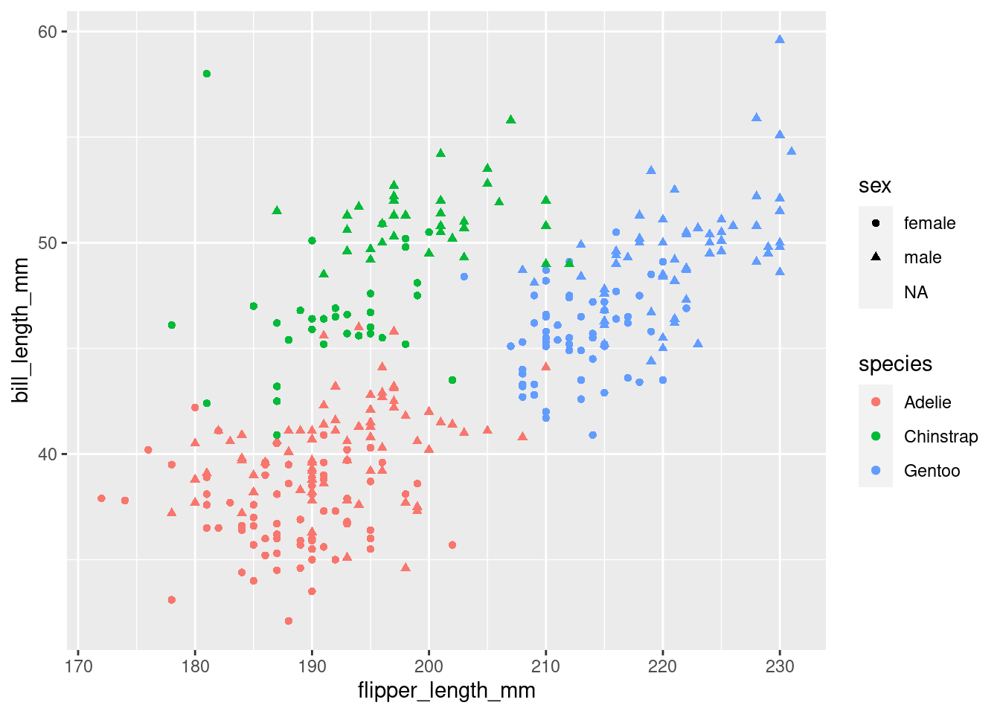

# Introduction {#intro}

::: { .alert .alert-info}
Hi there! this is where the material for the first lecture will appear.
To sign up, check out the [welcome page](https://jmbuhr.de/dataintro/index.html)
:::

> ... in which we get started with R and RStudio,
  learn about literate programming and build our first
  plot by discovering a Grammar of Graphics.

::: {.video-container}
<iframe class="video" src="https://www.youtube.com/embed/r0bWxrzu4tg?vq=hd1080" allowfullscreen></iframe>
:::

## What You will Learn

Throughout your scientific career --- and potentially outside of it --- you will encounter various forms of data. Maybe you do an experiment and measured the fluorescence of a molecular probe, or you simply count the penguins at your local zoo. Everything is data in some form or another. But raw numbers without context are meaningless and tables of numbers are not only boring to look at, but often hide the actual structure in the data.

In this course you will learn to handle different kinds of data. You will learn to create pretty and insightful visualizations, compute different statistics on your data and also what these statistical concepts mean. From penguins to p-values, I got you covered.

The course will be held in English, as the concepts covered will directly transfer to the research you do, where the working language is English. That being said, feel free to ask questions in any language that I understand, so German is also fine. My Latin is a little rusty, thought.

In this course, we will be using the programming language R. R is a language particularly well suited for data analysis, because it was initially designed by statisticians and because of the interactive nature of the language, which makes it easier to get started. So don't fret if this is your first encounter with programming, we will take one step at a time.

The datasets chosen to illustrate the various concepts and tools are not particularly centered around Biology. Rather, I chose general datasets that require less introduction and enable us to focus on learning R and statistics. This is why we will be talking about penguins, racing games or life expectancy instead of intricate molecular measurements.

## Execute R Code

- console
- script
- a script is like a recipe, keeping it is more important than keeping e.g.
  the plots that come out of it!

You can now execute commands in the R console in the bottom left. For example we can calculate a mathematical expression:


```r
1 + 1
```

```
[1] 2
```

Or generate the numbers from one to 10:


```r
1:10
```

```
 [1]  1  2  3  4  5  6  7  8  9 10
```

But I rarely type directly into the console. Because we want our results to be reproducible, we write our code in a **script** first, so that the next person [^1] can see what we did and replicate our analysis. You will see that reproducibility is quite near and dear to me, so it will pop up once or twice. And as scientists, I am sure you understand the importance.

> A script is like a recipe. It is the most important part of your data analysis
  workflow, because as long as you have the recipe, you can recreate whatever
  products (e.g. plots, statistics, tables) you have with ease.

[^1]: This will most likely be future You. And you will thank yourself later

To create a new script, click the little button in the top left corner. In a script you can type regular R code, but it won't get executed straight away. To send a line of code to the console to be executed, hit **Ctrl+Enter**. Go ahead, try it with:

## Get to know RStudio

- projects
- panes / layout
- important settings:
  - never restore .Rdata at startup
- theme (more via packages,
  which we will talk about later today)

Before we get deeper into R,
let's talk a little bit about our Home when working with R:
RStudio.

There is one important setting that I would like you to change:
Under Tools -> Global Options make sure that "Restore .RData into workspace at startup"
is **unchecked**.
The workspace that RStudio would save as `.RData` contains all objects created in a session, which is, what we can see in the **Environment** pane (by default in the top right panel, bottom right in my setup). Why would we not want to load the objects we created in the last session into our current session automatically? The reason is reproducibility. We want to make sure that everything our analysis needs is in the script. It creates our variables and plots from the raw data and should be the sole source of truth.

Check out the lecture video for further customization of RStudio
e.g. with themes and make sure to also use _RStudio Projects_ to structure your work.

## Expressions: Tell R to do things


R can do lot's of things, but let's start with some basics, like calculating.
Everything that starts with `#` is a comment and will be ignored by R.


```r
1 + 1 # addition
```

```
[1] 2
```

```r
32 / 11 # division
```

```
[1] 2.909091
```

```r
3 * 4 # multiplication
```

```
[1] 12
```

```r
13 %% 5 # modulo
```

```
[1] 3
```

```r
13 %/% 5 # integer division
```

```
[1] 2
```

Create vectors with the `:` operator, e.g. numbers from:to


```r
1:4
```

```
[1] 1 2 3 4
```

And mathematical operations are automatically "vectorized":


```r
1:3 + 1:3
```

```
[1] 2 4 6
```

In fact, R as no scalars (individual values), those are just vectors of length 1.

## Variables: Boxes for things

Often, you will want to store the result of a computation for reuse, or to give it a sensible name and make your code more readable.
This is what **variables** are for. We can assign a value to a variable using the assignment operator `<-` (In RStudio, there is a shortcut for it: **Alt+Minus**):


```r
my_number <- 42
```

Executing the above code will not give you any output, but when you use the name of the variable, you can see its content.


```r
my_number
```

```
[1] 42
```

And you can do operations with those variables:


```r
x <- 41
y <- 1
x + y
```

```
[1] 42
```

> **NOTE** Be careful about the order of execution! R enables you to work interactively and to execute the code you write in your script in any order with Ctrl+Enter, but when you execute (="source") the whole script, it will be executed from top to bottom.

Furthermore, code is not executed again automatically, if you change some dependency of the expression later on. So the second assignment to x doesn't change y.


```r
x <- 1
y <- x + 1
x <- 1000
y
```

```
[1] 2
```

Variable names can contain letters (capitalization matters), numbers (but not as the first character) and underscores `_`. [^2]

[^2]: They can also contain dots (`.`), but it is considered bad practice because it can lead to some confusing edge cases.


```r
# snake_case
main_character_name <- "Kvothe"

# or camelCase
bookTitle <- "The Name of the Wind"

# you can have numbers in the name
x1 <- 12
```


A good convention is to always use `snake_case`.

## Atomic datatype

First we have numbers (which internally are called `numeric` or `double`)


```r
12
12.5
```

Then, there are whole numbers (`integer`)


```r
1L # denoted by L
```

as well as the rarely used complex numbers (`complex`)


```r
1 + 3i # denoted by the small i for the imaginary part
```

Text data however will be used more often (`character`, `string`).
Everything enclosed in quotation marks will be treated as text.
Double or single quotation marks are both fine.


```r
"It was night again."
'This is also text'
```

Logical values can only contain yes or no, or rather `TRUE` and `FALSE` in programming terms (`boolean`, `logical`).


```r
TRUE
FALSE
```

There are some special types that mix with any other type. Like `NULL` for no value and `NA` for Not Assigned.


```r
NULL
NA
```

`NA` is contagious. Any computation involving `NA` will return `NA` (because R has no way of knowing the answer):


```r
NA + 1
```

```
[1] NA
```

```r
max(NA, 12, 1)
```

```
[1] NA
```

But some functions can remove `NA`s before giving us an answer:


```r
max(NA, 12, 1, na.rm = TRUE)
```

```
[1] 12
```

You can ask for the datatype of an object with the function `typeof`:


```r
typeof("hello")
```

```
[1] "character"
```

There is also a concept called factors (`factor`) for categorical data, but we will talk about that later, when we get deeper into vectors.

## Functions: Calculate, run and automate things

> In R, everything that exists is an object, everything that does something is a function.

Functions are the main workhorse of our data analysis. For example, there are mathematical functions, like `sin`, `cos` etc.


```r
sin(x = 0)
```

```
[1] 0
```

Functions take arguments (sometimes called parameters) and sometimes they also return things. The `sin` function takes just one argument `x` and returns its sine. What we do with the returned value is up to us. We can use it directly in another computation or store it in a variable. If we don't do anything with the return value, R simply prints it to the console.

Note, that the `=` inside the function parenthesis gives `x = 0` to the function and is separate from any `x` defined outside of the function. For example:


```r
x <- 10
cos(x = 0)
```

```
[1] 1
```

```r
# x outside of the function is still 10
x
```

```
[1] 10
```

To learn more about a function in R, execute `?` with the function name or press **F1** with your mouse over the function. This is actually one of the most important things to learn today, because the help pages can be... well... incredibly helpful.


```r
?sin
```

We can pass arguments by name or by order of appearance. The following two expressions are equivalent.


```r
sin(x = 12)
sin(12)
```

Other notable functions to start out with:

Combine elements into a vector:


```r
c(1, 3, 5, 31)
```

```
[1]  1  3  5 31
```

Convert between datatypes with:


```r
as.numeric("1")
```

```
[1] 1
```

```r
as.character(1)
```

```
[1] "1"
```

Calculate summary value of a vectore:


```r
x <- c(1, 3, 5, 42)
max(x)
```

```
[1] 42
```

```r
min(x)
```

```
[1] 1
```

```r
mean(x)
```

```
[1] 12.75
```

```r
range(x)
```

```
[1]  1 42
```

Create sequences of numbers:


```r
seq(1, 10, by = 2)
```

```
[1] 1 3 5 7 9
```

You just learned about the functions `sin`, `seq` and `max`. But wait, there is more! Not only in the sense that there are more functions in R (what kind of language would that be with only two verbs?!), but also in a more powerful way:

> We can define our own functions!

The syntax ($\leftarrow$ grammar for programming languages) is as follows.


```r
name_for_the_function <- function(parameter1, parameter2, ...) { # etc.
  # body of the function
  # things happen
  result <- parameter1 + parameter2
  # Something the function should return to the caller
  return(result)
}
```

The function ends when it reaches the `return` keyword. It also ends when it reaches the end of the function body and implicitly returns the last expression. So we could have written it a bit shorter and in fact you will often see people omitting the explicit return at the end:


```r
add <- function(x, y) {
  x + y
}
```

And we can call our freshly defined function:


```r
add(23, 19)
```

```
[1] 42
```

Got an error like `Error in add(23, 19) : could not find function "add"`? Check that you did in fact execute the code that defines the function (i.e. put your cursor on the line with the `function` keyword and hit Ctrl+Enter.).

## Packages: Sharing functions

You are not the only one using R.
There is a welcoming and helpful community out there.
Some people also write a bunch of functions and put them together in a so called `package`.
And some people even went a step further.
The `tidyverse` is a **collection of packages** that play very well together and also iron out some of the quirkier ways in which R works [@wickhamWelcomeTidyverse2019b].
They provide a consistent interface to enable us to do more while having to learn less special cases.
The R function `install.packages("<package_name_here>")` installs packages from CRAN a curated set of R packages.

R packages, especially the ones we will be using, often come
with great manuals and help pages and I added a link
to the package website for each of the
packages to the hexagonal icons for each package in the script,
so make sure to **click the icons**.

If you don't have the link at hand you can also always find
help on the internet.
Most of these packages publish their source code on a site
called GitHub, so you will be able to find
further links, help and documentation by searching
for _r <the package> github_.
Sometimes it can be helpful to write our R's full name
when searching (turns out there are a lot of thing with the
letter R): `rstats`.
 
## Literate Programming with Rmarkdown: Code is communication

<aside>
<a href="https://rmarkdown.rstudio.com/index.html">
{width=200}
</a>
</aside>

The first package I would like you to install is called `Rmarkdown`.
Go ahead and install it with:


```r
install.packages("rmarkdown")
```

This is one exception to our effort of having everything in our script and not just in the console. We don't want R trying to install the package every time we run the script, as this needs to happen only once. So you can either turn it into a comment, delete it from the script, or only type it in the console. You can also use RStudio's built-in panel for package installation.

**Rmarkdown** enables us, to combine text with `code` and then produce a range of output formats like pdf, html, word documents, presentations etc. In fact, this whole website, including the slides, was created with Rmarkdown. Sounds exciting? Let's dive into it!

Open up a new Rmarkdown document with the file extension `.Rmd` from the *New File* menu in the top left corner of RStudio: **File → New File → R Markdown** and choose **html** as the output format. I particularly like html, because you don't have to worry about page breaks and it easily works on screens of different sizes, like your phone.

An Rmarkdown document consists of three things:

1.  **Metadata**:\
    Information about your document such as the author or the date in a format called `YAML`. This YAML header starts and ends with three minus signs `---`.
2.  **Text**:\
    Regular text is interpreted as markdown, meaning it supports things like creating headings by prefixing a line with `#`, or text that will be bold in the output by surrounding it with `**`.
3.  **Code chunks**:\
    Starting with a line with 3 backticks and {r} and ending with 3 backticks. They will be interpreted as R code. This is where you write the code like you did in the `.R` script file. You can insert new chunks with the button on the top right of the editor window or use the shortcut **Ctrl+Alt+i**.

Use these to document your thoughts alongside your code when you are doing data analysis. Future you (and reviewer number 2) will be happy! To run code inside of chunks, use,the little play button on the chunk, the tried and true **Ctrl+Enter** to run one line, or **Ctrl+Shift+Enter** to run the whole chunk. Your chunks can be as large or small as you want, but try to maintain some sensible structure.

The lecture video also demonstrates the different output formats,
but for the exercises we will only be using `html_document`.

- knit
- show output formats
  - html_document
  - pdf_document
  - docx_document
- show visual editor


### The Tidyverse

<aside>
<a href="https://tidyverse.org/">
{width=200}
</a>
</aside>

Go ahead and install the tidyverse packages with


```r
install.packages("tidyverse")
```

## Our First Dataset: The Palmer Penguins

{#fig-penguins}

So let's explore our first dataset together in a fresh Rmarkdown document. The `setup` chunk is special. It gets executed automatically before any other chunk in the document is run. This makes it a good place to load packages. The dataset we are working with today actually comes in its own package, so we need to install this as well (Yes, there is a lot of installing today, but you will have to do this only once):


```r
install.packages("palmerpenguins")
```

And then we populate our `setup` chunk with


```r
library(tidyverse)
library(palmerpenguins)
```

This gives us the `penguins` dataset [@R-palmerpenguins]:


```r
penguins
```

<div data-pagedtable="false">
  <script data-pagedtable-source type="application/json">
{"columns":[{"label":["species"],"name":[1],"type":["fct"],"align":["left"]},{"label":["island"],"name":[2],"type":["fct"],"align":["left"]},{"label":["bill_length_mm"],"name":[3],"type":["dbl"],"align":["right"]},{"label":["bill_depth_mm"],"name":[4],"type":["dbl"],"align":["right"]},{"label":["flipper_length_mm"],"name":[5],"type":["int"],"align":["right"]},{"label":["body_mass_g"],"name":[6],"type":["int"],"align":["right"]},{"label":["sex"],"name":[7],"type":["fct"],"align":["left"]},{"label":["year"],"name":[8],"type":["int"],"align":["right"]}],"data":[{"1":"Adelie","2":"Torgersen","3":"39.1","4":"18.7","5":"181","6":"3750","7":"male","8":"2007"},{"1":"Adelie","2":"Torgersen","3":"39.5","4":"17.4","5":"186","6":"3800","7":"female","8":"2007"},{"1":"Adelie","2":"Torgersen","3":"40.3","4":"18.0","5":"195","6":"3250","7":"female","8":"2007"},{"1":"Adelie","2":"Torgersen","3":"NA","4":"NA","5":"NA","6":"NA","7":"NA","8":"2007"},{"1":"Adelie","2":"Torgersen","3":"36.7","4":"19.3","5":"193","6":"3450","7":"female","8":"2007"},{"1":"Adelie","2":"Torgersen","3":"39.3","4":"20.6","5":"190","6":"3650","7":"male","8":"2007"},{"1":"Adelie","2":"Torgersen","3":"38.9","4":"17.8","5":"181","6":"3625","7":"female","8":"2007"},{"1":"Adelie","2":"Torgersen","3":"39.2","4":"19.6","5":"195","6":"4675","7":"male","8":"2007"},{"1":"Adelie","2":"Torgersen","3":"34.1","4":"18.1","5":"193","6":"3475","7":"NA","8":"2007"},{"1":"Adelie","2":"Torgersen","3":"42.0","4":"20.2","5":"190","6":"4250","7":"NA","8":"2007"},{"1":"Adelie","2":"Torgersen","3":"37.8","4":"17.1","5":"186","6":"3300","7":"NA","8":"2007"},{"1":"Adelie","2":"Torgersen","3":"37.8","4":"17.3","5":"180","6":"3700","7":"NA","8":"2007"},{"1":"Adelie","2":"Torgersen","3":"41.1","4":"17.6","5":"182","6":"3200","7":"female","8":"2007"},{"1":"Adelie","2":"Torgersen","3":"38.6","4":"21.2","5":"191","6":"3800","7":"male","8":"2007"},{"1":"Adelie","2":"Torgersen","3":"34.6","4":"21.1","5":"198","6":"4400","7":"male","8":"2007"},{"1":"Adelie","2":"Torgersen","3":"36.6","4":"17.8","5":"185","6":"3700","7":"female","8":"2007"},{"1":"Adelie","2":"Torgersen","3":"38.7","4":"19.0","5":"195","6":"3450","7":"female","8":"2007"},{"1":"Adelie","2":"Torgersen","3":"42.5","4":"20.7","5":"197","6":"4500","7":"male","8":"2007"},{"1":"Adelie","2":"Torgersen","3":"34.4","4":"18.4","5":"184","6":"3325","7":"female","8":"2007"},{"1":"Adelie","2":"Torgersen","3":"46.0","4":"21.5","5":"194","6":"4200","7":"male","8":"2007"},{"1":"Adelie","2":"Biscoe","3":"37.8","4":"18.3","5":"174","6":"3400","7":"female","8":"2007"},{"1":"Adelie","2":"Biscoe","3":"37.7","4":"18.7","5":"180","6":"3600","7":"male","8":"2007"},{"1":"Adelie","2":"Biscoe","3":"35.9","4":"19.2","5":"189","6":"3800","7":"female","8":"2007"},{"1":"Adelie","2":"Biscoe","3":"38.2","4":"18.1","5":"185","6":"3950","7":"male","8":"2007"},{"1":"Adelie","2":"Biscoe","3":"38.8","4":"17.2","5":"180","6":"3800","7":"male","8":"2007"},{"1":"Adelie","2":"Biscoe","3":"35.3","4":"18.9","5":"187","6":"3800","7":"female","8":"2007"},{"1":"Adelie","2":"Biscoe","3":"40.6","4":"18.6","5":"183","6":"3550","7":"male","8":"2007"},{"1":"Adelie","2":"Biscoe","3":"40.5","4":"17.9","5":"187","6":"3200","7":"female","8":"2007"},{"1":"Adelie","2":"Biscoe","3":"37.9","4":"18.6","5":"172","6":"3150","7":"female","8":"2007"},{"1":"Adelie","2":"Biscoe","3":"40.5","4":"18.9","5":"180","6":"3950","7":"male","8":"2007"},{"1":"Adelie","2":"Dream","3":"39.5","4":"16.7","5":"178","6":"3250","7":"female","8":"2007"},{"1":"Adelie","2":"Dream","3":"37.2","4":"18.1","5":"178","6":"3900","7":"male","8":"2007"},{"1":"Adelie","2":"Dream","3":"39.5","4":"17.8","5":"188","6":"3300","7":"female","8":"2007"},{"1":"Adelie","2":"Dream","3":"40.9","4":"18.9","5":"184","6":"3900","7":"male","8":"2007"},{"1":"Adelie","2":"Dream","3":"36.4","4":"17.0","5":"195","6":"3325","7":"female","8":"2007"},{"1":"Adelie","2":"Dream","3":"39.2","4":"21.1","5":"196","6":"4150","7":"male","8":"2007"},{"1":"Adelie","2":"Dream","3":"38.8","4":"20.0","5":"190","6":"3950","7":"male","8":"2007"},{"1":"Adelie","2":"Dream","3":"42.2","4":"18.5","5":"180","6":"3550","7":"female","8":"2007"},{"1":"Adelie","2":"Dream","3":"37.6","4":"19.3","5":"181","6":"3300","7":"female","8":"2007"},{"1":"Adelie","2":"Dream","3":"39.8","4":"19.1","5":"184","6":"4650","7":"male","8":"2007"},{"1":"Adelie","2":"Dream","3":"36.5","4":"18.0","5":"182","6":"3150","7":"female","8":"2007"},{"1":"Adelie","2":"Dream","3":"40.8","4":"18.4","5":"195","6":"3900","7":"male","8":"2007"},{"1":"Adelie","2":"Dream","3":"36.0","4":"18.5","5":"186","6":"3100","7":"female","8":"2007"},{"1":"Adelie","2":"Dream","3":"44.1","4":"19.7","5":"196","6":"4400","7":"male","8":"2007"},{"1":"Adelie","2":"Dream","3":"37.0","4":"16.9","5":"185","6":"3000","7":"female","8":"2007"},{"1":"Adelie","2":"Dream","3":"39.6","4":"18.8","5":"190","6":"4600","7":"male","8":"2007"},{"1":"Adelie","2":"Dream","3":"41.1","4":"19.0","5":"182","6":"3425","7":"male","8":"2007"},{"1":"Adelie","2":"Dream","3":"37.5","4":"18.9","5":"179","6":"2975","7":"NA","8":"2007"},{"1":"Adelie","2":"Dream","3":"36.0","4":"17.9","5":"190","6":"3450","7":"female","8":"2007"},{"1":"Adelie","2":"Dream","3":"42.3","4":"21.2","5":"191","6":"4150","7":"male","8":"2007"},{"1":"Adelie","2":"Biscoe","3":"39.6","4":"17.7","5":"186","6":"3500","7":"female","8":"2008"},{"1":"Adelie","2":"Biscoe","3":"40.1","4":"18.9","5":"188","6":"4300","7":"male","8":"2008"},{"1":"Adelie","2":"Biscoe","3":"35.0","4":"17.9","5":"190","6":"3450","7":"female","8":"2008"},{"1":"Adelie","2":"Biscoe","3":"42.0","4":"19.5","5":"200","6":"4050","7":"male","8":"2008"},{"1":"Adelie","2":"Biscoe","3":"34.5","4":"18.1","5":"187","6":"2900","7":"female","8":"2008"},{"1":"Adelie","2":"Biscoe","3":"41.4","4":"18.6","5":"191","6":"3700","7":"male","8":"2008"},{"1":"Adelie","2":"Biscoe","3":"39.0","4":"17.5","5":"186","6":"3550","7":"female","8":"2008"},{"1":"Adelie","2":"Biscoe","3":"40.6","4":"18.8","5":"193","6":"3800","7":"male","8":"2008"},{"1":"Adelie","2":"Biscoe","3":"36.5","4":"16.6","5":"181","6":"2850","7":"female","8":"2008"},{"1":"Adelie","2":"Biscoe","3":"37.6","4":"19.1","5":"194","6":"3750","7":"male","8":"2008"},{"1":"Adelie","2":"Biscoe","3":"35.7","4":"16.9","5":"185","6":"3150","7":"female","8":"2008"},{"1":"Adelie","2":"Biscoe","3":"41.3","4":"21.1","5":"195","6":"4400","7":"male","8":"2008"},{"1":"Adelie","2":"Biscoe","3":"37.6","4":"17.0","5":"185","6":"3600","7":"female","8":"2008"},{"1":"Adelie","2":"Biscoe","3":"41.1","4":"18.2","5":"192","6":"4050","7":"male","8":"2008"},{"1":"Adelie","2":"Biscoe","3":"36.4","4":"17.1","5":"184","6":"2850","7":"female","8":"2008"},{"1":"Adelie","2":"Biscoe","3":"41.6","4":"18.0","5":"192","6":"3950","7":"male","8":"2008"},{"1":"Adelie","2":"Biscoe","3":"35.5","4":"16.2","5":"195","6":"3350","7":"female","8":"2008"},{"1":"Adelie","2":"Biscoe","3":"41.1","4":"19.1","5":"188","6":"4100","7":"male","8":"2008"},{"1":"Adelie","2":"Torgersen","3":"35.9","4":"16.6","5":"190","6":"3050","7":"female","8":"2008"},{"1":"Adelie","2":"Torgersen","3":"41.8","4":"19.4","5":"198","6":"4450","7":"male","8":"2008"},{"1":"Adelie","2":"Torgersen","3":"33.5","4":"19.0","5":"190","6":"3600","7":"female","8":"2008"},{"1":"Adelie","2":"Torgersen","3":"39.7","4":"18.4","5":"190","6":"3900","7":"male","8":"2008"},{"1":"Adelie","2":"Torgersen","3":"39.6","4":"17.2","5":"196","6":"3550","7":"female","8":"2008"},{"1":"Adelie","2":"Torgersen","3":"45.8","4":"18.9","5":"197","6":"4150","7":"male","8":"2008"},{"1":"Adelie","2":"Torgersen","3":"35.5","4":"17.5","5":"190","6":"3700","7":"female","8":"2008"},{"1":"Adelie","2":"Torgersen","3":"42.8","4":"18.5","5":"195","6":"4250","7":"male","8":"2008"},{"1":"Adelie","2":"Torgersen","3":"40.9","4":"16.8","5":"191","6":"3700","7":"female","8":"2008"},{"1":"Adelie","2":"Torgersen","3":"37.2","4":"19.4","5":"184","6":"3900","7":"male","8":"2008"},{"1":"Adelie","2":"Torgersen","3":"36.2","4":"16.1","5":"187","6":"3550","7":"female","8":"2008"},{"1":"Adelie","2":"Torgersen","3":"42.1","4":"19.1","5":"195","6":"4000","7":"male","8":"2008"},{"1":"Adelie","2":"Torgersen","3":"34.6","4":"17.2","5":"189","6":"3200","7":"female","8":"2008"},{"1":"Adelie","2":"Torgersen","3":"42.9","4":"17.6","5":"196","6":"4700","7":"male","8":"2008"},{"1":"Adelie","2":"Torgersen","3":"36.7","4":"18.8","5":"187","6":"3800","7":"female","8":"2008"},{"1":"Adelie","2":"Torgersen","3":"35.1","4":"19.4","5":"193","6":"4200","7":"male","8":"2008"},{"1":"Adelie","2":"Dream","3":"37.3","4":"17.8","5":"191","6":"3350","7":"female","8":"2008"},{"1":"Adelie","2":"Dream","3":"41.3","4":"20.3","5":"194","6":"3550","7":"male","8":"2008"},{"1":"Adelie","2":"Dream","3":"36.3","4":"19.5","5":"190","6":"3800","7":"male","8":"2008"},{"1":"Adelie","2":"Dream","3":"36.9","4":"18.6","5":"189","6":"3500","7":"female","8":"2008"},{"1":"Adelie","2":"Dream","3":"38.3","4":"19.2","5":"189","6":"3950","7":"male","8":"2008"},{"1":"Adelie","2":"Dream","3":"38.9","4":"18.8","5":"190","6":"3600","7":"female","8":"2008"},{"1":"Adelie","2":"Dream","3":"35.7","4":"18.0","5":"202","6":"3550","7":"female","8":"2008"},{"1":"Adelie","2":"Dream","3":"41.1","4":"18.1","5":"205","6":"4300","7":"male","8":"2008"},{"1":"Adelie","2":"Dream","3":"34.0","4":"17.1","5":"185","6":"3400","7":"female","8":"2008"},{"1":"Adelie","2":"Dream","3":"39.6","4":"18.1","5":"186","6":"4450","7":"male","8":"2008"},{"1":"Adelie","2":"Dream","3":"36.2","4":"17.3","5":"187","6":"3300","7":"female","8":"2008"},{"1":"Adelie","2":"Dream","3":"40.8","4":"18.9","5":"208","6":"4300","7":"male","8":"2008"},{"1":"Adelie","2":"Dream","3":"38.1","4":"18.6","5":"190","6":"3700","7":"female","8":"2008"},{"1":"Adelie","2":"Dream","3":"40.3","4":"18.5","5":"196","6":"4350","7":"male","8":"2008"},{"1":"Adelie","2":"Dream","3":"33.1","4":"16.1","5":"178","6":"2900","7":"female","8":"2008"},{"1":"Adelie","2":"Dream","3":"43.2","4":"18.5","5":"192","6":"4100","7":"male","8":"2008"},{"1":"Adelie","2":"Biscoe","3":"35.0","4":"17.9","5":"192","6":"3725","7":"female","8":"2009"},{"1":"Adelie","2":"Biscoe","3":"41.0","4":"20.0","5":"203","6":"4725","7":"male","8":"2009"},{"1":"Adelie","2":"Biscoe","3":"37.7","4":"16.0","5":"183","6":"3075","7":"female","8":"2009"},{"1":"Adelie","2":"Biscoe","3":"37.8","4":"20.0","5":"190","6":"4250","7":"male","8":"2009"},{"1":"Adelie","2":"Biscoe","3":"37.9","4":"18.6","5":"193","6":"2925","7":"female","8":"2009"},{"1":"Adelie","2":"Biscoe","3":"39.7","4":"18.9","5":"184","6":"3550","7":"male","8":"2009"},{"1":"Adelie","2":"Biscoe","3":"38.6","4":"17.2","5":"199","6":"3750","7":"female","8":"2009"},{"1":"Adelie","2":"Biscoe","3":"38.2","4":"20.0","5":"190","6":"3900","7":"male","8":"2009"},{"1":"Adelie","2":"Biscoe","3":"38.1","4":"17.0","5":"181","6":"3175","7":"female","8":"2009"},{"1":"Adelie","2":"Biscoe","3":"43.2","4":"19.0","5":"197","6":"4775","7":"male","8":"2009"},{"1":"Adelie","2":"Biscoe","3":"38.1","4":"16.5","5":"198","6":"3825","7":"female","8":"2009"},{"1":"Adelie","2":"Biscoe","3":"45.6","4":"20.3","5":"191","6":"4600","7":"male","8":"2009"},{"1":"Adelie","2":"Biscoe","3":"39.7","4":"17.7","5":"193","6":"3200","7":"female","8":"2009"},{"1":"Adelie","2":"Biscoe","3":"42.2","4":"19.5","5":"197","6":"4275","7":"male","8":"2009"},{"1":"Adelie","2":"Biscoe","3":"39.6","4":"20.7","5":"191","6":"3900","7":"female","8":"2009"},{"1":"Adelie","2":"Biscoe","3":"42.7","4":"18.3","5":"196","6":"4075","7":"male","8":"2009"},{"1":"Adelie","2":"Torgersen","3":"38.6","4":"17.0","5":"188","6":"2900","7":"female","8":"2009"},{"1":"Adelie","2":"Torgersen","3":"37.3","4":"20.5","5":"199","6":"3775","7":"male","8":"2009"},{"1":"Adelie","2":"Torgersen","3":"35.7","4":"17.0","5":"189","6":"3350","7":"female","8":"2009"},{"1":"Adelie","2":"Torgersen","3":"41.1","4":"18.6","5":"189","6":"3325","7":"male","8":"2009"},{"1":"Adelie","2":"Torgersen","3":"36.2","4":"17.2","5":"187","6":"3150","7":"female","8":"2009"},{"1":"Adelie","2":"Torgersen","3":"37.7","4":"19.8","5":"198","6":"3500","7":"male","8":"2009"},{"1":"Adelie","2":"Torgersen","3":"40.2","4":"17.0","5":"176","6":"3450","7":"female","8":"2009"},{"1":"Adelie","2":"Torgersen","3":"41.4","4":"18.5","5":"202","6":"3875","7":"male","8":"2009"},{"1":"Adelie","2":"Torgersen","3":"35.2","4":"15.9","5":"186","6":"3050","7":"female","8":"2009"},{"1":"Adelie","2":"Torgersen","3":"40.6","4":"19.0","5":"199","6":"4000","7":"male","8":"2009"},{"1":"Adelie","2":"Torgersen","3":"38.8","4":"17.6","5":"191","6":"3275","7":"female","8":"2009"},{"1":"Adelie","2":"Torgersen","3":"41.5","4":"18.3","5":"195","6":"4300","7":"male","8":"2009"},{"1":"Adelie","2":"Torgersen","3":"39.0","4":"17.1","5":"191","6":"3050","7":"female","8":"2009"},{"1":"Adelie","2":"Torgersen","3":"44.1","4":"18.0","5":"210","6":"4000","7":"male","8":"2009"},{"1":"Adelie","2":"Torgersen","3":"38.5","4":"17.9","5":"190","6":"3325","7":"female","8":"2009"},{"1":"Adelie","2":"Torgersen","3":"43.1","4":"19.2","5":"197","6":"3500","7":"male","8":"2009"},{"1":"Adelie","2":"Dream","3":"36.8","4":"18.5","5":"193","6":"3500","7":"female","8":"2009"},{"1":"Adelie","2":"Dream","3":"37.5","4":"18.5","5":"199","6":"4475","7":"male","8":"2009"},{"1":"Adelie","2":"Dream","3":"38.1","4":"17.6","5":"187","6":"3425","7":"female","8":"2009"},{"1":"Adelie","2":"Dream","3":"41.1","4":"17.5","5":"190","6":"3900","7":"male","8":"2009"},{"1":"Adelie","2":"Dream","3":"35.6","4":"17.5","5":"191","6":"3175","7":"female","8":"2009"},{"1":"Adelie","2":"Dream","3":"40.2","4":"20.1","5":"200","6":"3975","7":"male","8":"2009"},{"1":"Adelie","2":"Dream","3":"37.0","4":"16.5","5":"185","6":"3400","7":"female","8":"2009"},{"1":"Adelie","2":"Dream","3":"39.7","4":"17.9","5":"193","6":"4250","7":"male","8":"2009"},{"1":"Adelie","2":"Dream","3":"40.2","4":"17.1","5":"193","6":"3400","7":"female","8":"2009"},{"1":"Adelie","2":"Dream","3":"40.6","4":"17.2","5":"187","6":"3475","7":"male","8":"2009"},{"1":"Adelie","2":"Dream","3":"32.1","4":"15.5","5":"188","6":"3050","7":"female","8":"2009"},{"1":"Adelie","2":"Dream","3":"40.7","4":"17.0","5":"190","6":"3725","7":"male","8":"2009"},{"1":"Adelie","2":"Dream","3":"37.3","4":"16.8","5":"192","6":"3000","7":"female","8":"2009"},{"1":"Adelie","2":"Dream","3":"39.0","4":"18.7","5":"185","6":"3650","7":"male","8":"2009"},{"1":"Adelie","2":"Dream","3":"39.2","4":"18.6","5":"190","6":"4250","7":"male","8":"2009"},{"1":"Adelie","2":"Dream","3":"36.6","4":"18.4","5":"184","6":"3475","7":"female","8":"2009"},{"1":"Adelie","2":"Dream","3":"36.0","4":"17.8","5":"195","6":"3450","7":"female","8":"2009"},{"1":"Adelie","2":"Dream","3":"37.8","4":"18.1","5":"193","6":"3750","7":"male","8":"2009"},{"1":"Adelie","2":"Dream","3":"36.0","4":"17.1","5":"187","6":"3700","7":"female","8":"2009"},{"1":"Adelie","2":"Dream","3":"41.5","4":"18.5","5":"201","6":"4000","7":"male","8":"2009"},{"1":"Gentoo","2":"Biscoe","3":"46.1","4":"13.2","5":"211","6":"4500","7":"female","8":"2007"},{"1":"Gentoo","2":"Biscoe","3":"50.0","4":"16.3","5":"230","6":"5700","7":"male","8":"2007"},{"1":"Gentoo","2":"Biscoe","3":"48.7","4":"14.1","5":"210","6":"4450","7":"female","8":"2007"},{"1":"Gentoo","2":"Biscoe","3":"50.0","4":"15.2","5":"218","6":"5700","7":"male","8":"2007"},{"1":"Gentoo","2":"Biscoe","3":"47.6","4":"14.5","5":"215","6":"5400","7":"male","8":"2007"},{"1":"Gentoo","2":"Biscoe","3":"46.5","4":"13.5","5":"210","6":"4550","7":"female","8":"2007"},{"1":"Gentoo","2":"Biscoe","3":"45.4","4":"14.6","5":"211","6":"4800","7":"female","8":"2007"},{"1":"Gentoo","2":"Biscoe","3":"46.7","4":"15.3","5":"219","6":"5200","7":"male","8":"2007"},{"1":"Gentoo","2":"Biscoe","3":"43.3","4":"13.4","5":"209","6":"4400","7":"female","8":"2007"},{"1":"Gentoo","2":"Biscoe","3":"46.8","4":"15.4","5":"215","6":"5150","7":"male","8":"2007"},{"1":"Gentoo","2":"Biscoe","3":"40.9","4":"13.7","5":"214","6":"4650","7":"female","8":"2007"},{"1":"Gentoo","2":"Biscoe","3":"49.0","4":"16.1","5":"216","6":"5550","7":"male","8":"2007"},{"1":"Gentoo","2":"Biscoe","3":"45.5","4":"13.7","5":"214","6":"4650","7":"female","8":"2007"},{"1":"Gentoo","2":"Biscoe","3":"48.4","4":"14.6","5":"213","6":"5850","7":"male","8":"2007"},{"1":"Gentoo","2":"Biscoe","3":"45.8","4":"14.6","5":"210","6":"4200","7":"female","8":"2007"},{"1":"Gentoo","2":"Biscoe","3":"49.3","4":"15.7","5":"217","6":"5850","7":"male","8":"2007"},{"1":"Gentoo","2":"Biscoe","3":"42.0","4":"13.5","5":"210","6":"4150","7":"female","8":"2007"},{"1":"Gentoo","2":"Biscoe","3":"49.2","4":"15.2","5":"221","6":"6300","7":"male","8":"2007"},{"1":"Gentoo","2":"Biscoe","3":"46.2","4":"14.5","5":"209","6":"4800","7":"female","8":"2007"},{"1":"Gentoo","2":"Biscoe","3":"48.7","4":"15.1","5":"222","6":"5350","7":"male","8":"2007"},{"1":"Gentoo","2":"Biscoe","3":"50.2","4":"14.3","5":"218","6":"5700","7":"male","8":"2007"},{"1":"Gentoo","2":"Biscoe","3":"45.1","4":"14.5","5":"215","6":"5000","7":"female","8":"2007"},{"1":"Gentoo","2":"Biscoe","3":"46.5","4":"14.5","5":"213","6":"4400","7":"female","8":"2007"},{"1":"Gentoo","2":"Biscoe","3":"46.3","4":"15.8","5":"215","6":"5050","7":"male","8":"2007"},{"1":"Gentoo","2":"Biscoe","3":"42.9","4":"13.1","5":"215","6":"5000","7":"female","8":"2007"},{"1":"Gentoo","2":"Biscoe","3":"46.1","4":"15.1","5":"215","6":"5100","7":"male","8":"2007"},{"1":"Gentoo","2":"Biscoe","3":"44.5","4":"14.3","5":"216","6":"4100","7":"NA","8":"2007"},{"1":"Gentoo","2":"Biscoe","3":"47.8","4":"15.0","5":"215","6":"5650","7":"male","8":"2007"},{"1":"Gentoo","2":"Biscoe","3":"48.2","4":"14.3","5":"210","6":"4600","7":"female","8":"2007"},{"1":"Gentoo","2":"Biscoe","3":"50.0","4":"15.3","5":"220","6":"5550","7":"male","8":"2007"},{"1":"Gentoo","2":"Biscoe","3":"47.3","4":"15.3","5":"222","6":"5250","7":"male","8":"2007"},{"1":"Gentoo","2":"Biscoe","3":"42.8","4":"14.2","5":"209","6":"4700","7":"female","8":"2007"},{"1":"Gentoo","2":"Biscoe","3":"45.1","4":"14.5","5":"207","6":"5050","7":"female","8":"2007"},{"1":"Gentoo","2":"Biscoe","3":"59.6","4":"17.0","5":"230","6":"6050","7":"male","8":"2007"},{"1":"Gentoo","2":"Biscoe","3":"49.1","4":"14.8","5":"220","6":"5150","7":"female","8":"2008"},{"1":"Gentoo","2":"Biscoe","3":"48.4","4":"16.3","5":"220","6":"5400","7":"male","8":"2008"},{"1":"Gentoo","2":"Biscoe","3":"42.6","4":"13.7","5":"213","6":"4950","7":"female","8":"2008"},{"1":"Gentoo","2":"Biscoe","3":"44.4","4":"17.3","5":"219","6":"5250","7":"male","8":"2008"},{"1":"Gentoo","2":"Biscoe","3":"44.0","4":"13.6","5":"208","6":"4350","7":"female","8":"2008"},{"1":"Gentoo","2":"Biscoe","3":"48.7","4":"15.7","5":"208","6":"5350","7":"male","8":"2008"},{"1":"Gentoo","2":"Biscoe","3":"42.7","4":"13.7","5":"208","6":"3950","7":"female","8":"2008"},{"1":"Gentoo","2":"Biscoe","3":"49.6","4":"16.0","5":"225","6":"5700","7":"male","8":"2008"},{"1":"Gentoo","2":"Biscoe","3":"45.3","4":"13.7","5":"210","6":"4300","7":"female","8":"2008"},{"1":"Gentoo","2":"Biscoe","3":"49.6","4":"15.0","5":"216","6":"4750","7":"male","8":"2008"},{"1":"Gentoo","2":"Biscoe","3":"50.5","4":"15.9","5":"222","6":"5550","7":"male","8":"2008"},{"1":"Gentoo","2":"Biscoe","3":"43.6","4":"13.9","5":"217","6":"4900","7":"female","8":"2008"},{"1":"Gentoo","2":"Biscoe","3":"45.5","4":"13.9","5":"210","6":"4200","7":"female","8":"2008"},{"1":"Gentoo","2":"Biscoe","3":"50.5","4":"15.9","5":"225","6":"5400","7":"male","8":"2008"},{"1":"Gentoo","2":"Biscoe","3":"44.9","4":"13.3","5":"213","6":"5100","7":"female","8":"2008"},{"1":"Gentoo","2":"Biscoe","3":"45.2","4":"15.8","5":"215","6":"5300","7":"male","8":"2008"},{"1":"Gentoo","2":"Biscoe","3":"46.6","4":"14.2","5":"210","6":"4850","7":"female","8":"2008"},{"1":"Gentoo","2":"Biscoe","3":"48.5","4":"14.1","5":"220","6":"5300","7":"male","8":"2008"},{"1":"Gentoo","2":"Biscoe","3":"45.1","4":"14.4","5":"210","6":"4400","7":"female","8":"2008"},{"1":"Gentoo","2":"Biscoe","3":"50.1","4":"15.0","5":"225","6":"5000","7":"male","8":"2008"},{"1":"Gentoo","2":"Biscoe","3":"46.5","4":"14.4","5":"217","6":"4900","7":"female","8":"2008"},{"1":"Gentoo","2":"Biscoe","3":"45.0","4":"15.4","5":"220","6":"5050","7":"male","8":"2008"},{"1":"Gentoo","2":"Biscoe","3":"43.8","4":"13.9","5":"208","6":"4300","7":"female","8":"2008"},{"1":"Gentoo","2":"Biscoe","3":"45.5","4":"15.0","5":"220","6":"5000","7":"male","8":"2008"},{"1":"Gentoo","2":"Biscoe","3":"43.2","4":"14.5","5":"208","6":"4450","7":"female","8":"2008"},{"1":"Gentoo","2":"Biscoe","3":"50.4","4":"15.3","5":"224","6":"5550","7":"male","8":"2008"},{"1":"Gentoo","2":"Biscoe","3":"45.3","4":"13.8","5":"208","6":"4200","7":"female","8":"2008"},{"1":"Gentoo","2":"Biscoe","3":"46.2","4":"14.9","5":"221","6":"5300","7":"male","8":"2008"},{"1":"Gentoo","2":"Biscoe","3":"45.7","4":"13.9","5":"214","6":"4400","7":"female","8":"2008"},{"1":"Gentoo","2":"Biscoe","3":"54.3","4":"15.7","5":"231","6":"5650","7":"male","8":"2008"},{"1":"Gentoo","2":"Biscoe","3":"45.8","4":"14.2","5":"219","6":"4700","7":"female","8":"2008"},{"1":"Gentoo","2":"Biscoe","3":"49.8","4":"16.8","5":"230","6":"5700","7":"male","8":"2008"},{"1":"Gentoo","2":"Biscoe","3":"46.2","4":"14.4","5":"214","6":"4650","7":"NA","8":"2008"},{"1":"Gentoo","2":"Biscoe","3":"49.5","4":"16.2","5":"229","6":"5800","7":"male","8":"2008"},{"1":"Gentoo","2":"Biscoe","3":"43.5","4":"14.2","5":"220","6":"4700","7":"female","8":"2008"},{"1":"Gentoo","2":"Biscoe","3":"50.7","4":"15.0","5":"223","6":"5550","7":"male","8":"2008"},{"1":"Gentoo","2":"Biscoe","3":"47.7","4":"15.0","5":"216","6":"4750","7":"female","8":"2008"},{"1":"Gentoo","2":"Biscoe","3":"46.4","4":"15.6","5":"221","6":"5000","7":"male","8":"2008"},{"1":"Gentoo","2":"Biscoe","3":"48.2","4":"15.6","5":"221","6":"5100","7":"male","8":"2008"},{"1":"Gentoo","2":"Biscoe","3":"46.5","4":"14.8","5":"217","6":"5200","7":"female","8":"2008"},{"1":"Gentoo","2":"Biscoe","3":"46.4","4":"15.0","5":"216","6":"4700","7":"female","8":"2008"},{"1":"Gentoo","2":"Biscoe","3":"48.6","4":"16.0","5":"230","6":"5800","7":"male","8":"2008"},{"1":"Gentoo","2":"Biscoe","3":"47.5","4":"14.2","5":"209","6":"4600","7":"female","8":"2008"},{"1":"Gentoo","2":"Biscoe","3":"51.1","4":"16.3","5":"220","6":"6000","7":"male","8":"2008"},{"1":"Gentoo","2":"Biscoe","3":"45.2","4":"13.8","5":"215","6":"4750","7":"female","8":"2008"},{"1":"Gentoo","2":"Biscoe","3":"45.2","4":"16.4","5":"223","6":"5950","7":"male","8":"2008"},{"1":"Gentoo","2":"Biscoe","3":"49.1","4":"14.5","5":"212","6":"4625","7":"female","8":"2009"},{"1":"Gentoo","2":"Biscoe","3":"52.5","4":"15.6","5":"221","6":"5450","7":"male","8":"2009"},{"1":"Gentoo","2":"Biscoe","3":"47.4","4":"14.6","5":"212","6":"4725","7":"female","8":"2009"},{"1":"Gentoo","2":"Biscoe","3":"50.0","4":"15.9","5":"224","6":"5350","7":"male","8":"2009"},{"1":"Gentoo","2":"Biscoe","3":"44.9","4":"13.8","5":"212","6":"4750","7":"female","8":"2009"},{"1":"Gentoo","2":"Biscoe","3":"50.8","4":"17.3","5":"228","6":"5600","7":"male","8":"2009"},{"1":"Gentoo","2":"Biscoe","3":"43.4","4":"14.4","5":"218","6":"4600","7":"female","8":"2009"},{"1":"Gentoo","2":"Biscoe","3":"51.3","4":"14.2","5":"218","6":"5300","7":"male","8":"2009"},{"1":"Gentoo","2":"Biscoe","3":"47.5","4":"14.0","5":"212","6":"4875","7":"female","8":"2009"},{"1":"Gentoo","2":"Biscoe","3":"52.1","4":"17.0","5":"230","6":"5550","7":"male","8":"2009"},{"1":"Gentoo","2":"Biscoe","3":"47.5","4":"15.0","5":"218","6":"4950","7":"female","8":"2009"},{"1":"Gentoo","2":"Biscoe","3":"52.2","4":"17.1","5":"228","6":"5400","7":"male","8":"2009"},{"1":"Gentoo","2":"Biscoe","3":"45.5","4":"14.5","5":"212","6":"4750","7":"female","8":"2009"},{"1":"Gentoo","2":"Biscoe","3":"49.5","4":"16.1","5":"224","6":"5650","7":"male","8":"2009"},{"1":"Gentoo","2":"Biscoe","3":"44.5","4":"14.7","5":"214","6":"4850","7":"female","8":"2009"},{"1":"Gentoo","2":"Biscoe","3":"50.8","4":"15.7","5":"226","6":"5200","7":"male","8":"2009"},{"1":"Gentoo","2":"Biscoe","3":"49.4","4":"15.8","5":"216","6":"4925","7":"male","8":"2009"},{"1":"Gentoo","2":"Biscoe","3":"46.9","4":"14.6","5":"222","6":"4875","7":"female","8":"2009"},{"1":"Gentoo","2":"Biscoe","3":"48.4","4":"14.4","5":"203","6":"4625","7":"female","8":"2009"},{"1":"Gentoo","2":"Biscoe","3":"51.1","4":"16.5","5":"225","6":"5250","7":"male","8":"2009"},{"1":"Gentoo","2":"Biscoe","3":"48.5","4":"15.0","5":"219","6":"4850","7":"female","8":"2009"},{"1":"Gentoo","2":"Biscoe","3":"55.9","4":"17.0","5":"228","6":"5600","7":"male","8":"2009"},{"1":"Gentoo","2":"Biscoe","3":"47.2","4":"15.5","5":"215","6":"4975","7":"female","8":"2009"},{"1":"Gentoo","2":"Biscoe","3":"49.1","4":"15.0","5":"228","6":"5500","7":"male","8":"2009"},{"1":"Gentoo","2":"Biscoe","3":"47.3","4":"13.8","5":"216","6":"4725","7":"NA","8":"2009"},{"1":"Gentoo","2":"Biscoe","3":"46.8","4":"16.1","5":"215","6":"5500","7":"male","8":"2009"},{"1":"Gentoo","2":"Biscoe","3":"41.7","4":"14.7","5":"210","6":"4700","7":"female","8":"2009"},{"1":"Gentoo","2":"Biscoe","3":"53.4","4":"15.8","5":"219","6":"5500","7":"male","8":"2009"},{"1":"Gentoo","2":"Biscoe","3":"43.3","4":"14.0","5":"208","6":"4575","7":"female","8":"2009"},{"1":"Gentoo","2":"Biscoe","3":"48.1","4":"15.1","5":"209","6":"5500","7":"male","8":"2009"},{"1":"Gentoo","2":"Biscoe","3":"50.5","4":"15.2","5":"216","6":"5000","7":"female","8":"2009"},{"1":"Gentoo","2":"Biscoe","3":"49.8","4":"15.9","5":"229","6":"5950","7":"male","8":"2009"},{"1":"Gentoo","2":"Biscoe","3":"43.5","4":"15.2","5":"213","6":"4650","7":"female","8":"2009"},{"1":"Gentoo","2":"Biscoe","3":"51.5","4":"16.3","5":"230","6":"5500","7":"male","8":"2009"},{"1":"Gentoo","2":"Biscoe","3":"46.2","4":"14.1","5":"217","6":"4375","7":"female","8":"2009"},{"1":"Gentoo","2":"Biscoe","3":"55.1","4":"16.0","5":"230","6":"5850","7":"male","8":"2009"},{"1":"Gentoo","2":"Biscoe","3":"44.5","4":"15.7","5":"217","6":"4875","7":"NA","8":"2009"},{"1":"Gentoo","2":"Biscoe","3":"48.8","4":"16.2","5":"222","6":"6000","7":"male","8":"2009"},{"1":"Gentoo","2":"Biscoe","3":"47.2","4":"13.7","5":"214","6":"4925","7":"female","8":"2009"},{"1":"Gentoo","2":"Biscoe","3":"NA","4":"NA","5":"NA","6":"NA","7":"NA","8":"2009"},{"1":"Gentoo","2":"Biscoe","3":"46.8","4":"14.3","5":"215","6":"4850","7":"female","8":"2009"},{"1":"Gentoo","2":"Biscoe","3":"50.4","4":"15.7","5":"222","6":"5750","7":"male","8":"2009"},{"1":"Gentoo","2":"Biscoe","3":"45.2","4":"14.8","5":"212","6":"5200","7":"female","8":"2009"},{"1":"Gentoo","2":"Biscoe","3":"49.9","4":"16.1","5":"213","6":"5400","7":"male","8":"2009"},{"1":"Chinstrap","2":"Dream","3":"46.5","4":"17.9","5":"192","6":"3500","7":"female","8":"2007"},{"1":"Chinstrap","2":"Dream","3":"50.0","4":"19.5","5":"196","6":"3900","7":"male","8":"2007"},{"1":"Chinstrap","2":"Dream","3":"51.3","4":"19.2","5":"193","6":"3650","7":"male","8":"2007"},{"1":"Chinstrap","2":"Dream","3":"45.4","4":"18.7","5":"188","6":"3525","7":"female","8":"2007"},{"1":"Chinstrap","2":"Dream","3":"52.7","4":"19.8","5":"197","6":"3725","7":"male","8":"2007"},{"1":"Chinstrap","2":"Dream","3":"45.2","4":"17.8","5":"198","6":"3950","7":"female","8":"2007"},{"1":"Chinstrap","2":"Dream","3":"46.1","4":"18.2","5":"178","6":"3250","7":"female","8":"2007"},{"1":"Chinstrap","2":"Dream","3":"51.3","4":"18.2","5":"197","6":"3750","7":"male","8":"2007"},{"1":"Chinstrap","2":"Dream","3":"46.0","4":"18.9","5":"195","6":"4150","7":"female","8":"2007"},{"1":"Chinstrap","2":"Dream","3":"51.3","4":"19.9","5":"198","6":"3700","7":"male","8":"2007"},{"1":"Chinstrap","2":"Dream","3":"46.6","4":"17.8","5":"193","6":"3800","7":"female","8":"2007"},{"1":"Chinstrap","2":"Dream","3":"51.7","4":"20.3","5":"194","6":"3775","7":"male","8":"2007"},{"1":"Chinstrap","2":"Dream","3":"47.0","4":"17.3","5":"185","6":"3700","7":"female","8":"2007"},{"1":"Chinstrap","2":"Dream","3":"52.0","4":"18.1","5":"201","6":"4050","7":"male","8":"2007"},{"1":"Chinstrap","2":"Dream","3":"45.9","4":"17.1","5":"190","6":"3575","7":"female","8":"2007"},{"1":"Chinstrap","2":"Dream","3":"50.5","4":"19.6","5":"201","6":"4050","7":"male","8":"2007"},{"1":"Chinstrap","2":"Dream","3":"50.3","4":"20.0","5":"197","6":"3300","7":"male","8":"2007"},{"1":"Chinstrap","2":"Dream","3":"58.0","4":"17.8","5":"181","6":"3700","7":"female","8":"2007"},{"1":"Chinstrap","2":"Dream","3":"46.4","4":"18.6","5":"190","6":"3450","7":"female","8":"2007"},{"1":"Chinstrap","2":"Dream","3":"49.2","4":"18.2","5":"195","6":"4400","7":"male","8":"2007"},{"1":"Chinstrap","2":"Dream","3":"42.4","4":"17.3","5":"181","6":"3600","7":"female","8":"2007"},{"1":"Chinstrap","2":"Dream","3":"48.5","4":"17.5","5":"191","6":"3400","7":"male","8":"2007"},{"1":"Chinstrap","2":"Dream","3":"43.2","4":"16.6","5":"187","6":"2900","7":"female","8":"2007"},{"1":"Chinstrap","2":"Dream","3":"50.6","4":"19.4","5":"193","6":"3800","7":"male","8":"2007"},{"1":"Chinstrap","2":"Dream","3":"46.7","4":"17.9","5":"195","6":"3300","7":"female","8":"2007"},{"1":"Chinstrap","2":"Dream","3":"52.0","4":"19.0","5":"197","6":"4150","7":"male","8":"2007"},{"1":"Chinstrap","2":"Dream","3":"50.5","4":"18.4","5":"200","6":"3400","7":"female","8":"2008"},{"1":"Chinstrap","2":"Dream","3":"49.5","4":"19.0","5":"200","6":"3800","7":"male","8":"2008"},{"1":"Chinstrap","2":"Dream","3":"46.4","4":"17.8","5":"191","6":"3700","7":"female","8":"2008"},{"1":"Chinstrap","2":"Dream","3":"52.8","4":"20.0","5":"205","6":"4550","7":"male","8":"2008"},{"1":"Chinstrap","2":"Dream","3":"40.9","4":"16.6","5":"187","6":"3200","7":"female","8":"2008"},{"1":"Chinstrap","2":"Dream","3":"54.2","4":"20.8","5":"201","6":"4300","7":"male","8":"2008"},{"1":"Chinstrap","2":"Dream","3":"42.5","4":"16.7","5":"187","6":"3350","7":"female","8":"2008"},{"1":"Chinstrap","2":"Dream","3":"51.0","4":"18.8","5":"203","6":"4100","7":"male","8":"2008"},{"1":"Chinstrap","2":"Dream","3":"49.7","4":"18.6","5":"195","6":"3600","7":"male","8":"2008"},{"1":"Chinstrap","2":"Dream","3":"47.5","4":"16.8","5":"199","6":"3900","7":"female","8":"2008"},{"1":"Chinstrap","2":"Dream","3":"47.6","4":"18.3","5":"195","6":"3850","7":"female","8":"2008"},{"1":"Chinstrap","2":"Dream","3":"52.0","4":"20.7","5":"210","6":"4800","7":"male","8":"2008"},{"1":"Chinstrap","2":"Dream","3":"46.9","4":"16.6","5":"192","6":"2700","7":"female","8":"2008"},{"1":"Chinstrap","2":"Dream","3":"53.5","4":"19.9","5":"205","6":"4500","7":"male","8":"2008"},{"1":"Chinstrap","2":"Dream","3":"49.0","4":"19.5","5":"210","6":"3950","7":"male","8":"2008"},{"1":"Chinstrap","2":"Dream","3":"46.2","4":"17.5","5":"187","6":"3650","7":"female","8":"2008"},{"1":"Chinstrap","2":"Dream","3":"50.9","4":"19.1","5":"196","6":"3550","7":"male","8":"2008"},{"1":"Chinstrap","2":"Dream","3":"45.5","4":"17.0","5":"196","6":"3500","7":"female","8":"2008"},{"1":"Chinstrap","2":"Dream","3":"50.9","4":"17.9","5":"196","6":"3675","7":"female","8":"2009"},{"1":"Chinstrap","2":"Dream","3":"50.8","4":"18.5","5":"201","6":"4450","7":"male","8":"2009"},{"1":"Chinstrap","2":"Dream","3":"50.1","4":"17.9","5":"190","6":"3400","7":"female","8":"2009"},{"1":"Chinstrap","2":"Dream","3":"49.0","4":"19.6","5":"212","6":"4300","7":"male","8":"2009"},{"1":"Chinstrap","2":"Dream","3":"51.5","4":"18.7","5":"187","6":"3250","7":"male","8":"2009"},{"1":"Chinstrap","2":"Dream","3":"49.8","4":"17.3","5":"198","6":"3675","7":"female","8":"2009"},{"1":"Chinstrap","2":"Dream","3":"48.1","4":"16.4","5":"199","6":"3325","7":"female","8":"2009"},{"1":"Chinstrap","2":"Dream","3":"51.4","4":"19.0","5":"201","6":"3950","7":"male","8":"2009"},{"1":"Chinstrap","2":"Dream","3":"45.7","4":"17.3","5":"193","6":"3600","7":"female","8":"2009"},{"1":"Chinstrap","2":"Dream","3":"50.7","4":"19.7","5":"203","6":"4050","7":"male","8":"2009"},{"1":"Chinstrap","2":"Dream","3":"42.5","4":"17.3","5":"187","6":"3350","7":"female","8":"2009"},{"1":"Chinstrap","2":"Dream","3":"52.2","4":"18.8","5":"197","6":"3450","7":"male","8":"2009"},{"1":"Chinstrap","2":"Dream","3":"45.2","4":"16.6","5":"191","6":"3250","7":"female","8":"2009"},{"1":"Chinstrap","2":"Dream","3":"49.3","4":"19.9","5":"203","6":"4050","7":"male","8":"2009"},{"1":"Chinstrap","2":"Dream","3":"50.2","4":"18.8","5":"202","6":"3800","7":"male","8":"2009"},{"1":"Chinstrap","2":"Dream","3":"45.6","4":"19.4","5":"194","6":"3525","7":"female","8":"2009"},{"1":"Chinstrap","2":"Dream","3":"51.9","4":"19.5","5":"206","6":"3950","7":"male","8":"2009"},{"1":"Chinstrap","2":"Dream","3":"46.8","4":"16.5","5":"189","6":"3650","7":"female","8":"2009"},{"1":"Chinstrap","2":"Dream","3":"45.7","4":"17.0","5":"195","6":"3650","7":"female","8":"2009"},{"1":"Chinstrap","2":"Dream","3":"55.8","4":"19.8","5":"207","6":"4000","7":"male","8":"2009"},{"1":"Chinstrap","2":"Dream","3":"43.5","4":"18.1","5":"202","6":"3400","7":"female","8":"2009"},{"1":"Chinstrap","2":"Dream","3":"49.6","4":"18.2","5":"193","6":"3775","7":"male","8":"2009"},{"1":"Chinstrap","2":"Dream","3":"50.8","4":"19.0","5":"210","6":"4100","7":"male","8":"2009"},{"1":"Chinstrap","2":"Dream","3":"50.2","4":"18.7","5":"198","6":"3775","7":"female","8":"2009"}],"options":{"columns":{"min":{},"max":[10]},"rows":{"min":[10],"max":[10]},"pages":{}}}
  </script>
</div>


### Dataframes: R's powerfull tables

Let's talk about the shape of the `penguins` object. The `str` function reveals the **structure** of an object to us.


```r
str(penguins)
```

```
tibble [344 × 8] (S3: tbl_df/tbl/data.frame)
 $ species          : Factor w/ 3 levels "Adelie","Chinstrap",..: 1 1 1 1 1 1 1 1 1 1 ...
 $ island           : Factor w/ 3 levels "Biscoe","Dream",..: 3 3 3 3 3 3 3 3 3 3 ...
 $ bill_length_mm   : num [1:344] 39.1 39.5 40.3 NA 36.7 39.3 38.9 39.2 34.1 42 ...
 $ bill_depth_mm    : num [1:344] 18.7 17.4 18 NA 19.3 20.6 17.8 19.6 18.1 20.2 ...
 $ flipper_length_mm: int [1:344] 181 186 195 NA 193 190 181 195 193 190 ...
 $ body_mass_g      : int [1:344] 3750 3800 3250 NA 3450 3650 3625 4675 3475 4250 ...
 $ sex              : Factor w/ 2 levels "female","male": 2 1 1 NA 1 2 1 2 NA NA ...
 $ year             : int [1:344] 2007 2007 2007 2007 2007 2007 2007 2007 2007 2007 ...
```

The penguins variable contains a `tibble`, which is the tidyverse
version of a `dataframe`.
It behaves the same way but prints out nicer.
Both are a list of columns, where columns are (usually) vectors.

## The Grammar of Graphics: Translate data into visualizations

<aside>
<a href="https://ggplot2.tidyverse.org/">
{width=200}
</a>
</aside>

You probably took this course because you want to build some cool visualizations for you data. In order to do that, let us talk about how we can describe visualizations. Just like language has grammar, some smart people came up with a **grammar of graphics** [@wilkinsonGrammarGraphics2005], which was then slightly modified and turned into an R package so that we can not only talk about but also create visualizations using this grammar [@wickhamLayeredGrammarGraphics2010].
The package is called `ggplot2`, and we already have it loaded because it is included in the tidyverse. Before looking at the code, we can describe what we need in order to create this graphic.


```r
library(tidyverse)
library(palmerpenguins)

penguins %>%
  ggplot(aes(flipper_length_mm, bill_length_mm,
             color = species,
             shape = sex)) +
  geom_point(size = 2.5) +
  geom_smooth(aes(group = species), method = "lm", se = FALSE,
              show.legend = FALSE) +
  labs(x = "Flipper length [mm]",
       y = "Bill length [mm]",
       title = "Penguins!",
       subtitle = "The 3 penguin species can be differentiated by their flipper- and bill-lengths.",
       caption = "Datasource:\nHorst AM, Hill AP, Gorman KB (2020). palmerpenguins:\nPalmer Archipelago (Antarctica) penguin data.\nR package version 0.1.0. https://allisonhorst.github.io/palmerpenguins/",
       color = "Species",
       shape = "Sex") +
  theme_minimal() +
  scale_color_brewer(type = "qual") +
  theme(plot.caption = element_text(hjust = 0))
```


Having a grammar means:
  - we can build complex visualizations
    with basic building blocks
    that fit together according to
    some rules (the grammar)
  - just like lego bricks
  - we just have to learn the building blocks and
    not a different function for
    all the different types of plots
    (e.g. barplot, scatterplot, lineplot,
    piechart)

We can build this plot up step by step. The data is the foundation of our plot, but this just gives us an empty plotting canvas. I am assigning the individual steps we are going through to a variable, so that we can sequentially add elements, but you can do this in one step as shown above.


```r
plt <- ggplot(penguins)

plt
```


Then, we add and `aesthetic mapping` to the plot. It creates a relation from the features of our dataset (like the flipper length of each penguin) to a visual property, like position of the x-axis, color or shape.


```r
plt <- ggplot(penguins,
              aes(x = flipper_length_mm,
                  y = bill_length_mm,
                  color = species,
                  shape = sex))

plt
```


Still, the plot is empty, it only has a coordinate system with a certain scale. This is because we have no geometric objects to represent our aesthetics. Elements of the plot are added using the `+` operator and all geometric elements that ggplot knows start with `geom_`. Let's add some points:


```r
plt <- plt +
  geom_point()

plt
```



Look at the help page for `geom_point` to find out what aesthetics it understands. The exact way that features are mapped to aesthetics is regulated by **scales** starting with `scale_` and the name of an aesthetic:


```r
plt <- plt +
  scale_color_manual(values = c("red", "blue", "orange"))

plt
```


We can add or change labels (like the x-axis-label) by adding the `labs` function.


```r
plt <- plt +
    labs(x = "Flipper length [mm]",
         y = "Bill length [mm]",
         title = "Penguins!",
         subtitle = "The 3 penguin species can differentiated by their flipper and bill lengths")
```

The overall look of the plot is regulated by themes like the pre-made `theme_` functions or more finely regulated with the `theme()` function, which uses `element` functions to create the look of individual elements. Autocomplete helps us out a lot here (**Ctrl+Space**).


```r
plt <- plt + 
  theme_minimal() +
  theme(legend.text = element_text(face = "bold"))

plt
```


In summary, this is what our plot needs:

- data
- aesthetic mapping
- geom(s)
- (stat(s))
- coordinate system
- guides
- scales
- theme


```r
my_plot <- ggplot(penguins,
                  aes(x = flipper_length_mm,
                      y = bill_length_mm,
                      shape = sex,
                      color = species)) +
  geom_point() +
  scale_color_manual(values = c("red", "blue", "orange")) +
  labs(title = "Penguins") +
  theme(plot.title = element_text(colour = "purple"))

my_plot 
```


We can save our plot with the `ggsave` function.
It also has more arguments to control the dimentions and resolution
of the image.


```r
ggsave("my_plot.png", my_plot)
```

Next week we will be get rid of the annoying `NA` in the legend for `sex`.

## The Community: There to catch You.

{width=50%}

{width=50%}

## Bonus: Get more RStudio themes

- and talk about where packages come from
- <https://github.com/gadenbuie/rsthemes>

## Exercises

This course is not graded, but I need some way of confirming that you did indeed take part in this course. In order to get the confirmation, you will send your solutions for a minimum of 5 out of the 8 exercises to me before the Seminar Fridays. For each week I would like you to create a fresh Rmarkdown document with your solutions as code as well as any questions that arose during the lecture. This will help me a lot in improving this course.

When you are done solving the exercises, hit the `knit` button (at the top of the editor panel) and send me the resulting **html** document via discord (confirm that it looks the way you expected beforehand).

Here are today's tasks:

### Put your flippers in the air!

In a fresh Rmarkdown document (without the example template content),
load the tidyverse and the palmerpenguins packages.

-   Write a section of text about your previous experience with data analysis and/or programming (optional, but I can use this information to customize the course).
-   Produce a scatterplot (meaning a plot with points) of the bill length vs. the bill depth, colorcoded by species.
    -   Imaginary bonus points if you manage to use the same colors as in the [penguin-image](#fig-penguins) (hint: look at the help page for `scale_color_manual()` to find out how. Note, that R can work with it's built-in color names, `rgb()` specifications or as hex-codes such as `#1573c7`). Even more bonus points if you also look into the `theme()` function and it's arguments, or the `theme_<...>()` functions to make the plot prettier.
-   Create a vector of all odd numbers from 1 to 99 and store it in a variable.
    -   Create a second variable that contains the squares of the first.
    -   Store both variables in a named list and then turn this list into a `tibble` (the enhanced version of a `data.frame`
    -   Discover a shortcut for the three steps above using the function `tibble`. Specifically, have a look at the third bullet point in the description of `?tibble::tibble` (The two colons `::` specify the package a function is coming from. You only need `tibble(...)` in the code because the `tibble` package is loaded automatically with the tidyverse. Here, I specify it directly to send you to the correct help page).
    -   Create a scatterplot of the two variables stored in the tibble using `ggplot`.
    -   What `geom_` function do you need to add to the plot to add a line that connects your points?
-   Check the metadata (YAML) of your Rmarkdown document and make sure it contains your name as the `author:` .
    -   [Here](https://bookdown.org/yihui/rmarkdown/html-document.html) are a couple more YAML options you can try if you feel adventurous.
- Knit it and ship it!

## Learn more:

Check out the dedicated [Resources](Resources) page.
