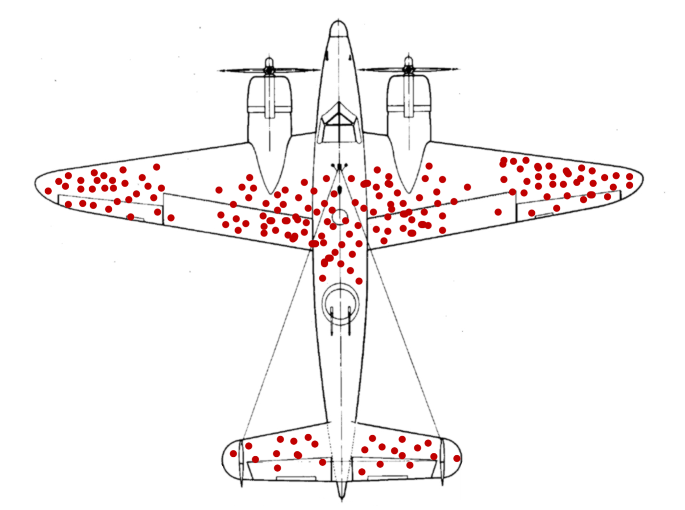

# Fallacies, Correlation and Regression

> ... in which we hear Stories of Warplanes,
  Correlation and Regression and explore the Datasaurus Dozen.
  
::: { .alert .alert-info}
These are just the notes for the lecture that
will be filled during the recording.
Check back later to the the completed script.
:::

<!-- ::: {.video-container} -->
<!-- <iframe class="video" src="https://www.youtube.com/embed/VYLAxbt9Izk?vq=hd1080" allowfullscreen></iframe> -->
<!-- ::: -->

## Setup


```r
library(tidyverse)
library(glue)
```

## Data Considerations

### 1943

It is 1943. The second World War is well underway, ravaging large parts of Europe.
Military aircraft that had first entered the stage in World War I are now
reaching their peak importance as they rain fire from the skies. But the Allied
forces are facing a problem. As warplanes get better, so do anti-aircraft
systems. In an effort to improve the survival of their fleet, the US military
starts examining the planes returning from skirmishes with the opposing forces.
They characterize the pattern of bullet holes in the metal hull, meticulously
noting down each hit that the plane sustained. The resulting picture is better
summarized in the modern, redrawn version below.



After taking a look at the data they gathered, the military is ready to rush
into action. To improve the endurance of their aircraft, the plan is to
reinforce the parts of the plane that were most often hit by bullets. With
stronger wings and a sturdier body of the plane, they think, surely more pilots
will come back from their missions safely. They were wrong.

But the pilots where in luck. The military also consulted with the Statistics
Research Group at Columbia University. A man named Abraham Wald worked there. In
his now unclassified report "A method of estimating plane vulnerability based on
damage of survivors", he argued against the generals' conclusion
[@waldReprintMethodEstimating1980]. Instead of the most-hit parts of the planes,
the least-hit parts are to be reinforced.


> Instead of the most-hit parts, the least-hit parts are to be reinforced.

The reason for this seemingly counterintuitive result is what is now known as
*survivorship bias*. The data that was collected contained only survivors, those
planes that sustained damage not severe enough to hinder them from coming back
after their mission. The aircraft that where hit in other places simply didn't
make it back. Consequently, Wald advised to reinforce the engines and the fuel
tanks.

### Thinking further

This is but one of a multitude of biases, specifically a selection bias, that
will influence the quality of the inferences you can draw from available data.
Keep in mind, data is not objective and never exists in a vacuum. There is
always context to consider. The way the data was collected is just one of them.
A lot of these ideas seem obvious in hindsight, which incidentally is another
bias that social psychologists call *hindsight bias*, but they can sometimes be
hard to spot.

A common saying is that music was better back in the days, or that all the old
music still holds up while the new stuff on the radio just sounds the same.
Well, not quite. This is also survivorship bias at work. All the bad and
forgettable songs from the past just faded into oblivion, never to be mentioned
again, while the songs people generally agreed to be good survived the ravages
of time unscathed.
A similar thing happens with success in general, not just songs.
If you ask any CEO high up the corporate ladder, a millionaire, or the author of a
book that reads "How to get rich", they are sure to have a witty anecdote about
how their persistence, or their brilliance, or charisma got them to where they are
now. What we are not seeing is all the people just as witty, just as charismatic
or even just as persistent that where simply not as lucky. Very few people will
tell you this. Because it takes a whole lot of courage to admit that ones
success is based on luck and privilege.

And to take it back to the scientific context: When you are planning an
experiment for the lab, always ask whether your data collection process can in
some way be biased towards what you are trying to show.

I leave you with this:


```{=html}
<blockquote class="twitter-tweet" data-width="550" data-lang="en" data-dnt="true" data-theme="light"><p lang="en" dir="ltr">weird how every time you see this image on twitter it has a ton of retweets <a href="https://t.co/VALAKdeheP">pic.twitter.com/VALAKdeheP</a></p>&mdash; Jake VanderPlas (@jakevdp) <a href="https://twitter.com/jakevdp/status/1336343740235935744?ref_src=twsrc%5Etfw">December 8, 2020</a></blockquote>

```

And from this cautionary tale we jump straight back into RStudio.

## Sidenotes

### Glue

### Best Practices

> **Your raw data is sacred!** Do not ever modify it or
  save over it.

- Don't touch the _save_ button in excel when looking at your raw data!
- SEPT2
- raw + derived

## Covariance, Correlation and Regression


$$var(X) = \frac{\sum_{i=0}^{n}{(x_i-\bar x)^2}}{(n-1)}$$


```r
N <- 50
df <- tibble(
  x = rnorm(N),
  y = rnorm(N)
)

m_x <- mean(df$x)
m_y <- mean(df$y)

ggplot(df, aes(x, y)) +
  geom_vline(xintercept = m_x, alpha = 0.8, color = "midnightblue") +
  geom_hline(yintercept = m_y, alpha = 0.8, color = "midnightblue") +
  geom_point() 
```


We now get the **covariance** of X and Y as:

$$cov(X,Y)=\text{E}\left[(X-\text{E}\left[X\right])(Y-\text{E}\left[Y\right])\right]$$

So what we do is standardize it by dividing by both standard
deviations and get the **correlation coefficient**:

$$corr(X,Y)=\frac{cov(X,Y)}{\sigma_{X}\sigma_{Y}}$$

It's full name is _Pearson product-moment correlation coefficient_,
or _pearsons R_. We can square it to get $R^2$.

### Introducing the Dataset

### Pearson vs. Spearman (not a Boxing Match)


### Linear Regression

## Non-linear Least Squares

## Exercises

### The Datasaurus Dozen


