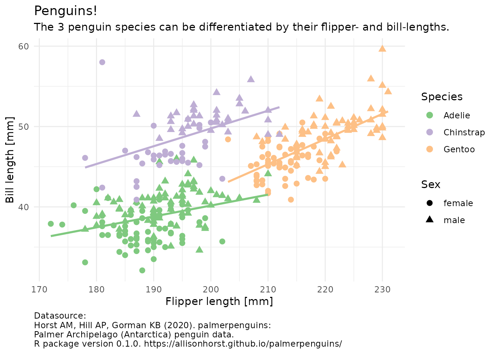

--- 
title: "Introduction to Data Analysis with R"
author: "Jannik Buhr"
date: "2021-12-04"
site: bookdown::bookdown_site
documentclass: book
bibliography: [book.bib, packages.bib]
csl: chicago-fullnote-bibliography.csl
url: "https://jmbuhr.de/dataintro/"
favicon: "favicon.png"
link-citations: false
description: "This is where you will find all the resources for the course Introduction to Data Analysis with R"
---

# Hello and welcome! {- #welcome}

... to the latest iteration of my introductory R course, where we will learn to analyse data in style.

::: { .alert .alert-info}
**Current course dates**\
WS21/22\
21.10.21 – 09.12.21\
Lecture online in your own time\
Seminar weekly on Fridays at 9:15 – 10:45\
Sign-up (Heidelberg University): see [discord](#discord)\
Language: Lectures are in English but the seminar can be in German if you choose so
(and in any case you can always ask questions in German as well).
:::

::: {.video-container}
<iframe class="video" src="https://www.youtube.com/embed/GguzPRquTLI?vq=hd1080" allowfullscreen></iframe>
:::

::: { .alert .alert-dark}
**Warning**: This site is still under development, as I am restructuring some of the lectures to further improve the learning experience.

If you are curious ahead of time about my style of teaching and the topics covered, check out the website for the previous year here: <https://jmbuhr.de/dataIntro20/>
:::

In this course, we will handle different kinds of data, create pretty and insightful visualizations, compute different statistics on our data and also explore what these statistical concepts mean.
From penguins to p-values, I got you covered.

(\#fig:cover-plot)One of the plots we will be creating in the first lecture.

## Prerequisits

No prior knowledge necessary.

Software to install:

- [R](https://cloud.r-project.org/)
- [Rstudio](https://www.rstudio.com/products/rstudio/download/#download)

## Structure of the course

The current course is for the WS21/22 at Heidelberg University.
Most participants will be biochemistry bachelor (and master) students,
but the material is open to anyone!

- There are 8 lectures in total, each accompanied by:
  - A video of the lecture at the top of each page
  - The lecture script, which consists of the code written during the lecture
    (plus some more code to generate illustrative graphics) and explanations
  - [Exercises](#exe) to complete and send in
  - A [seminar] to discuss the exercises
  - A [discord](#discord) server to ask questions and share solutions

I do recommend to watch the lecture in your own time, and then use the lecture script afterwards to look up concepts and code you want to revisit.
Code chunks also have a copy-button, which is helpful for quickly playing around with it, but make sure you actually walk through the lecture and do the typing first,
because muscle memory will server you well in the future.

### Exercises {#exe}

To complete the course, hand in at least 5 out of 8 exercises.
The important part here is not that each exercise is a perfect solution,
but if you encounter questions and struggles during your attempt of the exercise, make sure to include those pain points as well so that we can cover those in the [Seminar].
Please hand in your solutions **before** the seminar via a direct message on [discord](#discord).
The earlier in the week you submit your solutions,
the more time I have to prepare answers for the seminar.

### Seminar

Each week, we will meet to discuss the exercises and answer any questions that might have have popped up.
Currently it looks like it will be possible to do so in person, in which case we will meet here: 

> Mathematikon (INF 205), IWR CIP-Pool 3. OG

Even though these are technically computer rooms, it would be great if you could bring your own laptop so that you can code along and known that you will be able to apply what you learned after the course as well.
Also, we might not be able to install the necessary software in the computer room.

### Discord and signup {#discord}

If you are a biochemistry student at Heidelberg University,
click on this link: <https://discord.gg/jVZcNPCrp7> to join our discord server and sign up for the course.
If the link doesn't work, please send me a message via my [contact form](https://jmbuhr.de/contact)

Once you are there be sure to drop me a message with your name name matriculation number so that we can put the course onto your official transcript of records.
On the server, you will be able to ask questions that can be answered by me and your fellow learners, hand in the exercises and receive feedback.

Discord is a good choice for this, because messages there support code formatting and we can easily open up a voice call should a question get more complicated.

